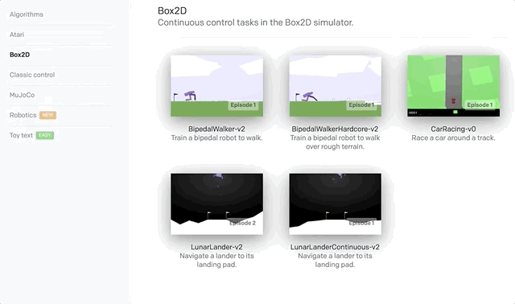

# Introduction
Let's begin by answering the question of **what is deep reinforcement learning exactly?** RL is ultimately about building code that can learn to perform complex tasks by itself, and deep RL refers to approaches where the knowledge is represented with a deep neural network. For example, Alpha Zero learned for itself how to play without being told any rules of the game. It plays a lot of games and based wins and losses learns the best strategy. The trial and error approach in RL can also be extended to other domains. For instance, teach a robot to walk or train a chatbot how to have better conversations. 

## Unity ML-Agents
All of the projects use the [Unity Machine Learning Agents (ML-Agents)](https://github.com/Unity-Technologies/ml-agents) toolkit, which you can learn more about by watching [this video](https://youtu.be/jC12h4UAxqs).

Unity ML-Agents is a toolkit for training intelligent agents in rich and realistic environments.

<p align="center">

</p>

It is a flexible and intuitive framework which enables:

- Academic and industry researchers to study complex behaviors from visual content and realistic physics.
- Industrial and enterprise researchers to implement large-scale parallel training regimes for robotics, autonomous vehicles, and other industrial applications.
- Game developers to tackle challenges, such as using agents to dynamically adjust the game-difficulty level.

## Reference Guide
You are encouraged to download [this sheet](https://github.com/udacity/deep-reinforcement-learning/blob/master/cheatsheet/cheatsheet.pdf), which contains most of the notation and algorithms that we will use in the first part of this course.

Another useful notation guide can be found in the pages immediately preceding Chapter 1 of the [textbook](http://go.udacity.com/rl-textbook).

# OpenAI Gym
In this course, we’ll make extensive use of [OpenAI Gym](https://gym.openai.com/), an open-source toolkit created by OpenAI for developing and comparing reinforcement learning (RL) algorithms. Using this toolkit, you will teach your own agents to accomplish a variety of complex tasks.

We'll use it to build practical, hands-on skills with many of the algorithms that we'll learn about during the nanodegree. Then, once you build your confidence with these environments, you'll be more than ready to tackle the projects!

## Take a Look
You can take a look at some of the environments that OpenAI Gym offers from the link [here](https://gym.openai.com/envs/).

<p align="center">

</p>

If you'd like to learn more about OpenAI Gym, please peruse the [GitHub repository](https://github.com/openai/gym.git). Check out this [blog post](https://blog.openai.com/openai-gym-beta/) to read more about how OpenAI Gym is used to accelerate reinforcement learning (RL) research.

## Learning by Doing
In the first part of the nanodegree, we’ll be using many of the environments that are available as part of this toolkit:

- You will deepen your understanding of **Dynamic Programming** with the frozen lake environment. As part of this environment, you'll teach an agent to navigate a world without falling into pits of frozen water.
- When learning about **Monte Carlo** methods, you'll write an agent to play blackjack.
- As part of the lesson on **Temporal-Difference** methods, you will teach an agent to navigate a world with a large cliff, where your goal is to avoid falling in!
- In the **Solve OpenAI Gym's Taxi-v2 Task** lesson, you will train a taxi to pick up and drop off passengers as quickly as possible.
- In **RL in Continuous Spaces**, you will train an under-powered car to manage a large hill.

One of the really cool things about OpenAI Gym is that you can watch your performance. So, your agent might start off just behaving randomly, but as it learns from interaction, you’ll be able to see it choose actions in a much more calculated, intelligent way.

<p align="center">

</p>

[Source the image above](https://blog.openai.com/roboschool/)

## OpenAI Gym Installation
If you'd like to install OpenAI Gym on your machine, you are encouraged to follow the instructions in the [GitHub repository](https://github.com/openai/gym#installation).

## GitHub Repository
You can find all of the coding exercises from the lessons in this [GitHub repository](https://github.com/udacity/deep-reinforcement-learning).

To clone the repository:

```bash
git clone https://github.com/udacity/deep-reinforcement-learning.git
```

Here is a demonstration of all the complex projects you'll accomplish by the end of this course.

<p align="center">

</p>

## Student Resources
You can start with the student-curated list of resources at [this link](http://bit.ly/drlndlinks). 

### Books to Read
We believe that you learn best when you are exposed to multiple perspectives on the same idea. As such, we recommend checking out the books below to get an added perspective on Deep Reinforcement Learning.

- [Grokking Deep Reinforcement Learning](https://www.manning.com/books/grokking-deep-reinforcement-learning) by Miguel Morales. Use our exclusive discount code gdrludacity50 for 50% off. This textbook features numerous examples, illustrations, exercises, and crystal-clear teaching. It is currently under development, but you can sign up to read the chapters as they are written!
- [Reinforcement Learning: An Introduction](http://go.udacity.com/rl-textbook) by Richard S. Sutton and Andrew G. Barto. This book is a classic text with an excellent introduction to reinforcement learning fundamentals.


