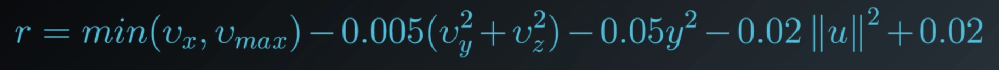
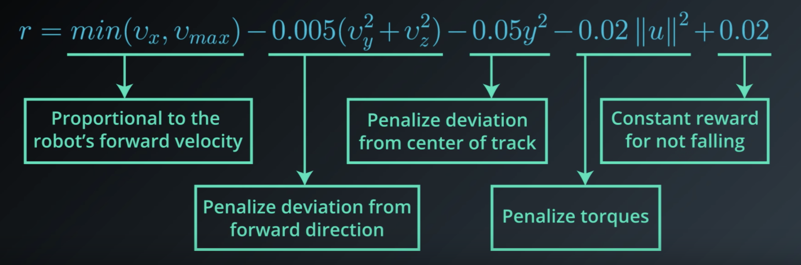
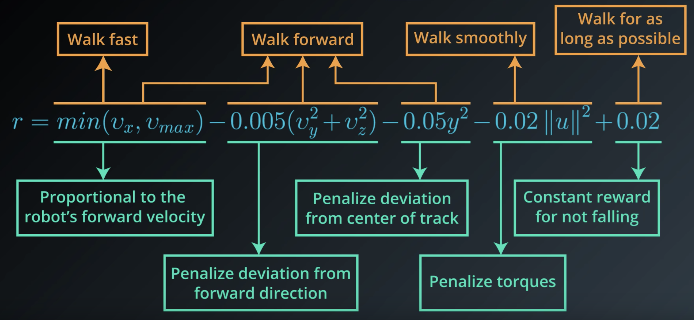

# Introduction
This lesson covers material in **Chapter 3** (especially 3.1-3.3) of the [textbook](http://go.udacity.com/rl-textbook).

# The Setting, Revisited
Remember the agent example (puppy example) from previous lesson? He set the stage as an agent who learns from trial and error and how to behave in an environment to maximize reward.

**What do we mean when we talk about RL in general?** 

Sort of the same thing described in the puppy example. In particular, the RL framework is characterized by an **agent learned to interact with its environment**. 

- We assume that time evolves in discrete time steps. At the initial time step, the agent observes the environment. You can think of this observation as a situation that the environment presents to the agent. 
- Then, it must select an appropriate action in response. Then, at the next time step in response to the agent's action, the environment presents a new situation to the agent.
- At the same time, the environment gives the agent a reward which provides some indication of whether the agent has responded appropriately to the environment. 
- Then, the process continues where at each time step, the environment sends the agent an observation and reward.
- And, in response, the agent must choose an action. 

In general, we **don't need assume** that the environment shows the agent everything he needs to make well-informed decisions. But, it **greatly simplifies** the underlying mathematics if we do. **So, in this course, we'll make the assumption that the agent is able to fully observe whatever state the environment is in**. 

And instead of referring to the agent as receiving an observation, we'll henceforth say that it receives the **environment state**.

Let's make this description a bit clearer with some added notation. 

- The agent first receives the **environment's initial state** which we denote by `S_0`, where `0` refers to time step zero. 
- Then, based on that observation the agent chooses an **action**, `A_0`.
- At the next time step, as direct consequence of agent's action and environment previous state, the **environment transitions to a new state**, `S_1`, and gives some **reward**, `R_1`, to the agent.
- The agent then chooses an action, `A_1`. 
- At time step 2, the process continues where the environment passes the reward and state and then the agent responds with an action and so on. 

Whereas the agent interacts with the environment, this interaction is manifested as a sequence of states, actions, and rewards.

```
S_0, A_0, R_1, S_1, A_1, R_2, S_2, A_2, ...
```

The reward will always be the most relevant quantity to the agent, meaning that **any agent has the goal to maximize expected cumulative reward** or the some of the rewards attained over all time steps. 

In other words, it seeks to find an strategy for choosing actions where the cumulative reward is likely to be quite high. The agent can only accomplish this by interacting with the environment. This is because at every time step, the environment decides how much reward the agent receives. In other words, the agent must play by the rules of the environment. But through interaction, the agent can learn those rules and choose appropriate actions to accomplish its goal. This is essentially what we're trying to accomplish in this course.

See the video [here](https://youtu.be/V6Q1uF8a6kA).

# Episodic vs. Continuing Tasks
Many of the real-world situations we'll consider will have a well-defined ending point. For instance, say, we're teaching an agent to play a game. Then, the interaction ends when the agent wins or loses. Or we might be running a simulation to teach a car to drive. Then, the interaction ends when the car crashes.

## Episodic Tasks
Of course, not all RL tasks have a well-defined ending point but those that do are called **episodic tasks**, meaning that the interaction ends at some time step. In this case, we'll refer to a complete sequence of interaction from start to finish as an **episode**. 

**When the episode ends**, the agent looks at the total amount of reward it received to figure out how well it did. It's then able to start from scratch as if it has been completely reborn into the same environment but now with the added knowledge of what happened in its past life. 

In this way, as time passes over its many lives, the agent makes better and better decisions. 

Once your agents spent enough time getting to know the environment, they should be able to pick a strategy where the cumulative reward is quite high. 

## Continuing Tasks
We'll also look at tasks that go on forever, without end. Those are called **continuing tasks**. For instance, an algorithm that buys and sells stocks in response to the financial market would be best modeled as an agent in the continuing tasks. In this case, **the agent lives forever**. So, it has to learn the best way to choose actions while simultaneously interacting with the environment.

## Test Your Intuition

### Playing Chess

<p align="center">

</p>

Say you are an agent, and your goal is to play chess. At every time step, you choose any  **action**  from the set of possible moves in the game. Your opponent is part of the environment; she responds with her own move, and the  **state**  you receive at the next time step is the configuration of the board, when it’s your turn to choose a move again. The  **reward**  is only delivered at the end of the game, and, let’s say, is +1 if you win, and -1 if you lose.

This is an  **episodic task**, where an episode finishes when the game ends. The idea is that by playing the game many times, or by interacting with the environment in many episodes, you can learn to play chess better and better.

It's important to note that this problem is exceptionally difficult, because the feedback is only delivered at the very end of the game. So, if you lose a game (and get a reward of -1 at the end of the episode), it’s unclear when exactly you went wrong: maybe you were so bad at playing that every move was horrible, or maybe instead … you played beautifully for the majority of the game, and then made only a small mistake at the end.

When the reward signal is largely uninformative in this way, we say that the task suffers the problem of  _**sparse rewards**_. There’s an entire area of research dedicated to this problem, and you’re encouraged to read more about it, if it interests you.

### Escaping a Maze
Consider a game in which the agent is located in a maze and trying to find the quickest route to the goal. If all the agent can do is randomly explore the maze, **it will not be able to learn anything until it reaches the goal at least once**.

<p align="center">

</p>

## Quiz: Episodic or Continuing?

Remember:

-   A  **task**  is an instance of the reinforcement learning (RL) problem.
-   **Continuing tasks**  are tasks that continue forever, without end.
-   **Episodic tasks**  are tasks with a well-defined starting and ending point.
    -   In this case, we refer to a complete sequence of interaction, from start to finish, as an  **episode**.
    -   Episodic tasks come to an end whenever the agent reaches a  **terminal state**.

With these ideas in mind, use the quiz below to classify tasks as continuing or episodic.

Consider an RL agent that would like to learn to [play the board game Go](https://en.wikipedia.org/wiki/AlphaGo). Is this a continuing or episodic task?

# The Reward Hypothesis
So far we've made sense of the idea of reward from the perspective of a puppy that interacts with its owner. In this case, the state in any time step was the command that the owner communicated to the puppy, the action was the puppy's response, the reward was just the number of treats. And, of course, the puppy seeks to maximize that reward. 

In the case of the example above, the idea of reward comes naturally and it lines up well with the way we think about teaching a puppy. But in fact the RL framework has any all agents formulate their goals in terms of _**maximizing expected cumulative reward**_. 

**But what could reward mean in the context of something like a robot learning to walk?** Maybe, we could think of the environment as a type of trainer that watches the robot's movements and rewards it for having a good walking form. But then the reward that it gives has the potential to be highly subjective and not scientific at all. I mean, what makes a walk _good_? 

**In general, how do we specify reward to describe any of a number of potential goals that our agents could have?** Before answering this question, let's take a step back.

It's important to note that the word **"reinforcement"** and **"reinforcement learning"** is a term originally from **behavioral science**. It refers to a stimulus that's delivered immediately after behavior to make behavior more likely to occur in the future. The fact that this name is borrowed is no coincidence. In fact, it's important to defining hypothesis and reinforcement learning that we can always formulate an agent's goal, along the lines of **maximizing _expected_ cumulative reward**. And we call this hypothesis the **"Reward Hypothesis"**. 

**Reward Hypothesis:** All goals can be framed as the maximization of <span style="color:red">_**expected**_</span> cumulative reward. 

See the video [here](https://youtu.be/uAqNwgZ49JE).

# Goals and Rewards: Part 1
Let's talk about some interesting research to illustrate the reward hypothesis.

**Google DeepMind** recently addressed the problem of teaching a robot to walk. Among other problem domains, they worked with a physical simulation of a humanoid robot and they managed to apply some nice RL to get great results. In order to frame this problem as a RL problem, we'll have to specify the state's actions and rewards. 

**What are the actions?**

These are the decisions that need to be made in order for the robot to walk. Now, the humanoid has several joints, and the actions are just the forces that the robot applies to its joints in order to move. 

Because the robot has an intelligent method for deciding these forces at every point in time, that will be sufficient to get it walking. 

**What about the states?**

The states are the context provided to the agent for choosing intelligent actions. In this context, the state at any point in time contains the current positions and velocities of all the of joints, along with some measurements about the surface that the robot is standing on. These measurements captures how flat or inclined the ground is, whether there is a large step along the path and so on. 

The researchers at DeepMind also added **contact sensor data**, so that it could detect if the robot is still walking of if it had fallen over. The idea is that based on the information in the state, the agent has to plan its next action. After all, if there's a step along the path, that will require a different type of movement that if the ground was completely flat. 

We'll design the reward as a feedback mechanism that tells the agent that it has chosen the appropriate movements. The reward will be our way of telling the agent "Good Job for not running into that wall, or too bad for missing that step and falling down". 

See the video [here](https://youtu.be/XPnj3Ya3EuM).

# Goals and Rewards: Part 2
So far, we've been trying to frame the idea of a humanoid learning to walk in the context of RL. We talked about the actions and states, but we still need to talk about rewards.

The reward structure from the DeepMind's paper is surprisingly intuitive. This line is pulled from the appendix of the paper and describes how the reward is decided at every time step.

<p align="center">

</p>

Each term communicates to the agent some part of what we'd like it to accomplish. So, let's look at each term individually.

At every time step, the agent receives a reward proportional to its _**forward velocity (`min(v_x, v_max)`)**_. So if it moves faster, it gets more reward, but up to a limit, here denoted by **`v_max`**. But it's _penalized_ an amount proportional to the force applied to each joint, **`-0.02||u||^2`**. So, if the agent applies more force to the joints, then more reward is taken away as punishment. 

Since the researchers also wanted the humanoid to focus on moving forward, the agent is also _penalized_ for moving left, right, or vertically **(`-0.005({v_x}^2 + {v_y}^2)`)**. 

It was also _penalized_ if the humanoid moved its body away from the center of the track **(`-0.05y^2`)**. So, the agent will try to keep the humanoid as close to the center as possible. 

At every time step, the agent also receives some positive reward if the humnoid has not yet fallen **(`+0.02`)**.  

<p align="center">

</p>

They frame the problem as an **episodic** task where if the humanoid falls, then the episode is terminated. At this point, whatever cumulative reward the agent had at that time point is all it's ever going to get. 

**In this way, the reward signal is designed, so if the robot focused entirely on maximizing this reward, it would also coincidentally learn to walk**. To see this, first note that if the robot falls, the episode terminates and that's a missed opportunity to collect more of the positive reward (the last term, **(`+0.02`)**). 

And in general, if the robot walks for more time steps, it'll get more opportunities to get reward, proportional to the number of time steps. So, if we give the reward in this way, the agent will try to keep from falling for as long as possible. 

Next, since the reward is proportional to the forward velocity, this will ensure the robot also feels pressured to walk as quickly as possible in the direction of the walking track. 

But, it also makes sense to penalize the agent for applying too much force to the joints. This is because otherwise, we could end up with a situation where the humanoid walks too erratically. By penalizing large forces, we can try to keep the movements more smooth and elegant. 

Likewise, we want to keep the agent on the track and moving forward. Otherwise, who knows where it could end up walking off to. 

Of course, the robot can't focus just on walking fast, of just on moving forward, or only walking smoothly, or just on walking for as long as possible.  

<p align="center">

</p>

These are four somewhat competing requirements that the agent has to balance for all time steps towards its goal of maximizing expected cumulative reward. DeepMind demonstrated that from this very simple reward function, the agent is able to learn how to walk in a very human like fashion. **In fact, this reward function is so simple, that it may seem that deciding reward is quite straightforward. But, in general, this is not the case**. 

Of course, there are some counter examples to this. For instance, if you're teaching an agent to play a video game, the reward is just the score on the screen. And if you're teaching an agent to play Backgammon, the reward is delivered only at the end of the game, and you could construct it to be positive if the agent wins and negative if it loses. The fact that the reward is so simple is precisely what makes this research from DeepMind so fascinating. 

See the video [here](https://youtu.be/pVIFc72VYH8).

**NOTE:** If you'd like to learn more about the research that was done at [DeepMind](https://deepmind.com/), please check out [this link](https://deepmind.com/blog/producing-flexible-behaviours-simulated-environments/). The research paper can be accessed [here](https://arxiv.org/pdf/1707.02286.pdf). Also, check out this cool [video](https://www.youtube.com/watch?v=hx_bgoTF7bs&feature=youtu.be)!

