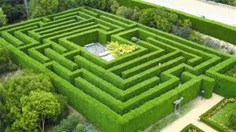
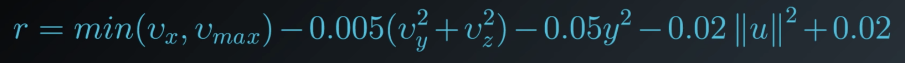
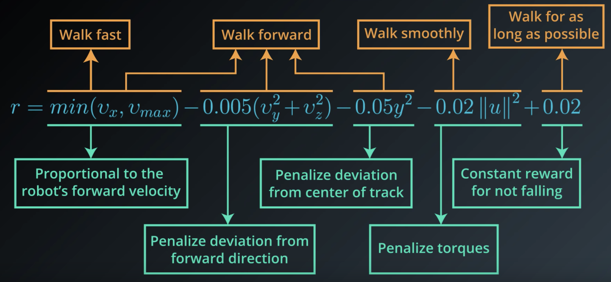
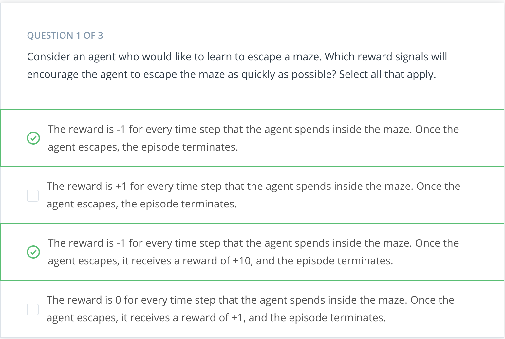
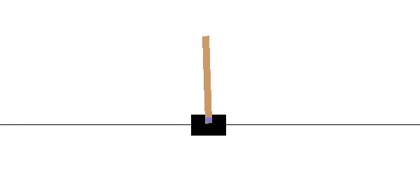

# Introduction
This lesson covers material in **Chapter 3** (especially 3.1-3.3) of the [textbook](http://go.udacity.com/rl-textbook).

# The Setting, Revisited
Remember the agent example (puppy example) from previous lesson? He set the stage as an agent who learns from trial and error and how to behave in an environment to maximize reward.

**What do we mean when we talk about RL in general?** 

Sort of the same thing described in the puppy example. In particular, the RL framework is characterized by an **agent learned to interact with its environment**. Therefore, the summation from previous section, - We assume that time evolves in discrete time steps. At the initial time step, the agent observes the environment. You can think of this observation as a situation that the environment presents to the agent. 
- Then, it must select an appropriate action in response. Then, at the next time step in response to the agent's action, the environment presents a new situation to the agent.
- At the same time, the environment gives the agent a reward which provides some indication of whether the agent has responded appropriately to the environment. 
- Then, the process continues where at each time step, the environment sends the agent an observation and reward.
- And, in response, the agent must choose an action. 

In general, we **don't need assume** that the environment shows the agent everything he needs to make well-informed decisions. But, it **greatly simplifies** the underlying mathematics if we do. **So, in this course, we'll make the assumption that the agent is able to fully observe whatever state the environment is in**. 

And instead of referring to the agent as receiving an observation, we'll henceforth say that it receives the **environment state**.

Let's make this description a bit clearer with some added notation. 

- The agent first receives the **environment's initial state** which we denote by `S_0`, where `0` refers to time step zero. 
- Then, based on that observation the agent chooses an **action**, `A_0`.
- At the next time step, as direct consequence of agent's action and environment previous state, the **environment transitions to a new state**, `S_1`, and gives some **reward**, `R_1`, to the agent.
- The agent then chooses an action, `A_1`. 
- At time step 2, the process continues where the environment passes the reward and state and then the agent responds with an action and so on. 

Whereas the agent interacts with the environment, this interaction is manifested as a sequence of states, actions, and rewards.

```
S_0, A_0, R_1, S_1, A_1, R_2, S_2, A_2, ...
```

The reward will always be the most relevant quantity to the agent, meaning that **any agent has the goal to maximize expected cumulative reward** or the some of the rewards attained over all time steps. 

In other words, it seeks to find an strategy for choosing actions where the cumulative reward is likely to be quite high. The agent can only accomplish this by interacting with the environment. This is because at every time step, the environment decides how much reward the agent receives. In other words, the agent must play by the rules of the environment. But through interaction, the agent can learn those rules and choose appropriate actions to accomplish its goal. This is essentially what we're trying to accomplish in this course.

See the video [here](https://youtu.be/V6Q1uF8a6kA).

# Episodic vs. Continuing Tasks
Many of the real-world situations we'll consider will have a well-defined ending point. For instance, say, we're teaching an agent to play a game. Then, the interaction ends when the agent wins or loses. Or we might be running a simulation to teach a car to drive. Then, the interaction ends when the car crashes.

## Episodic Tasks
Of course, not all RL tasks have a well-defined ending point but those that do are called **episodic tasks**, meaning that the interaction ends at some time step. In this case, we'll refer to a complete sequence of interaction from start to finish as an **episode**. 

**When the episode ends**, the agent looks at the total amount of reward it received to figure out how well it did. It's then able to start from scratch as if it has been completely reborn into the same environment but now with the added knowledge of what happened in its past life. 

In this way, as time passes over its many lives, the agent makes better and better decisions. 

Once your agents spent enough time getting to know the environment, they should be able to pick a strategy where the cumulative reward is quite high. 

## Continuing Tasks
We'll also look at tasks that go on forever, without end. Those are called **continuing tasks**. For instance, an algorithm that buys and sells stocks in response to the financial market would be best modeled as an agent in the continuing tasks. In this case, **the agent lives forever**. So, it has to learn the best way to choose actions while simultaneously interacting with the environment.

## Test Your Intuition

### Playing Chess

<p align="center">

</p>

Say you are an agent, and your goal is to play chess. At every time step, you choose any  **action**  from the set of possible moves in the game. Your opponent is part of the environment; she responds with her own move, and the  **state**  you receive at the next time step is the configuration of the board, when it’s your turn to choose a move again. The  **reward**  is only delivered at the end of the game, and, let’s say, is +1 if you win, and -1 if you lose.

This is an  **episodic task**, where an episode finishes when the game ends. The idea is that by playing the game many times, or by interacting with the environment in many episodes, you can learn to play chess better and better.

It's important to note that this problem is exceptionally difficult, because the feedback is only delivered at the very end of the game. So, if you lose a game (and get a reward of -1 at the end of the episode), it’s unclear when exactly you went wrong: maybe you were so bad at playing that every move was horrible, or maybe instead … you played beautifully for the majority of the game, and then made only a small mistake at the end.

When the reward signal is largely uninformative in this way, we say that the task suffers the problem of  _**sparse rewards**_. There’s an entire area of research dedicated to this problem, and you’re encouraged to read more about it, if it interests you.

### Escaping a Maze
Consider a game in which the agent is located in a maze and trying to find the quickest route to the goal. If all the agent can do is randomly explore the maze, **it will not be able to learn anything until it reaches the goal at least once**.

<p align="center">

</p>

## Quiz: Episodic or Continuing?

Remember:

-   A  **task**  is an instance of the reinforcement learning (RL) problem.
-   **Continuing tasks**  are tasks that continue forever, without end.
-   **Episodic tasks**  are tasks with a well-defined starting and ending point.
    -   In this case, we refer to a complete sequence of interaction, from start to finish, as an  **episode**.
    -   Episodic tasks come to an end whenever the agent reaches a  **terminal state**.

With these ideas in mind, use the quiz below to classify tasks as continuing or episodic.

Consider an RL agent that would like to learn to [play the board game Go](https://en.wikipedia.org/wiki/AlphaGo). Is this a continuing or episodic task?

# The Reward Hypothesis
So far we've made sense of the idea of reward from the perspective of a puppy that interacts with its owner. In this case, the state in any time step was the command that the owner communicated to the puppy, the action was the puppy's response, the reward was just the number of treats. And, of course, the puppy seeks to maximize that reward. 

In the case of the example above, the idea of reward comes naturally and it lines up well with the way we think about teaching a puppy. But in fact the RL framework has any all agents formulate their goals in terms of _**maximizing expected cumulative reward**_. 

**But what could reward mean in the context of something like a robot learning to walk?** Maybe, we could think of the environment as a type of trainer that watches the robot's movements and rewards it for having a good walking form. But then the reward that it gives has the potential to be highly subjective and not scientific at all. I mean, what makes a walk _good_? 

**In general, how do we specify reward to describe any of a number of potential goals that our agents could have?** Before answering this question, let's take a step back.

It's important to note that the word **"reinforcement"** and **"reinforcement learning"** is a term originally from **behavioral science**. It refers to a stimulus that's delivered immediately after behavior to make behavior more likely to occur in the future. The fact that this name is borrowed is no coincidence. In fact, it's important to defining hypothesis and reinforcement learning that we can always formulate an agent's goal, along the lines of **maximizing _expected_ cumulative reward**. And we call this hypothesis the **"Reward Hypothesis"**. 

**Reward Hypothesis:** All goals can be framed as the maximization of <span style="color:red">_**expected**_</span> cumulative reward. 

See the video [here](https://youtu.be/uAqNwgZ49JE).

# Goals and Rewards: Part 1
Let's talk about some interesting research to illustrate the reward hypothesis.

**Google DeepMind** recently addressed the problem of teaching a robot to walk. Among other problem domains, they worked with a physical simulation of a humanoid robot and they managed to apply some nice RL to get great results. In order to frame this problem as a RL problem, we'll have to specify the state's actions and rewards. 

**What are the actions?**

These are the decisions that need to be made in order for the robot to walk. Now, the humanoid has several joints, and the actions are just the forces that the robot applies to its joints in order to move. 

Because the robot has an intelligent method for deciding these forces at every point in time, that will be sufficient to get it walking. 

**What about the states?**

The states are the context provided to the agent for choosing intelligent actions. In this context, the state at any point in time contains the current positions and velocities of all the of joints, along with some measurements about the surface that the robot is standing on. These measurements captures how flat or inclined the ground is, whether there is a large step along the path and so on. 

The researchers at DeepMind also added **contact sensor data**, so that it could detect if the robot is still walking of if it had fallen over. The idea is that based on the information in the state, the agent has to plan its next action. After all, if there's a step along the path, that will require a different type of movement that if the ground was completely flat. 

We'll design the reward as a feedback mechanism that tells the agent that it has chosen the appropriate movements. The reward will be our way of telling the agent "Good Job for not running into that wall, or too bad for missing that step and falling down". 

See the video [here](https://youtu.be/XPnj3Ya3EuM).

# Goals and Rewards: Part 2
So far, we've been trying to frame the idea of a humanoid learning to walk in the context of RL. We talked about the actions and states, but we still need to talk about rewards.

The reward structure from the DeepMind's paper is surprisingly intuitive. This line is pulled from the appendix of the paper and describes how the reward is decided at every time step.

<p align="center">

</p>

Each term communicates to the agent some part of what we'd like it to accomplish. So, let's look at each term individually.

At every time step, the agent receives a reward proportional to its _**forward velocity (`min(v_x, v_max)`)**_. So if it moves faster, it gets more reward, but up to a limit, here denoted by **`v_max`**. But it's _penalized_ an amount proportional to the force applied to each joint, **`-0.02||u||^2`**. So, if the agent applies more force to the joints, then more reward is taken away as punishment. 

Since the researchers also wanted the humanoid to focus on moving forward, the agent is also _penalized_ for moving left, right, or vertically **(`-0.005({v_x}^2 + {v_y}^2)`)**. 

It was also _penalized_ if the humanoid moved its body away from the center of the track **(`-0.05y^2`)**. So, the agent will try to keep the humanoid as close to the center as possible. 

At every time step, the agent also receives some positive reward if the humnoid has not yet fallen **(`+0.02`)**.  

<p align="center">

</p>

They frame the problem as an **episodic** task where if the humanoid falls, then the episode is terminated. At this point, whatever cumulative reward the agent had at that time point is all it's ever going to get. 

**In this way, the reward signal is designed, so if the robot focused entirely on maximizing this reward, it would also coincidentally learn to walk**. To see this, first note that if the robot falls, the episode terminates and that's a missed opportunity to collect more of the positive reward (the last term, **(`+0.02`)**). 

And in general, if the robot walks for more time steps, it'll get more opportunities to get reward, proportional to the number of time steps. So, if we give the reward in this way, the agent will try to keep from falling for as long as possible. 

Next, since the reward is proportional to the forward velocity, this will ensure the robot also feels pressured to walk as quickly as possible in the direction of the walking track. 

But, it also makes sense to penalize the agent for applying too much force to the joints. This is because otherwise, we could end up with a situation where the humanoid walks too erratically. By penalizing large forces, we can try to keep the movements more smooth and elegant. 

Likewise, we want to keep the agent on the track and moving forward. Otherwise, who knows where it could end up walking off to. 

Of course, the robot can't focus just on walking fast, of just on moving forward, or only walking smoothly, or just on walking for as long as possible.  

<p align="center">

</p>

These are four somewhat competing requirements that the agent has to balance for all time steps towards its goal of maximizing expected cumulative reward. DeepMind demonstrated that from this very simple reward function, the agent is able to learn how to walk in a very human like fashion. **In fact, this reward function is so simple, that it may seem that deciding reward is quite straightforward. But, in general, this is not the case**. 

Of course, there are some counter examples to this. For instance, if you're teaching an agent to play a video game, the reward is just the score on the screen. And if you're teaching an agent to play Backgammon, the reward is delivered only at the end of the game, and you could construct it to be positive if the agent wins and negative if it loses. The fact that the reward is so simple is precisely what makes this research from DeepMind so fascinating. 

See the video [here](https://youtu.be/pVIFc72VYH8).

**NOTE:** If you'd like to learn more about the research that was done at [DeepMind](https://deepmind.com/), please check out [this link](https://deepmind.com/blog/producing-flexible-behaviours-simulated-environments/). The research paper can be accessed [here](https://arxiv.org/pdf/1707.02286.pdf). Also, check out this cool [video](https://www.youtube.com/watch?v=hx_bgoTF7bs&feature=youtu.be)!

# Quiz: Goals and Rewards

So far, you've seen one example for how to frame an agent's goal as the maximization of expected cumulative reward. In this quiz, you will investigate several more examples.

<p align="center">

</p>

<p align="center">

</p>

***

<p align="center">

</p>

<p align="center">

</p>

***

<p align="center">

</p>

<p align="center">

</p>

# Cumulative Reward
We've seen that the RL framework gives us a way to study how an agent can learn to accomplish a goal from interacting with its environment. This framework works for many real world applications and simplifies the interaction into **three signals** that are passed between agent and environment.

The **state** signal is the environment's way of presenting a situation to the agent. The agent then responds with an **action** which influences the environment. And the environment responds with the **reward** which gives some indication of whether the agent has responded appropriately to the environment. Also, built-in to the framework is the **agent's goal** which is to **maximize cumulative reward**. 

**But what exactly does this mean and how does the agent accomplish this?**

Let's try to understand this with the help of previous walking robot example. In this case, the goal of the robot was to stay walking forward for as long and as quickly as possible while exerting minimal effort. In this case, if the robot tried to _maximize_ the reward it received at a single time step, that would look like trying to move as quickly as possible with as little effort without falling immediately. That could work well in the short term, but it's possible, for instance, that the agent's movement gets it moving quickly without falling initially. But that first movement was de-stabilizing enough that it doomed the agent to fall in short time. In this way, if the agent focused on individual time steps, it could learn actions that maximize initial rewards, but then the episode terminates quite quickly. So, the cumulative reward would be quite small. And still worse, in this case, the agent will have not learned to walk. 

In this example then, it's clear that the agent cannot focus on individual time steps and instead needs to keep all time steps in mind. **This also holds true for RL agents in general**.

>**Actions have short AND long term consequences and the agent needs to gain some understanding of the complex effects its actions on the environment**.

Along these lines, in the walking robot example, the agent always has reward at all time steps in mind, it will learn to choose movement designed for long-term stability. So in this way, the robot moves a bit slowly to sacrifice a little but of reward but it will pay off because it will avoid falling for longer and collect higher cumulative reward.

**What does all of this mean when the agent chooses an action at an arbitrary time step? How exactly does it keep all time steps in mind?**

Well, if we're looking at some time step, `t`, it's important to note that the rewards for all previous time steps have already been decided as they're in the past. Only future rewards are inside the agent's control. 

## Return: G_t
We refer to the sum of rewards from the next time step onward as the **return**, and denote it with **`G`**. At an arbitrary time step, the agent will always choose an action towards the goal of maximizing the return.

<p align="center">

</p>

But, it's actually _more accurate_ to say that the agent seeks to maximize **expected return**. This is because it's generally the case that the agent can't predict with complete certainty what the future rewards is likely to be. So, it has to rely on a prediction or an estimate. 

See the video [here](https://youtu.be/ysriH65lV9o).

# Dicounted Return
We've discussed how an agent might choose actions with the goal of maximizing expected return but let's dig a bit deeper on that.

> **For instance, consider our puppy agent. How does he predict how much reward he could get at any point in the future?vCan the puppy really be expected to have just as much of an idea of how much he'll get now as does five years from now? Does it make more sense to consider that it's not entirely clear what the future holds especially if the puppy is still learning, proposing, and testing hypotheses and changing strategy? It's unlikely that he'll know 1000 time steps in advance what his reward potential is likely to be.** 

In general, the puppy is likely to have much better idea of what's likely to happen in the near future than he does for a distant time point. Along these lines then, **should present reward carry the same weight as future reward?**

>Maybe it makes more sense to value rewards that come sooner more highly, since those rewards are more predictable. Since there's always a chance that the agent won't get the reward (again because it's in the future and there's uncertainty associated with it), makes present rewards more valuable (and hence higher weights) relative to the future rewards. The more in the future the reward is, the more uncertainty in it.

This situation motivates the idea of **discounting** and **discounted return**. 

Remember that the goal of the agent is always to maximize cumulative reward. Instead of the reward in each time step having equal say, what if rewards that occured earlier in time to have a much greater say. Therefore, we can rewrite the summation from previous section as follows:

<p align="center">

</p>

**Discount rate**

The **`γ`** (Gamma) in the formula above is called the **discount rate**. Discount rate is always between [0,1]. Using the formula above, we'll have a nice decay, where rewards that occur earlier in time are always multiplied by a larger number.

It's important to note that the **`γ`** is **NOT** something that's learned by the agent. It's something that you set to refine the goal that you have for the agent. 

**So, how exactly might you set the value of `γ`?** The larger you make `γ`, the more agent cares about the distant future, and the opposite when `γ` is set smaller. 

It's important to note that **discounting is particularly relevant in continuing tasks**, where the agent environment interaction goes on without end. In this case, if the agent wants to maximize cumulative reward, while it's a pretty difficult task if the future is limitless. **So, we use discounting to avoid having to look too far into the limitless future.** 

**NOTE:** With or without discounting, the goal is always the same. It's always maximizing cumulative reward. The discount rate comes in when the agent chooses actions at an arbitrary time step. It uses the discount rate as part of its program for picking actions. And that program is more interested in securing rewards come sooner and are more likely than the rewards that come later and are less likely. 

See the video [here](https://youtu.be/opXGNPwwn7g).

<p align="left">

</p>

# Quiz: Pole-Balancing

<p align="center">

</p>

In this classic reinforcement learning task, a cart is positioned on a frictionless track, and a pole is attached to the top of the cart. The objective is to keep the pole from falling over by moving the cart either left or right, and without falling off the track.

In the  [OpenAI Gym implementation](https://gym.openai.com/envs/CartPole-v0/), the agent applies a force of +1 or -1 to the cart at every time step. It is formulated as an episodic task, where the episode ends when (1) the pole falls more than 20.9 degrees from vertical, (2) the cart moves more than 2.4 units from the center of the track, or (3) when more than 200 time steps have elapsed. The agent receives a reward of +1 for every time step, including the final step of the episode. You can read more about this environment in  [OpenAI's github](https://github.com/openai/gym/wiki/CartPole-v0). This task also appears in Example 3.4 of the textbook.

<p align="center">

</p>

For each of these discount rates, the agent receives a positive reward for each time step where the pole has not yet fallen. Thus, in each case, the agent will try to keep the pole balanced for as long as possible.

<p align="center">

</p>

Without discounting, the agent will always receive a reward of -1 (no matter what actions it chooses during the episode), and so the reward signal will not provide any useful feedback to the agent. With discounting, the agent will try to keep the pole balanced for as long as possible, as this will result in a return that is relatively less negative.

<p align="center">

</p>

If the discount rate is 1, the agent will always receive a reward of +1 (no matter what actions it chooses during the episode), and so the reward signal will not provide any useful feedback to the agent. If the discount rate is 0.5 or 0.9, the agent will try to terminate the episode as soon as possible (by either dropping the pole quickly or moving off the edge of the track). Thus, you are correct - we must redesign the reward signal!

# MDPs, Part 1
Over the next several videos, you'll learn all about how to rigorously define a reinforcement learning problem as a **Markov Decision Process (MDP)**. Towards this goal, we'll begin with an example!

So far, we've just started the conversation to set the stage for what we'd like to accomplish. We'll use the remainder of this lesson to specify a rigorous definition for RL problem. For context, we'll work with the example of a recycling robot from the Sutton textbook. 

Consider a robot that's desgined for picking up empty soda cans. The robot is equipped with arms to grab the cans and runs on a rechargeable battery. There's a docking station set up in one corner of the room and the robot has to sit at the station if it needs to recharge its battery. Say, you are trying to program this robot to collect empty soda cans without human intervention. 

In particular, you want the robot to be able to decide for itself when it needs to recharge its battery. And whenever it doesn't need to recharge, you want it to focus on collecting as many soda cans as possible. So, let's see if we can frame this as a RL problem.

We'll begin with the _actions_. We'll say the robot is capable of executing **three** potential actions. It can *search* the room for cans, it can head to the docking station to *recharge* its battery, or it can stay put (*wait*) in the hopes that someone brings it a can. We refer to the set of possible actions as the **action space**, and it's common to denote it with a script "**A**".

What about the _states_? States are just the context provided to the agent for making intelligent actions. The state, in this case, could be the charge left on the robot's battery. For simplicity, we'll assume that the battery has one of two states. One corresponding to a *high* amount of charge left, and the other corresponding to a *low* amount of charge. We refer to the set of possible states as the **state space** and it's common to denote it with a script "**S**".  

So, intuition tells us that if the robot has a high amonut of charge left on its battery, we'd like it to know to actively search the room for the cans. Searching the room should use up a lot of energy but this doesn't matter so much because the battery has a lot of charge anyway. But of the state is low, searching for cans has pretty high risk because the battery could get depleted mid-search and then the robot would be stranded. So, if the battery is low, maybe we'd like the robot to know to wait for a can or to go to recharge its battery.

See the video [here](https://youtu.be/NBWbluSbxPg).

<p align="left">

</p>

# MDP, Part 2
As a first step, consider the case of the charge on the battery is _high_. Then, the robot could choose to *search*, *wait*, or *recharge*. But actually, recharging doesn't make much sense if the battery is already high. So, the options are *search* or *wait*. 

So, if the agent chooses to *search*, then at the next time step, the state could be *high* or *low*. Let's say that with 0.7 probability, it stays *high*. So, there is 0.3 chance the battery switches to *low*. In both cases, we'll say that this decision to search led to the robot collecting exactly four cans. And in line with this, the environment gives the agent a reward of four. 

The other option is to *wait*. If the robot has a high battery and then decides to wait, well, waiting doesn't use any battery at all and we'll say that then, it's guaranteed that the battery will again be *high* at the next time step. In this case, we'll suppose that since the robot wasn't out actively searching, it's able to collect fewer cans and say it's delivered just one can. Again in line with this, the environment gives the agent a reward of one. 

Onto to the case, where the battery is *low*. Again, the robot has three options. If the battery is *low* and it chooses to *wait* for people to bring cans, that doesn't use any battery until the state at the next time is going to be *low*. And just like when the robot decided to *wait* when the battery was *high*, the agent gets a reward of one. 

If the robot *recharges*, then it goes back to the docking station and the state of the next time step is guaranteed to be *high*. Say it collects no cans along the way and gets a reward of zero. 

And if it *searches*, well, that's risky. It's possible that it gets away with this and then at the next time step, the battery is still low, but not entirely depleted. But, it's probably more likely that the robot depletes its battery, has to be **rescued** and is carried to a docking station to be charged. So the charge on its battery at the next time step is *high*. Say, the robot depletes its battery with 0.8 probability, and otherwise gets away with that risky action with 0.2 probability. As for the reward, if the robot needs to be rescued, we want to make sure we're **punishing** the robot in this case. So, say we don't look at all at the number of cans it was able to collect and we just give the robot a **reward of negative** three for that. But, if the robot gets away with it, it collects four cans and gets the reward of four. 

This picture completely characterizes one method that the environment could use to decide the next state in reward at any point in time. 

<p align="center">

</p>

**NOTE:** What is important to note here is how little information the environment uses to make decisions. It doesn't care what situation was presented to the agent 10 or 100 or even 2 steps prior. And it doesn't look at the actions that the took prior to the last one. And how well the agent is doing or how much reward it's collected has no effect on how the environment chooses to respond to the agent. Of course, it's possible to design environments that have much more complex procedures for interacting with the agent, but this is how it's done in RL. 

See the video [here](https://youtu.be/CUTtQvxKkNw).

# Quiz: One-Step Dynamics, Part 1

Consider the recycling robot example. In the previous concept, we described one method that the environment could use to decide the state and reward, at any time step.

<p align="center">

</p>

<p align="center">

</p>

<p align="center">

</p>

<p align="center">

</p>

<p align="center">

</p>

# Quiz: One-Step Dynamics, Part 2

It will prove convenient to represent the environment's dynamics using mathematical notation. In this concept, we will introduce this notation (which can be used for any reinforcement learning task) and use the recycling robot as an example.

<p align="center">

</p>

<p align="center">

</p>

<p align="center">

</p>

<p align="center">

</p>

# MDP, Part 3
Formally, a **Markov Decision Process (MDP)** is defined by the set of states, the set of actions, and the set of rewards along with the one-step dynamics of the environment and the discount rate.

<p align="center">

</p>

Let's talk a bit more about the "**discount rate**". So, **What is discount rate?** To answer this, it is important to notice that we've detailed a continuing task.

<p align="center">

</p>

So, it will prove useful to make the discount factor less than one because otherwise, the agent would have to look infinitely far into the limitless future. _It's common to set the discount rate to **0.9**_. 

**NOTE:** It's important to note that the discount rate is always set to some number much closer to one than to zero. Otherwise, the agent becomes excessively short-sighted to a fault. 

**NOTE:** In general, dealing with real world problems, you will need to specify the MDP and that will fully and formally define the problem that you want your agent to solve. This framework works for continuing and episodic tasks, and whenever you have a problem that you want to solve with RL, whether it entails a self-driving car, a walking robot, or a stock trading agent, this is the framework we'll use. **The agent will know the states and actions along with the discount factor. As for the set up rewards and the one-step dynamics, those specify how the environment work and will be unknown to the agent. Despite not having this information, the agent will still have to learn from interaction how to accomplish its goal**. 

See the video [here](https://youtu.be/UlXHFbla3QI).

# Finite MDPs
Please use [this link](https://github.com/openai/gym/wiki/Table-of-environments) to peruse the available environments in OpenAI Gym.

<p align="center">

</p>

The environments are indexed by  **Environment Id**, and each environment has corresponding  **Observation Space**,  **Action Space**,  **Reward Range**,  **tStepL**,  **Trials**, and  **rThresh**.

## CartPole-v0

----------

Find the line in the table that corresponds to the  **CartPole-v0**  environment. Take note of the corresponding  **Observation Space**  (`Box(4,)`) and  **Action Space**  (`Discrete(2)`).

<p align="center">

</p>

As described in the  [OpenAI Gym documentation](https://gym.openai.com/docs/),

> Every environment comes with first-class  `Space`  objects that describe the valid actions and observations.
> 
> -   The  `Discrete`  space allows a fixed range of non-negative numbers.
> -   The  `Box`  space represents an n-dimensional box, so valid actions or observations will be an array of n numbers.

## Observation Space
----------
The observation space for the CartPole-v0 environment has type  `Box(4,)`. Thus, the observation (or state) at each time point is an array of 4 numbers. You can look up what each of these numbers represents in  [this document](https://github.com/openai/gym/wiki/CartPole-v0). After opening the page, scroll down to the description of the observation space.

<p align="center">

</p>

Notice the minimum (-Inf) and maximum (Inf) values for both  **Cart Velocity**  and the  **Pole Velocity at Tip**.

Since the entry in the array corresponding to each of these indices can be any real number, the state space  `S+`  is infinite!

## Action Space
The action space for the CartPole-v0 environment has type `Discrete(2)`. Thus, at any time point, there are only two actions available to the agent. You can look up what each of these numbers represents in [this document](https://github.com/openai/gym/wiki/CartPole-v0) (note that it is the same document you used to look up the observation space!). After opening the page, scroll down to the description of the action space.

<p align="center">

</p>

In this case, the action space `A` is a finite set containing only two elements.

## Finite MDPs
----------
Recall from the previous concept that in a finite MDP, the state space  \mathcal{S}S  (or  \mathcal{S}^+S+, in the case of an episodic task) and action space  \mathcal{A}A  must both be finite.

Thus, while the CartPole-v0 environment does specify an MDP, it does not specify a  **finite**  MDP. In this course, we will first learn how to solve finite MDPs. Then, later in this course, you will learn how to use neural networks to solve much more complex MDPs!

# Summary

<p align="center">

</p>

### The Setting, Revisited
----------
- The reinforcement learning (RL) framework is characterized by an  **agent**  learning to interact with its  **environment**.
- At each time step, the agent receives the environment's  **state**  (_the environment presents a situation to the agent)_, and the agent must choose an appropriate  **action**  in response. One time step later, the agent receives a  **reward**  (_the environment indicates whether the agent has responded appropriately to the state_) and a new  **state**.
- All agents have the goal to maximize expected  **cumulative reward**, or the expected sum of rewards attained over all time steps.

### Episodic vs. Continuing Tasks
----------

- A  **task**  is an instance of the reinforcement learning (RL) problem.
- **Continuing tasks**  are tasks that continue forever, without end.
- **Episodic tasks**  are tasks with a well-defined starting and ending point.
>- In this case, we refer to a complete sequence of interaction, from start to finish, as an  **episode**.
>- Episodic tasks come to an end whenever the agent reaches a  **terminal state**.

### The Reward Hypothesis
----------
- **Reward Hypothesis**: All goals can be framed as the maximization of (expected) cumulative reward.

### Goals and Rewards
----------

- (Please see  **Part 1**  and  **Part 2**  to review an example of how to specify the reward signal in a real-world problem).

<p align="center">

</p>

<p align="center">

</p>

