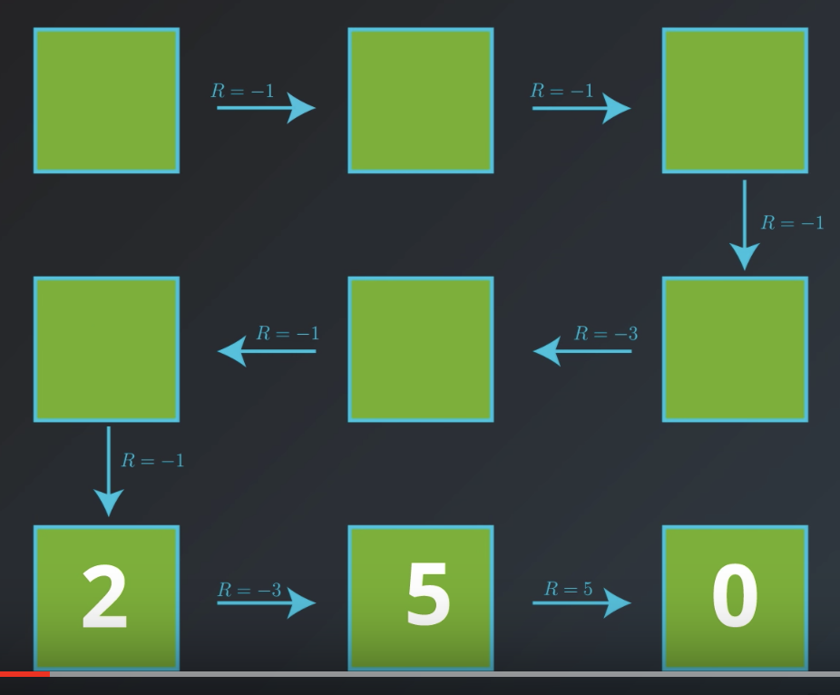

# Introduction
In previous lesson, we learned how to formulate a real world problem so it can be solved with RL. In this lesson, we'll begin to think about ways solve this problem. This lesson covers material in **Chapter 3** (especially 3.5-3.6) of the [textbook](http://go.udacity.com/rl-textbook).

# Policies
We've seen that we use a Markov decision process (MDP) as a formal definition of the problem that we'd like to solve with RL. Here, we specify a formal definition for the solution to this problem. 

We can start to **think of the solution as a series of actions that needs to be learned by the agent towards the pursuit of a goal**. For instance, in order to walk, the humanoid robot needs to learn the appropriate way to apply forces to its joint. But, as we've seen, the correct action changes with the situation. If a robot encounters a wall, the best series of actions will be different than if it had nothing blocking its path. Reward is always decided in the context of the state that it was decided in along with the state that follows. With this in mind, as long as the agent learns an appropriate action response to any environment state that it can observe, we have a solution to our problem.

This motivates the idea of a **policy**. The simplest kind of policy is a mapping from from the set of environment states to the set of possible actions: . If the agent wants to keep track of its strategy, all it needs to do is to specify this mapping. We call this kind of policy a **deterministic policy**. It takes an state as input and outputs an action.

**NOTE:** It's common to denote the policy with the Greek letter .

Another type of policy is a **stochastic policy**. The stochastic policy will allow the agent to choose actions randomly. We define stochastic policy as a mapping that accepts an environment state `S` and action `A` and returns the probability that the agent takes action `A` while in state `S`.

**Recycling robot example:** Let's re-examine the recycling robot example from previous lesson. The deterministic policy would specify something like whenever the battery is low, recharge it. And whenever the battery has a high amount of charge, search for cans. The stochastic policy does something more like whenever the battery is low, recharge it with 0.5 probability, wait where you are with 0.4 probability, and otherwise search for cans. Whenever the battery is high, search for cans with 0.9 probability, and otherwise wait for a can. 

It's important to note that any deterministic policy can be expressed using the same notation that we generally reserve for a stochastic policy. It's just that for the deterministic ones, we'd only have 1 or 0 values (no probabilities).

Now, the question is **what steps can we take to make sure that the agent's policy is the best one**.

See the video [here](https://youtu.be/hc3LrvaC13U).

# Gridworld Example
To understand how to go about searching for the best policy, it will help to have a running example. So, consider this very small world (picture below) and an agent who lives in it. Say, the world is primarily composed of nice patches of grass, but two out of the nine locations in the world have large mountains. Think of each of these nine possible locations in the world as states and the environment.

At each point in time, let's say the agent can only move up, down, left, or right, and can only take actions that lead it to not fall off the grid.

Let's also say that the goal of the agent is to get to the bottom right hand corner of the world as quickly as possible. Then, we'll think of this as an _episodic_ task where an episode finishes when the agent reaches the goal. So, we won't have to be worried about transitions away from the goal state. 

Furthermore, say that the agent receives a reward of negative one for most transitions. But, if an action leads it to encounter a mountain, it receives some reward of negative three. And it reaches the goal state, it gets the reward of five.

So, we can think of the reward signal as punishing the agent for every time step that it spends away from the goal. You can think of the mountains as having a special larger punishment because they take even longer to cross than the patches of grass. The reward structure encourages the agent to get to the goal as quickly as possible. And when it reaches the goal, it gets a reward of five, and the episode ends. 

# State-Value Functions
So, we're working with the grid example and looking for the best policy that leads us to a goal state as quickly as possible. 

Let's start with a very bad policy so that we understand why it's bad and then work to improve it. Specifically, we'll look at a policy where the agent visits every state in this very roundabout manner, and we can ignore the transition that the agent will never take under the policy.

Now, **why this policy is bad?**

Let's calculate the cumulative reward: it's -6 (we're not discounting, or discount rate = 1). 

Now, if the agent starts at the top middle, the cumulative reward would be: -5. Following the same path, eventually, if we it starts at the bottom middle, the cumulative reward is: 5.

It makes sense to think of the goal to think of goal state as resulting in the return of zero. After all, if the agent starts at the goal, the episode ends immediately and no reward is received.

In this case, no matter where the agent starts in the world, we have a way of keeping track of the return that follows. This way of analyzing this horrible policy will help us to improve it. 

Before discussing how to improve it, let's introduce a bit of notation.

You can think of this grid of numbers as a function of the environment state. For each state, it has a corresponding number, and we refer to this function as a **state-value function**. For each state, it yields the return that's likely to follow if the agent starts in the state and then follows the policy for all time steps. 

But, it's more common to see it equivalently expressed with a bit more notation. 

**The state-value function will always correspond to a particular policy**. So if we change the policy, we change the state-value function, and we typically denote the function with the lowercase "v" with the corresponding policy in the subscript.

# Bellman Equations
Again, let's start with our grid world example. Let's erase all the values except for the last row, nad let's see how we might work backwards to recalculate those values. Along the way, we'll discover that the value function has a nice **recursive** property. See this [video](https://youtu.be/UgIaDMvSdUo), from minute 2:30.

Bottom line, **we can calculate the value of any state, as the sum of the immediate reward plus the value of the state that follows**. 

What's important to note is that for simplicity, we set the discount rate to 1. But, in general we want to have a framework that takes discounting into account. So, **we'll need to use the discounted value of the state that follows**. 

We can express this idea in terms of what's known as the **Bellman Expectation Equation**, where for a general MDP, we have to calculate the **expected** sum.

The **expected** value is because, in general, with more complicated worlds, the immediate reward and next state cannot be known with certainty.

Again, the **main idea** here is that **we can express the value of any state in the MDP in terms of the immediate reward and the discounted value of the state that follows**.

# Optimality
By definition, we say a policy, , is better than or equal to a policy, , if its state-value function is greater than or equal to that policy  for **all** states.

There are a couple of important things to note about this definition. 

- If you take any two policies, it's not necessary the case that you're going to be able to decide which is better. In other words, they can't be compared. Having said that, **there will always be at least one policy that's better than or equal to all other policies**. We call this policy an **optimal policy**, and it's **guaranteed to exist**, but it **may not be unique**. 
- It's important to note that an optimal policy is what the agent is searching for. **It's the solution to the MDP and the best strategy to accomplish its goal**.
- Finally, all optimal policies have the same value function which we denote by . You might be wondering why it's not written . The answer is by convention, and probably because it just looks nicer this way!

Now, the next question is how to find the optimal policy. To answer to that, we need to define another type of value function: **action-value function**.

See the video [here](https://youtu.be/j231aRV74QM).

# Action-Value Function
So far we've been working with the state-value function for a policy. For each state , it yields the expected discounted return if the agent starts in state  and then uses the policy to choose its actions for all time steps. 

Here we define a new type of value function known as the **action-value function**. This value function is denoted with  instead of .

**While the state values are a function of the environment state, the action values are a function of the environment state and the agent's action**.

For each state  and action , the action value function yields the expected discounted return, , and ,if the agent starts in state , then chooses action  and then uses a policy to choose its actions for all future time steps. 

