# Review
Let's recall the problem at hand. We have an agent and environment. Time is broken into discrete time steps, and at every time step, the agent receives a reward and state from the environment, and chooses an action to perform in response. In this way, the interaction involved is a sequence of states, actions, and rewards. 

In this lesson, we'll confine our attention to episodic tasks where the interaction stops at some time step, , when the agent encounters a terminal state. We refer to the sequence as an **episode**. For any episode, the agent's goal is to find the optimal policy in order to maximize expected cumulative reward. The agent can only accomplish this by interacting with the environment. 

In this lesson, we'll dig deeply into a class of algorithms that help the agent to understand and leverage this interaction to obtain the optimal policy. 

See the video [here](https://youtu.be/3H5x0lstvmo).

## Review Your Notes
----------
In the lesson  **The RL Framework: The Problem**, you learned how to take a real-world problem and specify it in the language of reinforcement learning. In order to rigorously define a reinforcement learning task, we generally use a  **Markov Decision Process (MDP)**  to model the environment. The MDP specifies the rules that the environment uses to respond to the agent's actions, including how much reward to give to the agent in response to its behavior. The agent's goal is to learn how to play by the rules of the environment, in order to maximize reward.

<p align="center">

</p>

Next, in the lesson **The RL Framework: The Solution**, you learned how to specify a solution to the reinforcement learning problem. In particular, the **optimal policy**  specifies - for each environment state - how the agent should select an action towards its goal of maximizing reward. You learned that the agent could structure its search for an optimal policy by first estimating the **optimal action-value function** ; then, once  is known,  is quickly obtained.

<p align="center">

</p>

Before continuing with this lesson, please take the time to review your notes, to ensure that the terminology from the previous two lessons is familiar to you. In particular, you should peruse the summary page at the end of the lesson **The RL Framework: The Problem**, and the page at the end of **The RL Framework: The Solution** to ensure that the listed concepts are familiar.

# Gridworld Example
To illustrate the algorithms we'll discuss in this lesson, it'll help if we work with a simple RL task. Say, we have an agent in a world with only four possible states (stone (1), brick (2), wood (3), grass (4)). Say, that at the beginning of an episode, the agent always starts in state (1) and its goal is to reach state (4), which is a terminal state. To add a bit of difficulty, we add a wall separating state (1) from (4). At each time step, the agent can move up, down, left, or right. Let's also say that there is some uncertainty with the movement. Say if the agent decides to move in some direction, it moves in that direction with some _probability_, and ends up in other directions with some other probabilities. And if an agent runs into a wall, it just ends up in the same state where it started. The agent gets the reward of -1 for most of the states, but it lands in state (4), it'll get a reward a of 10. This is to ensure that the goal of the agent is to get to the terminal state as quickly as possible. For simplicity, let's say that the discount rate is 1 (so, basically no discount).   

<p align="center">
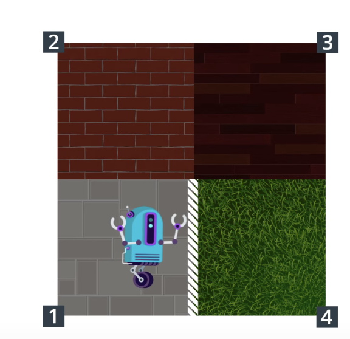
</p>

See the video [here](https://youtu.be/Lwibg_IfmrA).

# Monte Carlo Methods
So, following the gridworld example, **how should the agent begin if it initially knows nothing about the environment?**

Probably, the most sensible thing for the agent to do at the beginning when it doesn't know anything is just to behave *randomly* and see what happens.

Let's say when the agent enconuters a new state, it just selects either of four directions with equal probability. _When the agent randomly selects an action in this way, where each action has an equal chance of being selected, we say that it's following the **equiprobable random policy**_.

When the agent starts moving randomly and after some episodes, it has collected some information which is valuable. **How can the agent use it to improve its strategy?**

Remember what we were searching for: **the optimal policy** . It tells us for each state which action or actions are most useful towards the goal of maximizing return. So, the question is very simple: **from each state which action is best?** 

Maybe, it makes sense to just pick the action that got the most reward in these episodes that it collected so far. For instance, if in one episode, first action was "up" the final score end up +7, and if "right" the score ends up being +6, then action "up" might be better than action "right" when it's in state one. _This is a useful first step for thinking about how we might be able to estimate the optimal policy from interacting with the environment_. 

It should be noted that to infer any reliable policy, we need to collect hundreds or thousands of episodes for instance. **In fact, this is a fundamental idea behind Monte Carlo methids in general**. Even though the underlying problem involves a great degree of randomness, we can infer information that we can trust, just by collecting a lot of samples. 

See the video [here](https://youtu.be/titaMCRl224).

# MC Prediction, Part 1
Following the gridworld example from previous section, we assumed that the agent used the equiprobable random policy to interact with the environment. The agent collected two episodes, and now the question is: **how exactly should the agent consolidate this information towards its goal of obtaining the optimal policy?**

The real question that we want to ask is: **For each state, which action is the best?**

See the explanation in [this video](https://youtu.be/6ts9gdIS6vg).

<p align="center">
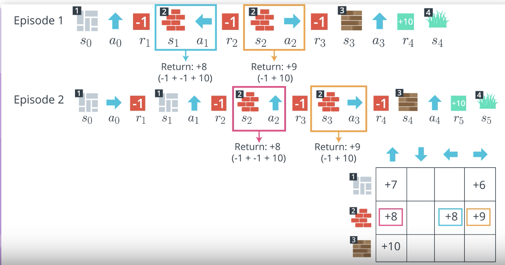
</p>

**NOTE:** In summary, the idea is that you'd create a matrix of states vs. actions and fill out the cells based on the score you get choosing the action in a state (if there's more than one instance, just take the average). With limited episodes of this example, it wouldn't give the optimal policy, but it's better than random.

<p align="center">
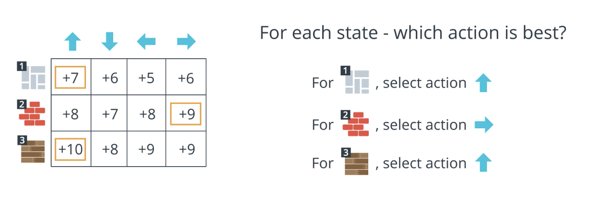
</p>

<p align="center">
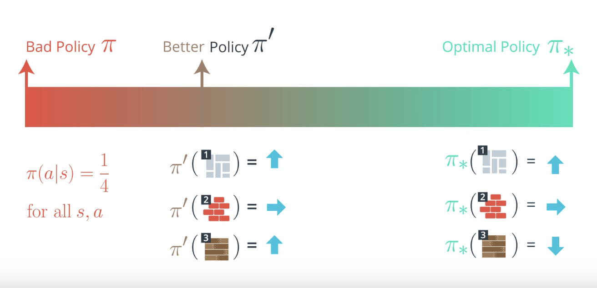
</p>

## Important Note
----------
In this video, we demonstrated a toy example where the agent collected two episodes, consolidated the information in a table, and then used the table to come up with a better policy. However, as discussed in the previous video, in real-world settings (_and even for the toy example depicted here!_), the agent will want to collect many more episodes, so that it can better trust the information stored in the table. In this video, we use two episodes only to simplify the example.

# MC Prediction, Part 2
So far, we've informally discussed how we might take a bad policy like the equiprobable random policy, use it to collect some episodes and then use those episodes to come up with a better policy. 

Central to this idea, we build a table that stores the return obtained from visiting each state action pair and then this table can be used to obtain a policy that's better than the one we started with.

In practice, this table is an estimate for how much return is likely to follow if the agent starts in a state, selects an action and then the policy to select all future actions. 

See the full explanation in [this video](https://youtu.be/jR49ZyKuJ98).

# MC Prediction, Part 3
So far in this lesson, we have discussed how the agent can take a bad policy, like the equiprobable random policy, use it to collect some episodes, and then consolidate the results to arrive at a better policy.

In the video in the previous concept, you saw that estimating the action-value function with a **Q-table** is an important intermediate step. We also refer to this as the  **prediction problem**.

> **Prediction Problem**: Given a policy, how might the agent estimate the value function for that policy?

We've been specifically interested in the action-value function, but the  **prediction problem**  also refers to approaches that can be used to estimate the state-value function. We refer to Monte Carlo (MC) approaches to the prediction problem as  **MC prediction methods**.

## Pseudocode
----------
As you have learned in the videos, in the algorithm for MC prediction, we begin by collecting many episodes with the policy. Then, we note that each entry in the Q-table corresponds to a particular state and action. To populate an entry, we use the return that followed when the agent was in that state, and chose the action. In the event that the agent has selected the same action many times from the same state, we need only average the returns.

Before we dig into the pseudocode, we note that there are two different versions of MC prediction, depending on how you decide to treat the special case where -  _in a single episode_  - the same action is selected from the same state many times. For more information, watch the [video below](https://youtu.be/9LP6uXdmWxQ).

---> from the video

Before dive into the pseudo code, there's a special case we have to discuss. **What if, in the same episode, we select the same action from a state multiple times?**

For instance, say that at time step 2, we select action "down" from state 3, and say we do the same thing at time step 99. If we count from the first time, then get a return of -87, and if we count from the last time, then we get a return of 10. _When this happens, we have two options and that gives us two different algorithms_. 

We can as a first option, take the average of both time steps on making the table. So, in this case, we'd get a value of -38.5.

Another option that will work well is to just use the first time we tried out the state action combination. In this case, we'd get a value of -87.

We refer to the first option as in **every-visit Monte Carlo method**, and we refer to the second option as **first-visit Monte Carlo method**. 

We define every occurence of a state-action pair in an episode as a **visit** to that state-action pair. _Every-visit MC prediction_ averages the return following every visit to a state-action pair. _First-visit MC prediction_ considers only first visits to the state-action pair and averages those returns. 

These algorithms do yield different behavior, and you can read more about those differences below. 

</--->

As discussed in the video, we define every occurrence of a state in an episode as a  **visit**  to that state-action pair. And, in the event that a state-action pair is visited more than once in an episode, we have two options.

#### Option 1: Every-visit MC Prediction

Average the returns following all visits to each state-action pair, in all episodes.

#### Option 2: First-visit MC Prediction

For each episode, we only consider the first visit to the state-action pair. The pseudocode for this option can be found below.

<p align="center">
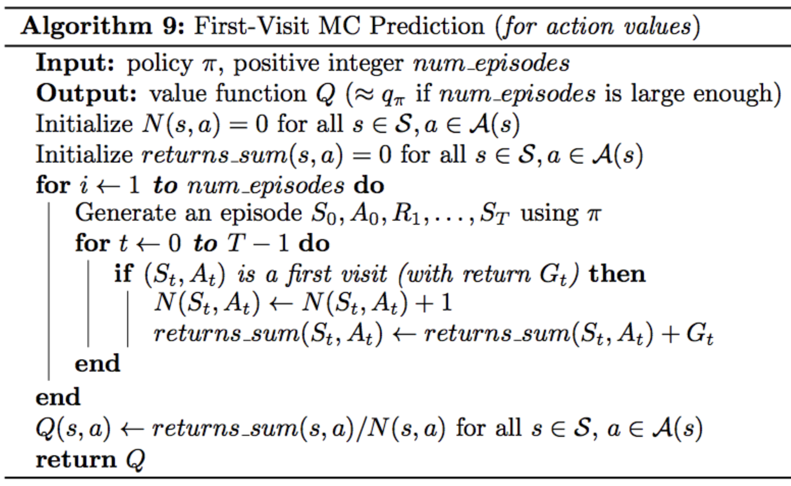
</p>

<p align="center">
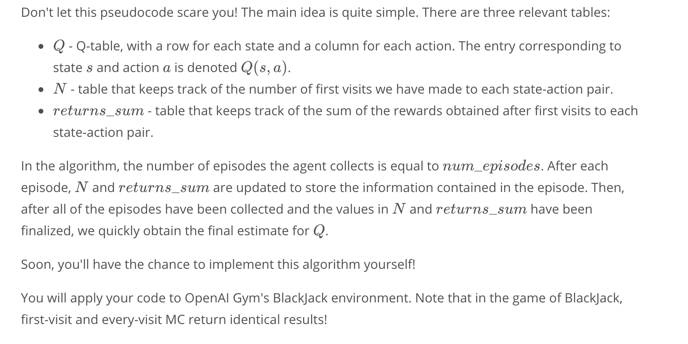
</p>

## First-visit or Every-visit?
----------
Both the first-visit and every-visit method are  **guaranteed to converge**  to the true action-value function, as the number of visits to each state-action pair approaches infinity. (_So, in other words, as long as the agent gets enough experience with each state-action pair, the value function estimate will be pretty close to the true value._) In the case of first-visit MC, convergence follows from the  [Law of Large Numbers](https://en.wikipedia.org/wiki/Law_of_large_numbers), and the details are covered in section 5.1 of the  [textbook](http://go.udacity.com/rl-textbook).

If you are interested in learning more about the difference between first-visit and every-visit MC methods, you are encouraged to read Section 3 of  [this paper](http://www-anw.cs.umass.edu/legacy/pubs/1995_96/singh_s_ML96.pdf). The results are summarized in Section 3.6. The authors show:

-   Every-visit MC is  [biased](https://en.wikipedia.org/wiki/Bias_of_an_estimator), whereas first-visit MC is unbiased (see Theorems 6 and 7).
-   Initially, every-visit MC has lower  [mean squared error (MSE)](https://en.wikipedia.org/wiki/Mean_squared_error), but as more episodes are collected, first-visit MC attains better MSE (see Corollary 9a and 10a, and Figure 4).

# OpenAI Gym: BlackJackEnv

In order to master the algorithms discussed in this lesson, you will write code to teach an agent to play Blackjack.

<p align="center">

</p>

Please read about the game of Blackjack in Example 5.1 of the  [textbook](http://go.udacity.com/rl-textbook).

When you have finished, please review the corresponding  [GitHub file](https://github.com/openai/gym/blob/master/gym/envs/toy_text/blackjack.py), by reading the commented block in the BlackjackEnv class. (_While you do  **not**  need to understand how all of the code works, please read the commented block that explains the dynamics of the environment._) For clarity, we have also pasted the description of the environment below:

```
    """Simple blackjack environment

    Blackjack is a card game where the goal is to obtain cards that sum to as
    near as possible to 21 without going over.  They're playing against a fixed
    dealer.
    Face cards (Jack, Queen, King) have point value 10.
    Aces can either count as 11 or 1, and it's called 'usable' at 11.
    This game is placed with an infinite deck (or with replacement).
    The game starts with each (player and dealer) having one face up and one
    face down card.

    The player can request additional cards (hit=1) until they decide to stop
    (stick=0) or exceed 21 (bust).

    After the player sticks, the dealer reveals their facedown card, and draws
    until their sum is 17 or greater.  If the dealer goes bust the player wins.

    If neither player nor dealer busts, the outcome (win, lose, draw) is
    decided by whose sum is closer to 21.  The reward for winning is +1,
    drawing is 0, and losing is -1.

    The observation of a 3-tuple of: the players current sum,
    the dealer's one showing card (1-10 where 1 is ace),
    and whether or not the player holds a usable ace (0 or 1).

    This environment corresponds to the version of the blackjack problem
    described in Example 5.1 in Reinforcement Learning: An Introduction
    by Sutton and Barto (1998).
    http://incompleteideas.net/sutton/book/the-book.html
    """
```

```python
import gym
from gym import spaces
from gym.utils import seeding

def cmp(a, b):
    return float(a > b) - float(a < b)

# 1 = Ace, 2-10 = Number cards, Jack/Queen/King = 10
deck = [1, 2, 3, 4, 5, 6, 7, 8, 9, 10, 10, 10, 10]


def draw_card(np_random):
    return int(np_random.choice(deck))


def draw_hand(np_random):
    return [draw_card(np_random), draw_card(np_random)]


def usable_ace(hand):  # Does this hand have a usable ace?
    return 1 in hand and sum(hand) + 10 <= 21


def sum_hand(hand):  # Return current hand total
    if usable_ace(hand):
        return sum(hand) + 10
    return sum(hand)


def is_bust(hand):  # Is this hand a bust?
    return sum_hand(hand) > 21


def score(hand):  # What is the score of this hand (0 if bust)
    return 0 if is_bust(hand) else sum_hand(hand)


def is_natural(hand):  # Is this hand a natural blackjack?
    return sorted(hand) == [1, 10]


class BlackjackEnv(gym.Env):
    """Simple blackjack environment
    Blackjack is a card game where the goal is to obtain cards that sum to as
    near as possible to 21 without going over.  They're playing against a fixed
    dealer.
    Face cards (Jack, Queen, King) have point value 10.
    Aces can either count as 11 or 1, and it's called 'usable' at 11.
    This game is placed with an infinite deck (or with replacement).
    The game starts with each (player and dealer) having one face up and one
    face down card.
    The player can request additional cards (hit=1) until they decide to stop
    (stick=0) or exceed 21 (bust).
    After the player sticks, the dealer reveals their facedown card, and draws
    until their sum is 17 or greater.  If the dealer goes bust the player wins.
    If neither player nor dealer busts, the outcome (win, lose, draw) is
    decided by whose sum is closer to 21.  The reward for winning is +1,
    drawing is 0, and losing is -1.
    The observation of a 3-tuple of: the players current sum,
    the dealer's one showing card (1-10 where 1 is ace),
    and whether or not the player holds a usable ace (0 or 1).
    This environment corresponds to the version of the blackjack problem
    described in Example 5.1 in Reinforcement Learning: An Introduction
    by Sutton and Barto.
    http://incompleteideas.net/book/the-book-2nd.html
    """
    def __init__(self, natural=False):
        self.action_space = spaces.Discrete(2)
        self.observation_space = spaces.Tuple((
            spaces.Discrete(32),
            spaces.Discrete(11),
            spaces.Discrete(2)))
        self.seed()

        # Flag to payout 1.5 on a "natural" blackjack win, like casino rules
        # Ref: http://www.bicyclecards.com/how-to-play/blackjack/
        self.natural = natural
        # Start the first game
        self.reset()

    def seed(self, seed=None):
        self.np_random, seed = seeding.np_random(seed)
        return [seed]

    def step(self, action):
        assert self.action_space.contains(action)
        if action:  # hit: add a card to players hand and return
            self.player.append(draw_card(self.np_random))
            if is_bust(self.player):
                done = True
                reward = -1
            else:
                done = False
                reward = 0
        else:  # stick: play out the dealers hand, and score
            done = True
            while sum_hand(self.dealer) < 17:
                self.dealer.append(draw_card(self.np_random))
            reward = cmp(score(self.player), score(self.dealer))
            if self.natural and is_natural(self.player) and reward == 1:
                reward = 1.5
        return self._get_obs(), reward, done, {}

    def _get_obs(self):
        return (sum_hand(self.player), self.dealer[0], usable_ace(self.player))

    def reset(self):
        self.dealer = draw_hand(self.np_random)
        self.player = draw_hand(self.np_random)
        return self._get_obs()
```

Refer to [this notebook](codes/Monte_Carlo_Solution.ipynb) for an implementation.

# Coding Exercise
Please use the next concept to complete the following sections of  `Monte_Carlo.ipynb`:

- Part 0: Explore BlackjackEnv
- Part 1: MC Prediction

To reference the pseudocode while working on the notebook, you are encouraged to look at  [this sheet](https://github.com/udacity/deep-reinforcement-learning/blob/master/cheatsheet/cheatsheet.pdf).

## Important Note
----------
Please do  **_not_**  complete the entire notebook in the next concept - you should only complete  **Part 0**  and  **Part 1**. The final part of the notebook will be addressed later in the lesson.

## Download the Exercise
----------
If you would prefer to work on your own machine, you can download the exercise from the  [DRLND GitHub repository](https://github.com/udacity/deep-reinforcement-learning).

## Check Your Implementation
----------
Once you have completed the exercise, you can check your solution by looking at the corresponding sections in  `Monte_Carlo_Solution.ipynb`. Watch the video below to see a solution walkthrough!

Note that the Jupyter interface will look slightly different, since at one point we experimented with  [JupyterLab](http://jupyterlab.readthedocs.io/en/stable/). However, all of the Python code is the same as you see in [the videos](https://youtu.be/Pwiqk7Pncgc)!

# Greedy Policies
So far, you learned how an agent can take a policy like the _**equiprobable random policy**_, use that to interact with the environment, and then use that experience to populate the corresponding Q-table, and this Q-table is an estimate of that policy's action-value function. 

**So, now the question is how can we use this in our search for an optimal policy?** 

Well, we've already seen that to get a better policy, that's not necessarily (and probably) **not the optimal one**. We need only select for each state the action that maximizes the Q-table. Let's call that new policy . 

**What if we replaced our old policy with this new policy and then estimated its value function and then use that new value function to get a better policy and then continued alternating between these two steps over and over until we got successively better and better policies in the hope that we converge to the optimal policy?**

It turns out that unfortunately, this won't work as it stands now! 

_But we have almost all the tools to make work! There's really just one thing that we have to fix._

When we take a Q-table and use the action that maximizes each row to come up with the policy, we say that we are constructing the policy that's greedy with respect to the Q-table, and that has some special notation: .

We'll plug this in to the loop we started with where the only thing that's changed is the notation is a bit fancier. We still begin with a starting policy, estimated its value function, then get a new policy that's greedy with respect to the value function. So, then we have a new policy and so on.

Again, this proposed algorithm is so close to giving us the optimal policy, as long as we run it for long enough. 

But to fix it, we'll need to slightly modify the step or reconstruct the greedy policy. 

See the video [here](https://youtu.be/DH6c-aODMLU).

# Epsilon-Greedy Policies
So, in general, when the agent is interacting with the environment and still trying to figure out what works and what doesn't in its quest to collect as much reward as possible, creating policies are quite dangerous. See why in [this video](https://youtu.be/PxJMtlR06MY) (from 00:15 second).

**Bottom line:** The problem with the greedy policy is that you may end up not exploring some state-actions at all, which may have yield better returns. So, instead of constructing a greedy policy, **a better policy would be _stochastic_ one** (picking actions with probabilities).

Stochastic policy is still pretty close to the greedy policy so we're still acting pretty optimally, but there's the added value that if we continue to explore other options with some small probability, we might end up with higher return.

Instead of always constructing greedy policy that always selects the greedy action, we construct a so-called **Epsilon-Greedy Policy** that's _most likely_ to pick the greedy action, but with some _small but non-zero_ probability, picks one of the other actions instead. 

In this case, you will set some small positive number, , which **must** be between [0,1]. Then, with probability  the agent selects the greedy action and with probability  it selects any action randomly. So, the larger it is the more likely you are to pick one of non-greedy actions. 

So, as long as  is set to a small number, we have a method for constructing a policy that's really close to the greedy policy, but with the added benefit that it doesn't prevent the agent from continuing to explore the range of possibilities. 

<p align="center">
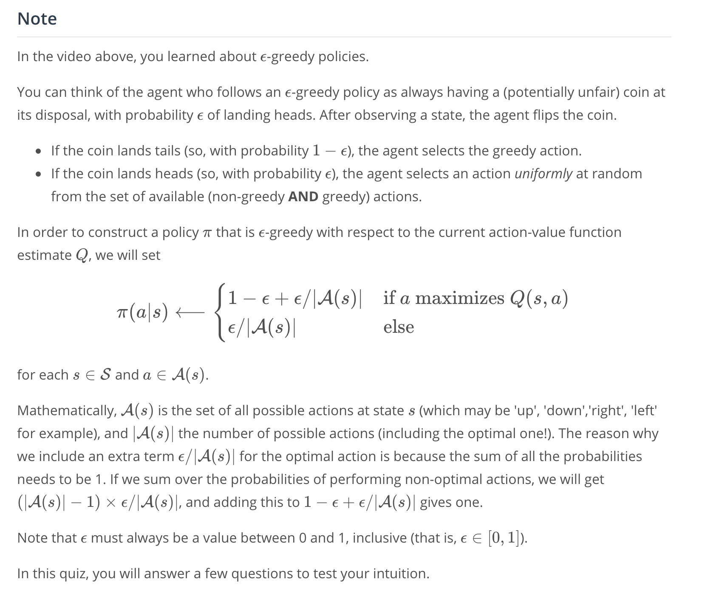
</p>

# MC Control
<p align="center">

</p>

<p align="center">
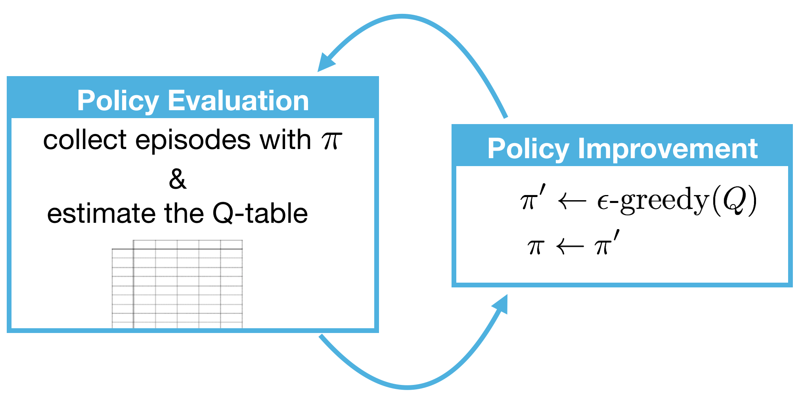
</p>

<p align="center">

</p>

# Exploration vs Exploitation
## Solving Environments in OpenAI Gym
In many cases, we would like our reinforcement learning (RL) agents to learn to maximize reward as quickly as possible. This can be seen in many OpenAI Gym environments.

For instance, the  [FrozenLake-v0](https://gym.openai.com/envs/FrozenLake-v0/)  environment is considered solved once the agent attains an average reward of 0.78 over 100 consecutive trials.

<p align="center">
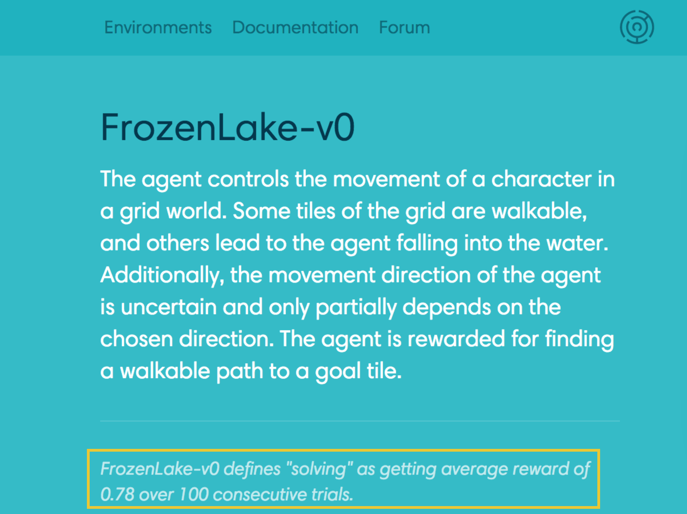
</p>

Algorithmic solutions to the [FrozenLake-v0](https://gym.openai.com/envs/FrozenLake-v0/) environment are ranked according to the number of episodes needed to find the solution.

<p align="center">
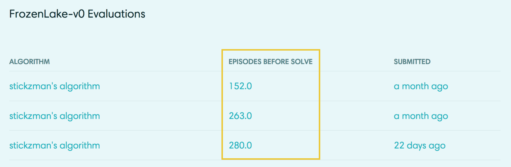
</p>

Solutions to [Taxi-v1](https://gym.openai.com/envs/Taxi-v1/), [Cartpole-v1](https://gym.openai.com/envs/CartPole-v1/), and [MountainCar-v0](https://gym.openai.com/envs/MountainCar-v0/) (along with many others) are also ranked according to the number of episodes before the solution is found. Towards this objective, it makes sense to design an algorithm that learns the optimal policy  as quickly as possible.

## Exploration-Exploitation Dilemma
----------
Recall that the environment's dynamics are initially unknown to the agent. Towards maximizing return, the agent must learn about the environment through interaction.

At every time step, when the agent selects an action, it bases its decision on past experience with the environment. And, towards minimizing the number of episodes needed to solve environments in OpenAI Gym, our first instinct could be to devise a strategy where the agent always selects the action that it believes (_based on its past experience_) will maximize return. With this in mind, the agent could follow the policy that is greedy with respect to the action-value function estimate. We examined this approach in a previous video and saw that it can easily lead to convergence to a sub-optimal policy.

To see why this is the case, note that in early episodes, the agent's knowledge is quite limited (and potentially flawed). So, it is highly likely that actions _estimated_ to be non-greedy by the agent are in fact better than the _estimated_ greedy action.

With this in mind, a successful RL agent cannot act greedily at every time step (_that is_, it cannot always **exploit** its knowledge); instead, in order to discover the optimal policy, it has to continue to refine the estimated return for all state-action pairs (_in other words_, it has to continue to  **explore**  the range of possibilities by visiting every state-action pair). That said, the agent should always act _somewhat greedily_, towards its goal of maximizing return _as quickly as possible_. This motivated the idea of an ϵ-greedy policy.

We refer to the need to balance these two competing requirements as the  **Exploration-Exploitation Dilemma**. One potential solution to this dilemma is implemented by gradually modifying the value of `ϵ` when constructing ϵ-greedy policies.

## Setting the Value of ϵ, in Theory
It makes sense for the agent to begin its interaction with the environment by favoring  **exploration** over **exploitation**. After all, when the agent knows relatively little about the environment's dynamics, it should distrust its limited knowledge and  **explore**, or try out various strategies for maximizing return. With this in mind, the best starting policy is the equiprobable random policy, as it is equally likely to explore all possible actions from each state. You discovered in the previous quiz that setting `ϵ=1` yields an ϵ-greedy policy that is equivalent to the equiprobable random policy.

At later time steps, it makes sense to favor **exploitation** over **exploration**, where the policy gradually becomes more greedy with respect to the action-value function estimate. After all, the more the agent interacts with the environment, the more it can trust its estimated action-value function. You discovered in the previous quiz that setting  `ϵ=0`  yields the greedy policy (or, the policy that most favors exploitation over exploration).

Thankfully, this strategy (of initially favoring exploration over exploitation, and then gradually preferring exploitation over exploration) can be demonstrated to be optimal.

<p align="center">
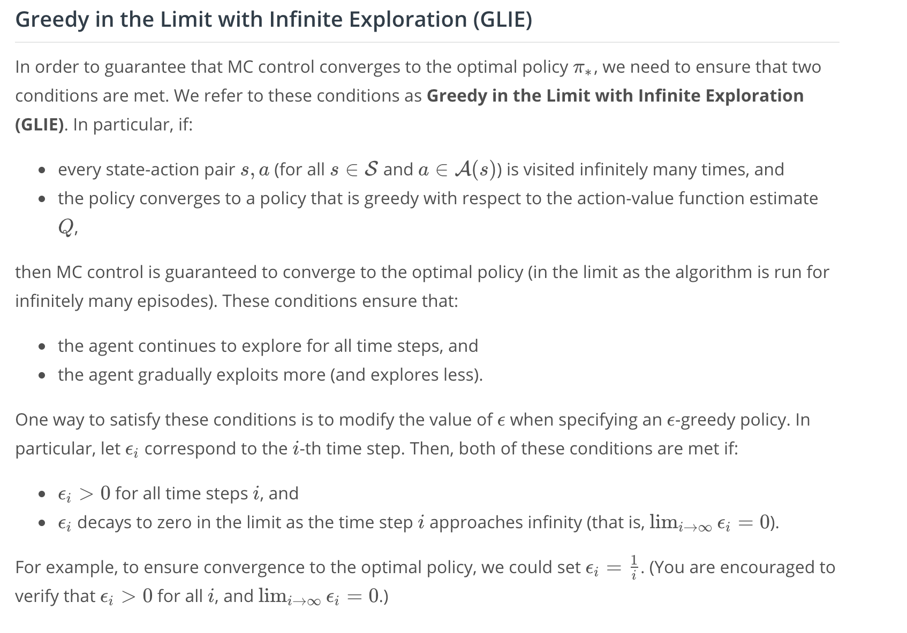
</p>

## Setting the Value of ϵ, in Practice
As you read in the above section, in order to guarantee convergence, we must let  `ϵ_i`​  decay in accordance with the GLIE conditions. But sometimes "guaranteed convergence" _isn't good enough_ in practice, since this really doesn't tell you how long you have to wait! It is possible that you could need trillions of episodes to recover the optimal policy, for instance, and the "guaranteed convergence" would still be accurate!

> Even though convergence is  **not**  guaranteed by the mathematics, you can often get better results by either:
> 
> -   using fixed **`ϵ`**, or
> -   letting **`ϵ_i`​**  decay to a small positive number, like 0.1.

This is because one has to be very careful with setting the decay rate for `ϵ`; letting it get too small too fast can be disastrous. If you get late in training and `ϵ` is really small, you pretty much want the agent to have already converged to the optimal policy, as it will take way too long otherwise for it to test out new actions!

As a famous example in practice, you can read more about how the value of `ϵ`  was set in the famous DQN algorithm by reading the Methods section of [the research paper](https://storage.googleapis.com/deepmind-media/dqn/DQNNaturePaper.pdf):

> _The behavior policy during training was epsilon-greedy with epsilon annealed linearly from 1.0 to 0.1 over the first million frames, and fixed at 0.1 thereafter._

When you implement your own algorithm for MC control later in this lesson, you are strongly encouraged to experiment with setting the value of `ϵ` to build your intuition.

# Incremental Mean
In our current algorithm for Monte Carlo control, we collect a large number of episodes to build the Q-table (as an estimate for the action-value function corresponding to the agent's current policy). Then, after the values in the Q-table have converged, we use the table to come up with an improved policy.

Maybe it would be more efficient to update the Q-table  **_after every episode_**. Then, the updated Q-table could be used to improve the policy. That new policy could then be used to generate the next episode, and so on.

<p align="center">
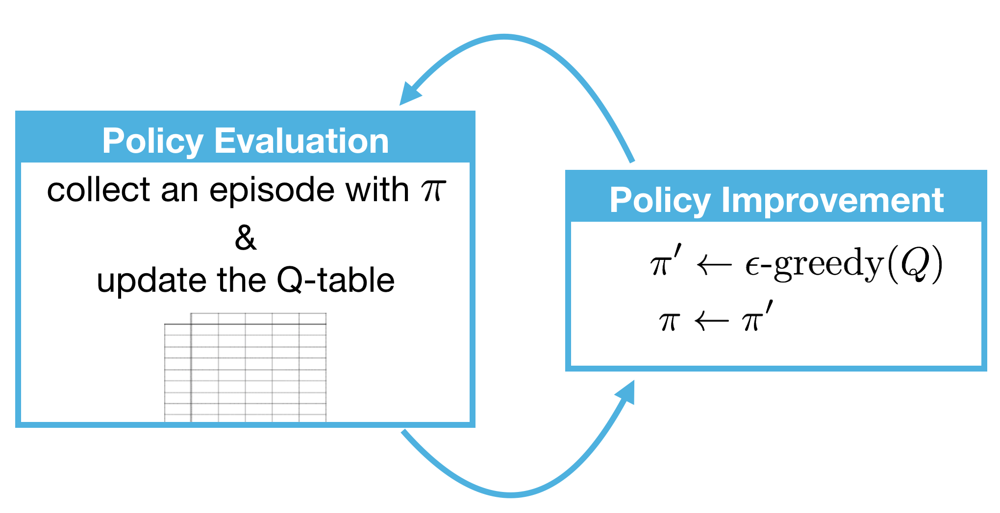
</p>

_So, how might we modify our code to accomplish this? Watch the [video](https://youtu.be/h-8MB7V1LiE) below to see!_

In this case, even though we're updating the policy before the values in the Q-table accurately approximate the action-value function, this lower-quality estimate nevertheless still has enough information to help us propose successively better policies. If you're curious to learn more, you can read section 5.6 of [the textbook](https://s3-us-west-1.amazonaws.com/udacity-dlnfd/suttonbookdraft2018jan1.pdf).

## Pseudocode
The pseudocode can be found below.

<p align="center">

</p>

<p align="center">

</p>

# Constant-alpha
In the [video below](https://youtu.be/QFV1nI9Zpoo), you will learn about another improvement that you can make to your Monte Carlo control algorithm.

---> video transcript here

Currently, your update step for **Policy Evaluation** looks a bit like this:

<p align="center">
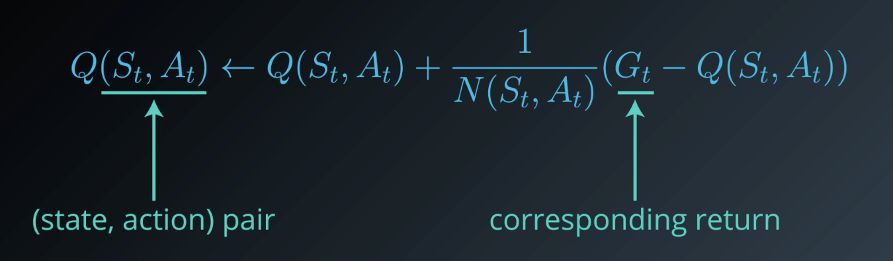
</p>

You generate an episode, then for each state-action pair that was visited, you calculate the corresponding return that follows. Then, you use that return to get an updated estimate. 

_We're going to look at this update step a bit closer with the aim of improving it._

You can think of as first calculating the difference between the most recently sampled return, and the corresponding value of the state-action pair (last term from the right). We denote that by , you can think of it as an **error term**. 

After all, it's the difference between what we expect the return to be, and what the return actually was.

<p align="center">
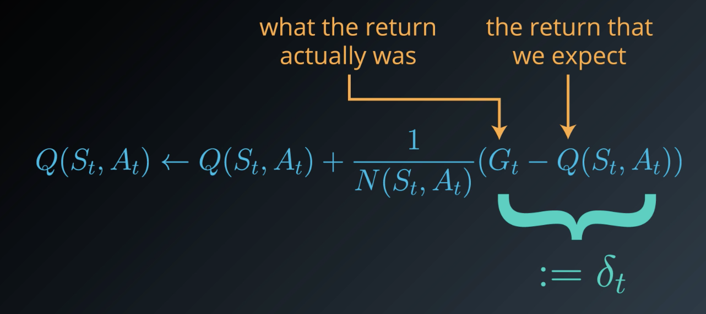
</p>

In this case that this error is positive, that means that the return that we received is more than what the value function expected. In this case, the action value is too low, so we use this update step to increase the estimate. 

On the other hand, if the error is negative, then that means that the return is higher than what the actual value function expected. So, it makes sense to take into account this new evidence, and decrease the estimate and the actual value function.

<p align="center">
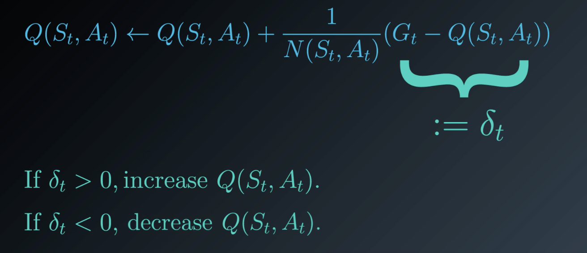
</p>

**And exactly how much do we increase or decrease the function?**

Currently, the algorithm decreases it by an amount inversely proportional to the number of times that we've visited the state-action pair already, . 

So, the first few times we visit the pair, the change is likely to be quite large. But at future time points, where the denominator of this fraction gets quite big, the changes get smaller and smaller. The reason this is the case is that we're just calculating the average effect and as we do average more and more (say 999 times) the effect of one more would change the average less than initially (say 10 times).

So, with this in mind, we change the algorithm to instead use a **constant step size** which we denote by  here. This ensures that returns that come later are more emphasized that those that arrived earlier. 

In this way, **the agent will mostly trust the most recent returns, and gradually forget about those that came in the past.**

This is quite important because the policy is constantly changing, and with every step becoming more optimal. So, in fact, later time steps are quite important to estimating the action values. 

<p align="center">

</p>

## Pseudocode
The pseudocode for constant-\alphaα GLIE MC Control can be found below.

<p align="center">

</p>

<p align="center">
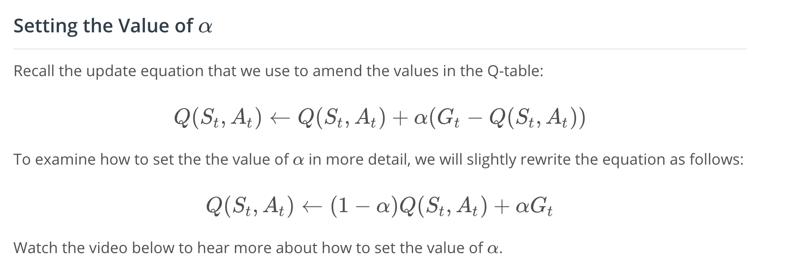
</p>

To understand how to set the value of , let's look at closely at the updated equation. 

Note that  must be set to a number between [0,1]. When it's set to 1, the new estimate is just the most recent return, where we completely ignore and replace the value in the queue table. 

If we were to set  to 0, we'd completely ignore the return and keep the old estimate unchanged. In this case, our agent would never learn.

It'd prove useful to set alpha to a small number that's close to 0. In general, the smaller the  is, the less we trust the most recent return when performing an update, and the more we rely on our existing estimate in the queue table. See the video [here](https://youtu.be/LetHoOtNdJc).

<p align="center">
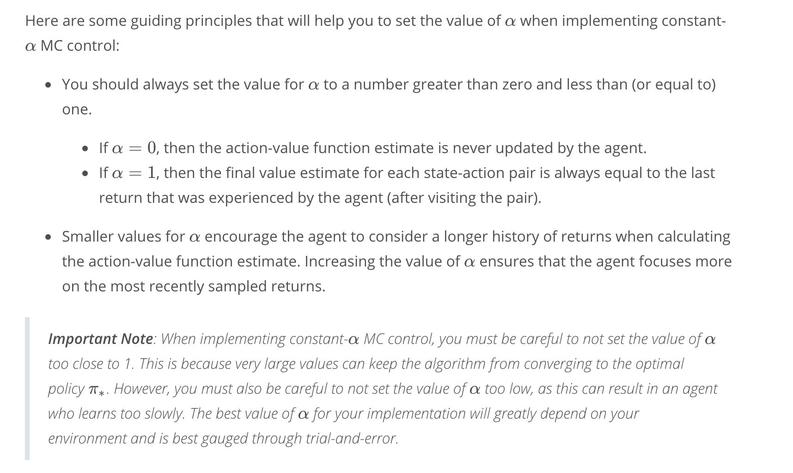
</p>


