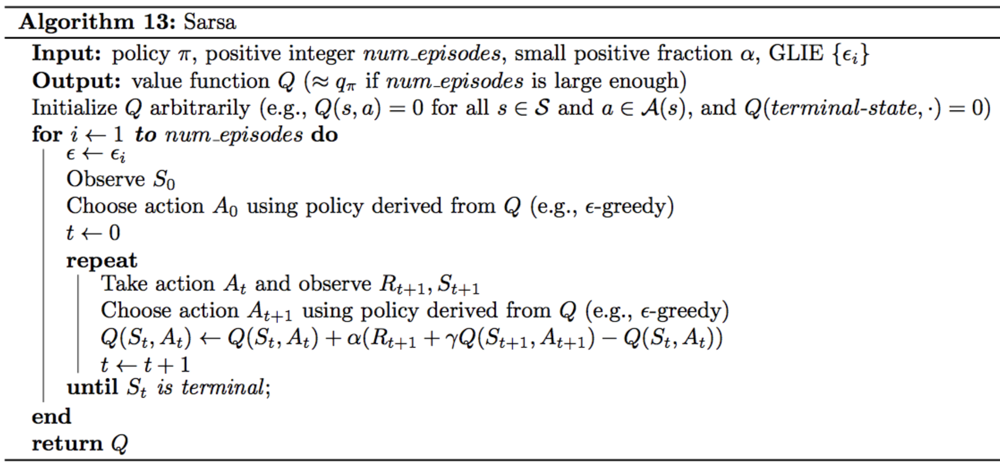

# Introduction
In this lesson, you'll learn about **Temporal Difference** or **TD Learning**. In order to understand TD learning, it'll help to discuss what exactly it would mean to solve this problem of learning from interaction. The solution will come many years into the future, when we've developed artificially intelligent agents that interact with the world much like the way humans do.

In order to accomplish this, the agents would need to learn from the kind of online streaming data that we learn from everyday. Real life is far from an episodic task and it requires its agents to constantly make decisions all day everyday. We get no break with our interaction with the world. 

Remember that Monte Carlo learning needed those breaks, it needed the episode to end so that the return could be calculated, and then used as an estimate for the action values. 

So, we'll need to come up with something else if we want to deal with more realistic learning in a real world setting. So, the _**main idea**_ is this: **if an agent is playing chess, instead of waiting until the end of an episode to see if it's won the game or not, it will at every move be able to _estimate the probability_ that it's winning the game, or a self-driving car at every turn will be able to estimate if it's likely to crash, and if necessary amend its strategy to avoid disaster.** To emphasize, the Monte Carlo approach would have this car crash every time it wants to learn anything, and this is too expensive and also quite dangerous.

**TD learning** will solve these problems. Instead of waiting to update values when the interaction ends, it will amend its predictions at every step, and you'll be able to use it to solve both continuous and episodic tasks. It's also widely used in RL and lies at the heart of many state-of-the-art algorithms that you see in the news today. 

See the video [here](https://youtu.be/yXErXQulI_o).

This lesson covers material in **Chapter 6** (especially 6.1-6.6) of the [textbook](http://go.udacity.com/rl-textbook).

# Review: MC Control Methods
In the previous lesson, you learned about the  **control problem**  in reinforcement learning and implemented some Monte Carlo (MC) control methods.

> **Control Problem**: Estimate the optimal policy.

In this lesson, you will learn several techniques for Temporal-Difference (TD) control.

## Review
Before continuing, please review  **Constant-alpha MC Control**  from the previous lesson.

Remember that the constant-\alphaα  MC control algorithm alternates between  **policy evaluation**  and  **policy improvement**  steps to recover the optimal policy . 

# TD Control: Sarsa
Monte Carlo (MC) control methods require us to complete an entire episode of interaction before updating the Q-table. Temporal Difference (TD) methods will instead update the Q-table after every time step.

Let's consider the gridworld example again. We'll discuss an algorithm that doesn't need us to complete an entire episode before updating the Q-table. Instead, we'll update the Q-table at the same time as the episode is unfolding. In particular, we'll only need this very small time window of information (figure below) to do an update.

The current estimate for the value of selecting action "right" in state (1) is +6 (pulled from Q-Table). **So, what about the alternative estimate?**

In the Monte Carlo case, we wainted until the end of the episode, and added up all the rewards that we got along the way.

But, if we're working with just the small time window, we don't have access to what happens at those later time steps. So, **how might we form an alternative estimate with this limited information?**

Here is an idea,

After we got the reward of -1, we ended up in state (2) and selected action "right". Our Q-Table already has an estimate for the return that's likely to follow from that point onward. It's just the estimated action-value for state (2) and action "right". So, our alternative estimate can just be `-1+8=7`, which is the value of next state-action pair. 

Then, like the Monte Carlo case, we can use this alternative estimate to update the Q-Table by just moving the of "+6" a little bit closer to "+7". So, let's say that we move this value to "6.2". 

Then, at the next time step, we repeat the same process where we update the entry in the Q-Table for state (2) and action "right" by just using the alternative estimate. **The alternative estimate is just the reward we received plus the currently estimated value of the next state-action pair.** So, in this case we'll move the value of "8" a little bit closer to "9" which will yield a new value like "8.2".

See the video [here](https://youtu.be/HYV0SP9wm7g).

## Sarsa or Sarsa(0)
We began this lesson by reviewing Monte Carlo Control. This was the corresponding **update equation**:

In order to use it we sample a complete episode. Then, we look up the current estimate in the Q-Table and compare it to the return that we actually experienced after visiting the state-action pair. We use that new return to make our Q-Table a little more accurate. 

But then you learned how to change the update equation to only use a very small time window of information. Instead of using the return as an alternative estimate for updating the Q-Table, we use the sum of the immediate reward and the discounted value of the next state-action pair. 

In the gridworld example, we assumed  but this need not be the case for a general MDP. This will yield a new control method that we can use for both continuous and episodic tasks. 

With the exception of this new update step, it's identical to what we did in the Monte Carlo case. In particular, we'll use Epsilon-greedy policy to select actions at every time step. The only real difference is that we update the Q-Table at every time step instead of waiting until the end of the episode. 

As long as we specify appropriate values for Epsilon, the algorithm is guaranteed to converge to the optimal policy. 

The name of this algorithm is **Sarsa(0)** also known as **Sarsa** for short. The name comes from the fact that each action-value update uses a (state-action reward, next state, next action) tuple of interaction.  

See the video [here](https://youtu.be/U_CV-UC9G2c).

## Pseudocode

# TD Control: Q-Learning
Please watch the video below to learn about  **Q-Learning (or Sarsamax)**, a second method for TD control.

So far, you already have one algorithm for temporal difference control. Remember that in **Sarsa** algorithm: 

1. We begin by initializing all action values to zero in constructing the corresponding Epsilon-greedy policy. 
2. Then, the agent begins interacting with the environment and receives the first state. 
3. Next, it uses the policy to choose its action. Immediately after it, it receives a reward and next state. 
4. Then, the agent again uses the same policy to pick the next action. 
5. After choosing that action, it updates the action-value corresponding to the previous state-action pair and improves the policy to be Epsilon-greedy with respect to the most recent estimate of the action-values.

Now, we build off this algorithm to design another control algorithm that works slightly differently. This algorithm is called **Sarsamax**, but it's also known as **Q-Learning**. 

We'll still begin with the same initial values for the action values and the policy. The agent receives the initial state, the first action is still chosen from the initial policy. But then, after receiving the reward and next state, we're going to do something else. 

Namely, we'll update the policy before choosing the next action. **Can you guess what action makes sense to put here?**

In the _Sarsa_ case, our update step was one step later and plugged in the action that was selected using Epsilon-greedy policy. For every step of the algorithm, it was the case that all of the actions was used for updating the action values, excatly coincide with those that were experienced by the agent. But, in general, this does not have to be the case. In particular, consider using the action from the greedy policy, instead of the Epsilon-greedy policy. **This is in fact what _Sarsamax_ or _Q-Learning_ does.**

