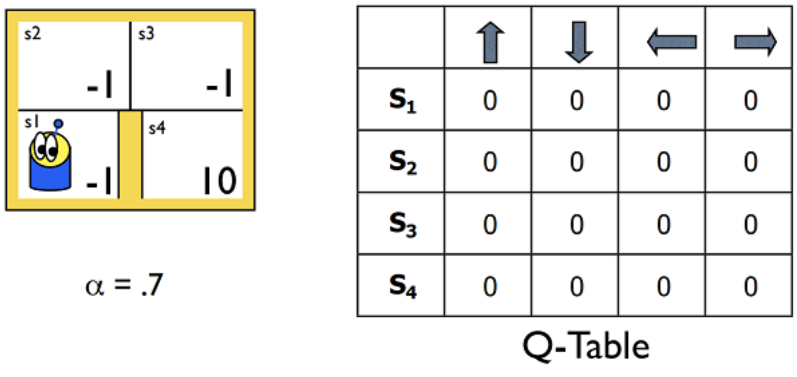
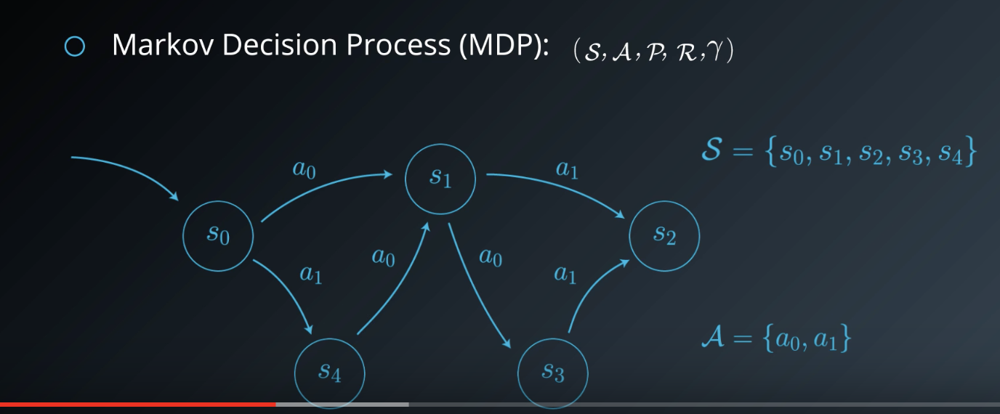
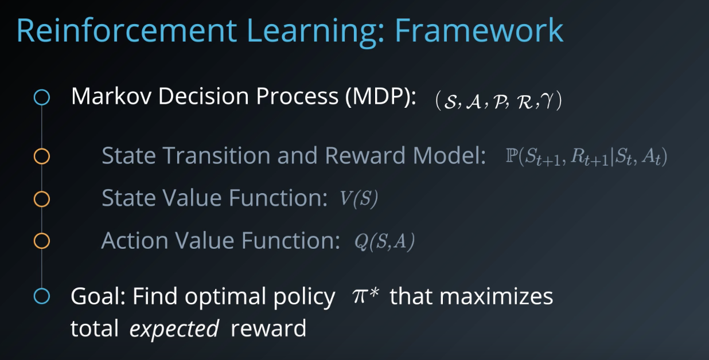
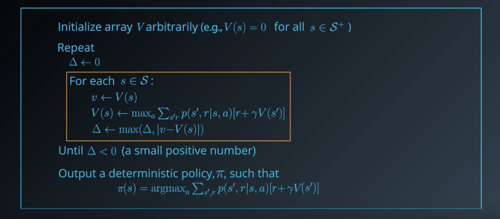
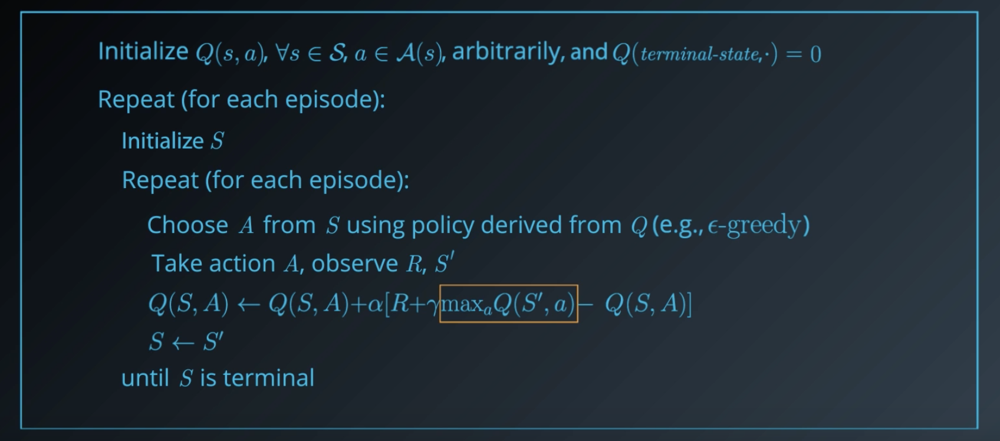

# Introduction
In this lesson, you'll learn how to adapt traditional reinforcement learning methods to solve a larger class of problems.

So far in this nanodegree, you have worked with reinforcement learning environments where the number of states and actions is limited. With small, finite  **Markov Decision Processes (MDPs)**, it is possible to represent the action-value function with a table, dictionary, or other finite structure.

For instance, consider the very small gridworld below. Say the world has four possible states, and the agent has four possible actions at its disposal (up, down, left, right). You learned in the previous lessons that we can represent the estimated optimal action-value function in a table, with a row for each state and a column for each action. We refer to this table as a  **Q-table**.

But what about MDPs with much larger spaces? Consider that the Q-table must have a  **row for each state**. So, for instance, if there are 10 million possible states, the Q-table must have 10 million rows. Furthermore, if the state space is the set of continuous  [real-valued numbers](https://en.wikipedia.org/wiki/Real_number)  (an  **_infinite_**  set!), it becomes impossible to represent the action values in a  **_finite_**  structure!

In this lesson, I'll teach you how to generalize the tabular solution methods from the previous lessons to work with large and continuous spaces. This will lay the foundation for developing the deep reinforcement learning algorithms that you will explore later in the nanodegree.

These algorithms can be hard to understand, so don’t worry if you find them challenging at first. Make sure you practice implementing the core components of these algorithms, and apply them to various environments, to observe how they perform – that is the only way to master deep reinforcement learning!

# Brief Overview of RL framework
RL problems are typically framed as **Markov Decision Processes (MDPs)**. An MDP consists of a set of states **S** and actions **A** along with probabilities **P**, rewards **R**, and a discount factor . 

- **P** captures how frequently different transitions and rewards occur, often modeled as a single joint probability where the state and reward at any time step `t+1` depend only state and action at previous time step `t`. This characteristics of certain environments is known as the **Markov property**. 

There are two quantities that we are typically interested in. 

- The value of a state **V(S)**, which we try to estimate or predict. 
- The value of an action taken in a certain state, **Q(S,A)**, which can help us decide what action to take. 

These two mappings (functions) are very inter-related and help us find an optimal policy for our problem **`π∗​`** that maximizes the total reward received. 

Note that since MDPs are probabilistic in nature, we can't predict with complete certainty what future rewards we will get and for how long. So, we typically aim for **expected reward**. This is where the discount factor comes into play as well. It is used to assign a lower weight to future rewards when computing state and action values. 

RL algorithms are generally classified into two groups:

- **Model-based approaches (Dynamic programming):**, such as **Policy iteration**, **Value iteration**, which require a known transition and reward model.They essentially apply _dynamic programming_ to iteratively compute the desired value functions and optimal policies using that model. 
- **Model-free approaches:** including **Monte Carlo methods**, and **Temporal difference learning** don't require an explicit model. They sample the environment by carrying out exploratory actions and use the experience gained to directly estimate value functions. 

## Deep RL
Deep RL is a relatively recent term that refers to approaches that use deep learning, mainly, **Multi-layer NNs** to solve RL problems. RL is typically characterized by finite MDPs, where the number of states and actions is limited. But there are so many problems where the space of states and actions is very large or even made of continuous real value numbers. 

Traditional algorithms use a table or a dictionary or other finite structures to capture state and action values. They no longer work for such problems. 

So, the first thing you'll learn in this lesson is how to generalize these algorithms to work with large and continuous spaces. That lays the foundation for developing **deep RL algorithms** including **value-based techniques** like **Deep Q-Learning**, and those that directly try to optimize the policy, such as **Policy Gradients**. Finally, you'll look at more advanced approaches that try to combine the best of both worlds, **Actor-Critic Methods**. 

See the video [here](https://youtu.be/GPjK124RU5g).

# Discrete vs Continuous Spaces
Recall the definition of the MDP where we assume that the environment state at any time is drawn from a set of possible states. When this set is **finite**, we can call it a **discrete state space**. Similarly with actions. 

Having discrete spaces simplifies things for us. It allows us to represent any function of states and actions as a dictionary or look up table. 

Consider the state value function **V** which is a mapping from the set of states to a real number. If you encode states as integers, you can code up the value function as a dictionary using each state as a key. Similarly, consider the action value function **Q** that maps every state action pair to a real number. Again, you could use a dictionary or store the value function as a table or matrix, where each row corresponds to a state, and each column to an action.

Discrete spaces are also critical to a number of RL algorithms. For instance, in value iteration, the internal for-loop goes over each state as one by one, and updates the corresponding value estimate **V(s)**. This is impossible if you have an infinite state space. The loop would go on forever. Even for discrete state spaces with a lot of states this can quickly become infeasible.

_Model-free methods_ like Q-learning assume discrete spaces as well. Here, the "max" is being computed over all possible actions from state **S'** which is easy when you have a finite set of actions. But, this tiny step by itself becomes a full-blown optimization problem if your action space is continuous.

**So, what do we exactly mean by continuous space?** 

The term continuous is used to contrast with discrete, that is a continuous space is not restricted to a set of distinct values like integers. Instead, it can take a range of values, typically real numbers. This means quantities like state values that could be depicted as say a bar chart for discrete case, will now need to be thought of as a density plot over a desired range. 

The same notion extends to environments where the state is no longer a single real valued number but a _**vector**_ of such numbers. **This is still referred to as a continuous space just with more than one dimension**. 

## Why Continuous?
Let's try to build some intuition for why continuous state spaces are important. Where do they even come from?

When you consider a high-level decision making task like playing chess, you can often think of the set of possible states as discrete. What piece is in which square on the board? You don't need to bother with precisely where each piece is located within its squares or which way it is facing. 