# Introduction
In this lesson, you'll learn how to adapt traditional reinforcement learning methods to solve a larger class of problems.

So far in this nanodegree, you have worked with reinforcement learning environments where the number of states and actions is limited. With small, finite  **Markov Decision Processes (MDPs)**, it is possible to represent the action-value function with a table, dictionary, or other finite structure.

For instance, consider the very small gridworld below. Say the world has four possible states, and the agent has four possible actions at its disposal (up, down, left, right). You learned in the previous lessons that we can represent the estimated optimal action-value function in a table, with a row for each state and a column for each action. We refer to this table as a  **Q-table**.

But what about MDPs with much larger spaces? Consider that the Q-table must have a  **row for each state**. So, for instance, if there are 10 million possible states, the Q-table must have 10 million rows. Furthermore, if the state space is the set of continuous  [real-valued numbers](https://en.wikipedia.org/wiki/Real_number)  (an  **_infinite_**  set!), it becomes impossible to represent the action values in a  **_finite_**  structure!

In this lesson, I'll teach you how to generalize the tabular solution methods from the previous lessons to work with large and continuous spaces. This will lay the foundation for developing the deep reinforcement learning algorithms that you will explore later in the nanodegree.

These algorithms can be hard to understand, so don’t worry if you find them challenging at first. Make sure you practice implementing the core components of these algorithms, and apply them to various environments, to observe how they perform – that is the only way to master deep reinforcement learning!

# Brief Overview of RL framework
RL problems are typically framed as **Markov Decision Processes (MDPs)**. An MDP consists of a set of states **S** and actions **A** along with probabilities **P**, rewards **R**, and a discount factor . 

- **P** captures how frequently different transitions and rewards occur, often modeled as a single joint probability where the state and reward at any time step `t+1` depend only state and action at previous time step `t`. This characteristics of certain environments is known as the **Markov property**. 

There are two quantities that we are typically interested in. 

- The value of a state **V(S)**, which we try to estimate or predict. 
- The value of an action taken in a certain state, **Q(S,A)**, which can help us decide what action to take. 

These two mappings (functions) are very inter-related and help us find an optimal policy for our problem **`π∗​`** that maximizes the total reward received. 

Note that since MDPs are probabilistic in nature, we can't predict with complete certainty what future rewards we will get and for how long. So, we typically aim for **expected reward**. This is where the discount factor comes into play as well. It is used to assign a lower weight to future rewards when computing state and action values. 

RL algorithms are generally classified into two groups:

- **Model-based approaches (Dynamic programming):**, such as **Policy iteration**, **Value iteration**, which require a known transition and reward model.They essentially apply _dynamic programming_ to iteratively compute the desired value functions and optimal policies using that model. 
- **Model-free approaches:** including **Monte Carlo methods**, and **Temporal difference learning** don't require an explicit model. They sample the environment by carrying out exploratory actions and use the experience gained to directly estimate value functions. 

## Deep RL
Deep RL is a relatively recent term that refers to approaches that use deep learning, mainly, **Multi-layer NNs** to solve RL problems. RL is typically characterized by finite MDPs, where the number of states and actions is limited. But there are so many problems where the space of states and actions is very large or even made of continuous real value numbers. 

Traditional algorithms use a table or a dictionary or other finite structures to capture state and action values. They no longer work for such problems. 

So, the first thing you'll learn in this lesson is how to generalize these algorithms to work with large and continuous spaces. That lays the foundation for developing **deep RL algorithms** including **value-based techniques** like **Deep Q-Learning**, and those that directly try to optimize the policy, such as **Policy Gradients**. Finally, you'll look at more advanced approaches that try to combine the best of both worlds, **Actor-Critic Methods**. 

See the video [here](https://youtu.be/GPjK124RU5g).

# Discrete vs Continuous Spaces
Recall the definition of the MDP where we assume that the environment state at any time is drawn from a set of possible states. When this set is **finite**, we can call it a **discrete state space**. Similarly with actions. 

Having discrete spaces simplifies things for us. It allows us to represent any function of states and actions as a dictionary or look up table. 

Consider the state value function **V** which is a mapping from the set of states to a real number. If you encode states as integers, you can code up the value function as a dictionary using each state as a key. Similarly, consider the action value function **Q** that maps every state action pair to a real number. Again, you could use a dictionary or store the value function as a table or matrix, where each row corresponds to a state, and each column to an action.

Discrete spaces are also critical to a number of RL algorithms. For instance, in value iteration, the internal for-loop goes over each state as one by one, and updates the corresponding value estimate **V(s)**. This is impossible if you have an infinite state space. The loop would go on forever. Even for discrete state spaces with a lot of states this can quickly become infeasible.

_Model-free methods_ like Q-learning assume discrete spaces as well. Here, the "max" is being computed over all possible actions from state **S'** which is easy when you have a finite set of actions. But, this tiny step by itself becomes a full-blown optimization problem if your action space is continuous.

**So, what do we exactly mean by continuous space?** 

The term continuous is used to contrast with discrete, that is a continuous space is not restricted to a set of distinct values like integers. Instead, it can take a range of values, typically real numbers. This means quantities like state values that could be depicted as say a bar chart for discrete case, will now need to be thought of as a density plot over a desired range. 

The same notion extends to environments where the state is no longer a single real valued number but a _**vector**_ of such numbers. **This is still referred to as a continuous space just with more than one dimension**. 

## Why Continuous?
Let's try to build some intuition for why continuous state spaces are important. Where do they even come from?

When you consider a high-level decision making task like playing chess, you can often think of the set of possible states as discrete. What piece is in which square on the board? You don't need to bother with precisely where each piece is located within its squares or which way it is facing. These are non-relevant details for the problem at hand and you can abstract then away in your model of the game. 

In general, grid-based worlds are very popular in RL. They give a glimpse at how agents might act in spatial environment. But, real physical spaces are not always neatly divided up into grids. There is no cell (5,3) for vacuum cleaner to go to. It has to chart a course from its current position to say (2.5, 1.8). It also has to keep track of its heading and turn smoothly to face the direction it wants to move in. These are all real numbers that the agent may need to process and represent as part of the state. 

Actions too can be continuous. Take for example a robot that plays darts. It has to set the height and angle it wants to release the dart at, choose an appropriate level of power with which to throw, etc. Even small differences in these values can have a large impact on where the dart ultimately lands on the board. In general, most actions that need to take place in a physical environment are continuous in nature. 

Clearly, we need to modify our representation or algorithms or both to accomodate continuous spaces. The two main strategies we'll be looking at are: **Discretization** and **Function Approximation**. 

See the video [here](https://youtu.be/uHstLeRzaE8).

# Discretization
As the name suggests, discretization is basically converting a continuous space into a discrete one. 

Remember our continuous vacuum cleaner world. All we're saying is let's bring back a grid structure with discrete positions identified. Note that we're not really forcing our agent to be in exactly the center of these positions, since the underlying world is continuous, and we don't have control over that. 

But in our representation of the state space, we only identify certain positions as relevant. For instance, whether the robot is at (3.1, 2.4) or (2.9,1.8), we can round that off to (3,2). 

Yes, this will almost always be a little incorrect, but for some environments, discretizing the state space can work out very well. It enables us to use existing algorithms with little, or no modification.

Actions can be discretized as well. For example, angles can be divided into whole degrees, or even 90 degrees increments, if appropriate. 

Now, let's imagine there are objects in this discretized world, obstacles that the robot may need to avoid. With our grid representation, all we can do is mark off the cells where an object is present, even by a little. This is known as an **occupancy grid**. 

But our choice of discretization may lead the agent into thinking, there is no path across these obstacles to reach some desired locations. Instead, if we vary the grid according to these obstacles, then we could open up a feasible path for the agent. 

An alternate approach would be to divide up the grid into smaller cells where required. It would still be an approximation, but it'll allow us to allocate more of our state representation to where it matters. Better than dividing the entire state space into finer cells, which may increase the total number of states, and in turn, the time needed to compute value functions. If you're familiar with **binary space partitioning** or **quad trees**, this is exactly the same idea. 

Now you might be wondering: this sort of discretization makes sense in spatial domains like gridworlds, but **what about other state spaces?**

Let's look at a different domain.

Most cars these days have automatic transmission. **Have you ever wondered how the car decides to pick what gear to switch to, and when?** Here is a simplified plot of how fuel consumption varies with speed for different gears in a typical car.

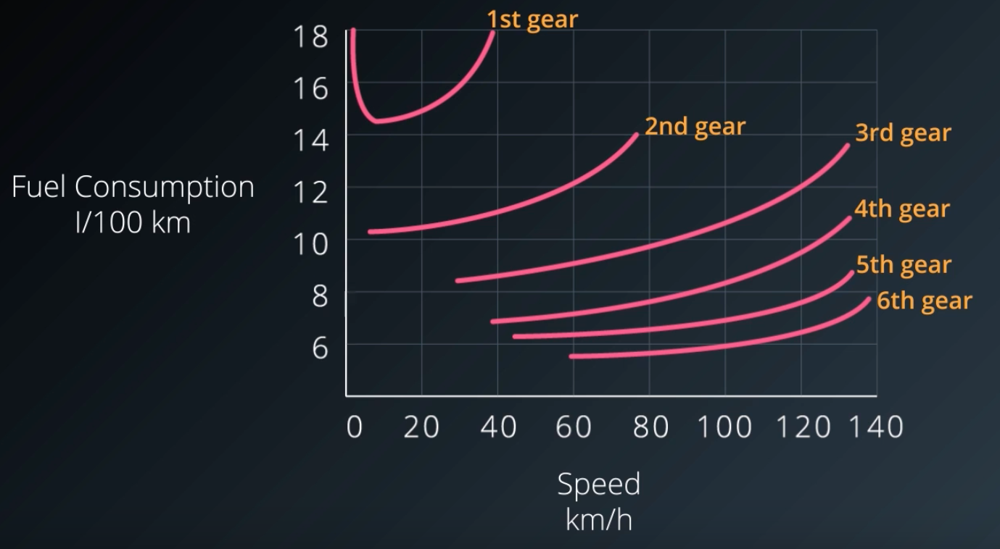

Let's assume that our state only consists of the vehicle speed, and which gear we are in. And our reward is inversely proportional to fuel consumption. The actions available to our agent are essentially switching up, or down. 

Now, although speed is a continuous value, it can be discretize into ranges, such that a single gear is the most optimal in each range. Note that these ranges can be of different lengths, that is, the discretization is non-uniform. It there were other dimensions to the state-space such as throttle position, then they could be subdivided non-uniformly as well. 

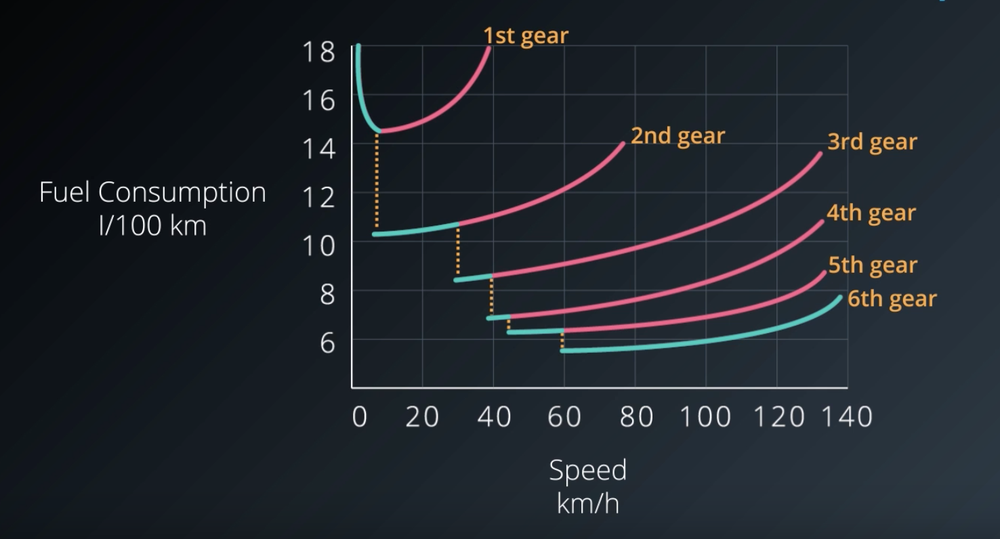

# Exercise: Discretization
Refer to [Discretization_Solution](codes/Discretization_Solution.ipynb) notebook.

# Tile Coding
If you have prior knowledge about the state space, you can manually design an appropriate discretization scheme. 

Like in our gear switching example, we knew the relationship between fuel consumption and speed. But, in order to function in arbitrary environments, we need a more generic method. 

One elegant approach for this is **Tile Coding**. Here, the underlying state space is continuous and two-dimensional. We overlay multiple grids or tilings on top of the space, each slightly offset from each other. 

Now, any position `S` in the state space can be coarsely identified by the tiles that it activates. If we assign a bit to each tile, then we can represent our new discretized state as a bit vector, with ones for the tiles that get activated, and zeros elsewhere. 

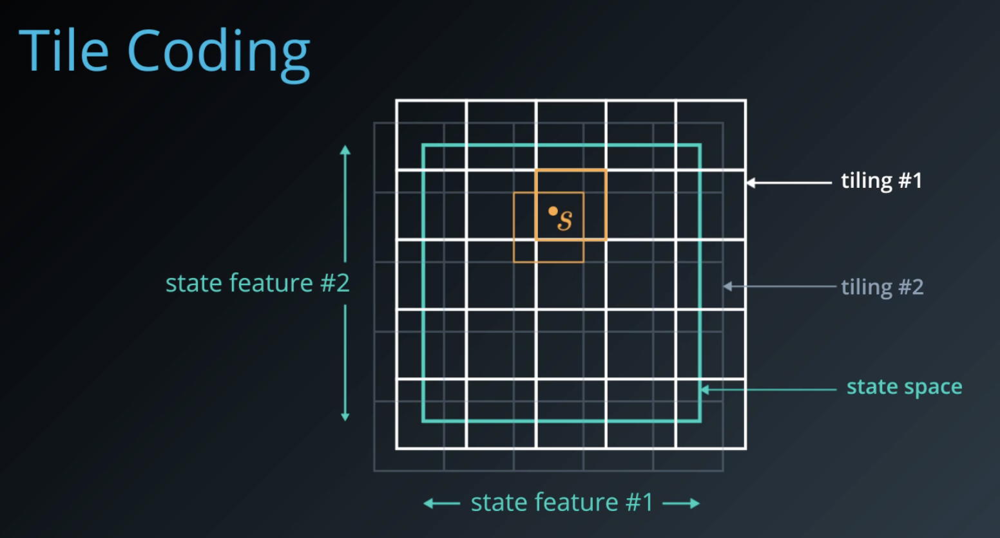

This, by itself, is a very efficient representation. But the genius lies in how the state value function is computed using the scheme. Instead of storing a separate value for each state `V(s)`, it is defined in terms of the bit vector for that state and a weight for each tile. 

The tile coding algorithm in turn updates these weights iteratively. This ensures nearby locations that share tiles also share some component of state value, effectively smoothing the learned value function. 

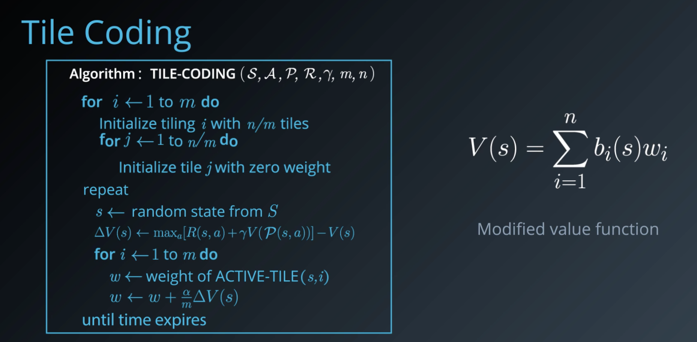

Tile coding does have some **drawbacks**. Just like a simple grid-based approach we have to manually select the tile sizes, their offsets, number of tilings, etc. ahead of time. 

A more flexible approach is **adaptive tile coding**, which starts with fairly large tiles and divides each tile into two, whenever appropriate. **How do we know when to split?**

We can use a heuristic for that. Basically, we want to split the state space when we realize that we are no longer learning much with the current representation. That is, when our value function isn't changing. We can stop when we have reached some upper limit on the number of splits, or some max iterations.

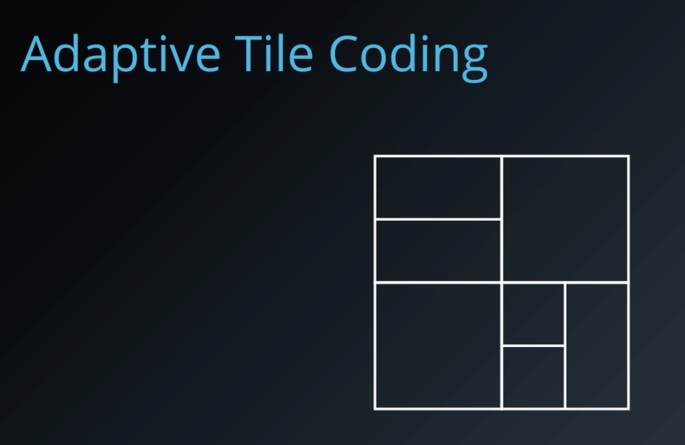

In order to figure out which tile to split, we have to look at which one is likely to have the greatest effect on the value function. For this, we need to keep track of subtiles and their projected weights. Then, we can pick the tile with the greatest difference between subtile weights. 

There are many other hueristics you can use, but the main advantage of _adaptive tile coding_ is that it does not rely on a human to specify a discretization ahead of time. The resulting state space is appropriately partitioned based on its complexity. 

See the video [here](https://youtu.be/BRs7AnTZ_8k).

# Coarse Coding
**Coarse Coding** is just like _tile coding_, but uses a sparser set of features to encode the state space. Imagine dropping a bunch of circles on your 2D continuous state space. Take any state `S` which is a position in this space, and mark all the circles that is belongs to. Prepare a bit vector with a one for those circles and zeros for the rest. And that's your **sparse coding representation** of the state. 

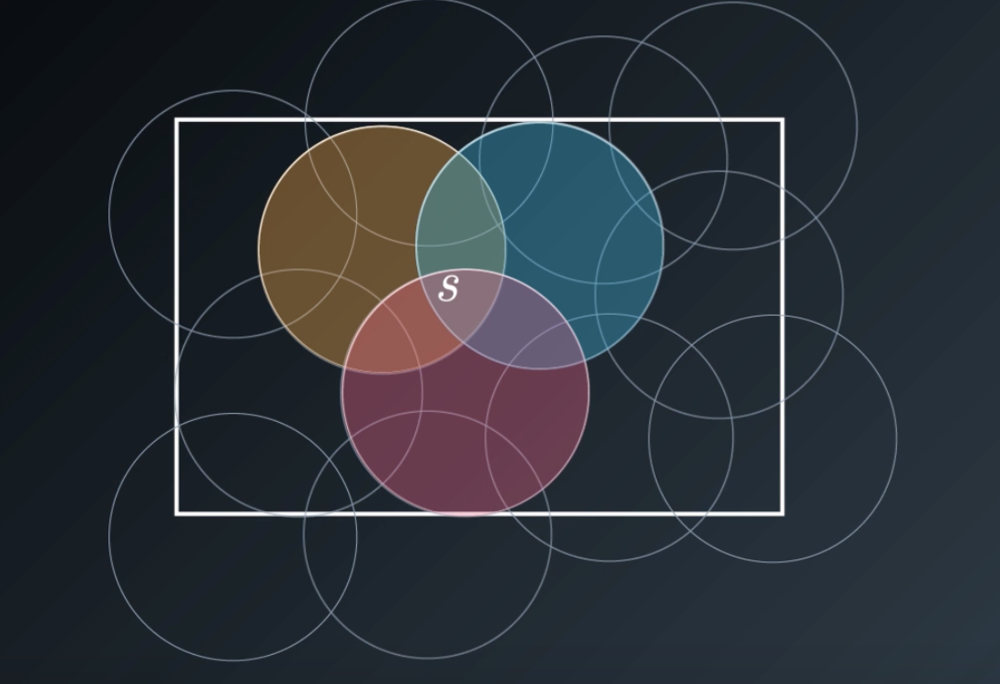

Looking at a 2D space helps us visualize the basic idea. But it also extends to higher dimensions where circles become spheres and hyper spheres. 

There are some neat properties of coarse coding. Using smaller circles results in less generalization across the space. The learning algorithm has to work a bit longer, but you have greater effective resolution. Larger circles lead to more generalization, and in general a smoother value function. You can use fewer large circles to cover the space, thus reducing your representation, but you would lose some resolution. 

It's not just the size of these circles that we can vary. We can change them in other ways like making them taller or wider to get more resolution along one dimension versus the other. In fact, this same technique generalizes to pretty much any shape. 

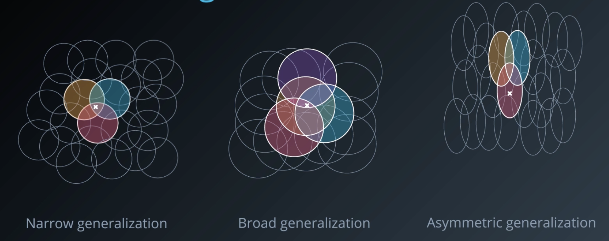

In coarse coding, just like in tile coding, are resulting state representation is a binary vector. Think of each tile or circle as a feature, 1, if it is an active, 0 if it is not. 

A natural extension to this idea is to use the distance from the center of each circle as a measure of how active that feature is. This measure/response can be made to fall off smoothly using a Gaussian or a bell-shaped curve centered on the circle, which is known as a **radial basis function**. 

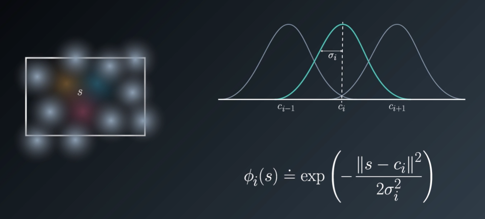

Of course, the resulting feature values will no longer be discrete. So, we'll end up with yet another continuous state vector. But what is cool is that the number of features can be drastically reduced this way. 

See the video [here](https://youtu.be/Uu1J5KLAfTU).

# Function Approximation
So far, we've looked at ways to discretize continuous state spaces. This enables us to use existing RL algorithms with little or no modification. But there are some limitations. 

When the underlying space is complicated, the number of discrete states needed can become very large. Thus, we lose the advantage of discretization. Moreover, if you think about positions in the state space that are nearby, you would expect their values to be similar, or smoothly changing. 

Discretization doesn't always exploit this characteristic, failing to generalize well across the space. What we're after is the true state value function , or action value function , which is typically smooth and continuous over the entire space. 

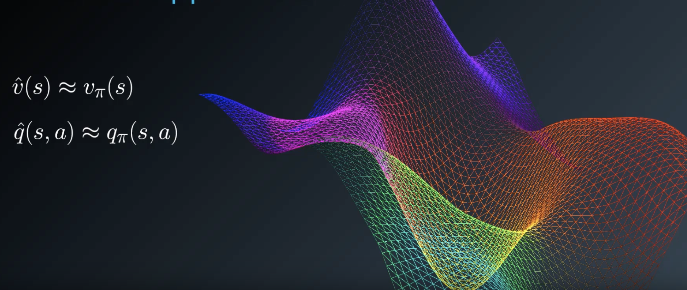

As you can imagine, capturing this completely is practically infeasible except for some very simple problems. Our best hope is **function approximation**. It is still an approximation because we don't know what the true underlying function is. 

A general way to define such as approximation is to introduce a parameter vector  that shapes the function. Our tasks then, reduces to tweaking this parameter vector till we find the desired approximation. 

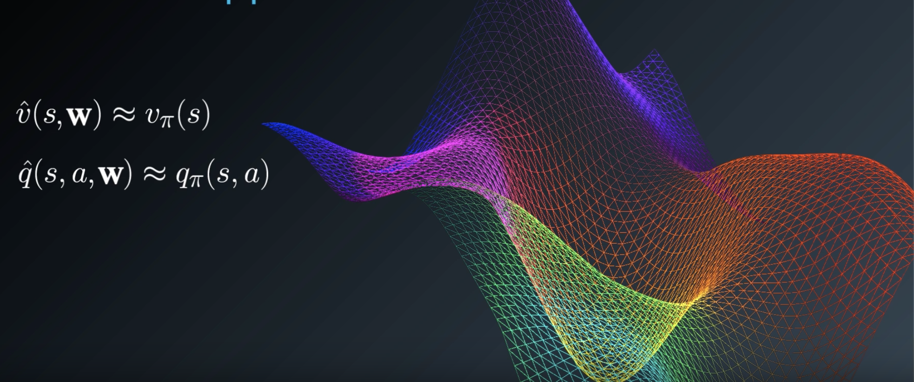

Note that the approximating function can either map a state to its value, or a state action pair to the corresponding  value. Another form is where we map from one state to a number of different  values, one for each action all at once. This is especially useful for Q-learning. 

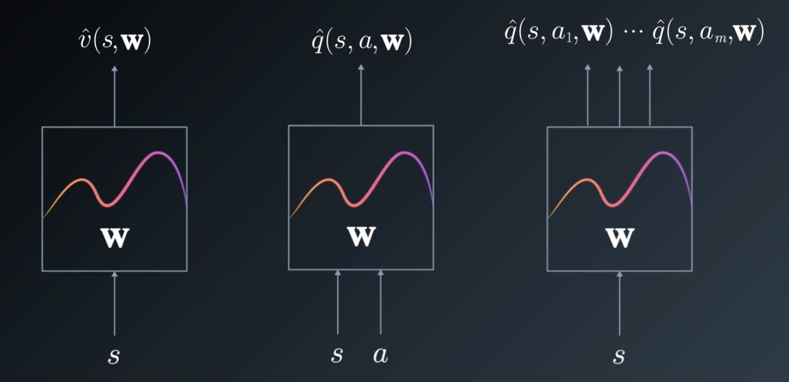

**Let's focus on this first case: Approximating a state value function.**

Now, we have this box here in the middle that's supposed to do some magic (figure below), and convert the state , and parameter vector  into a scalar value. **But how?**

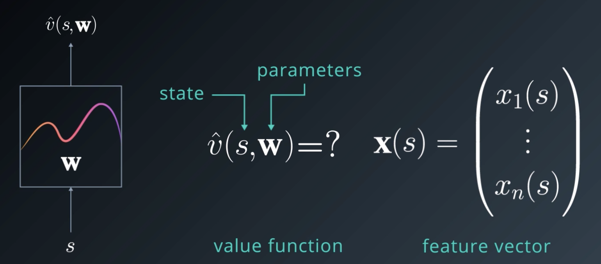

The first thing we need to do is to ensure we have a vector representing the state. Your state might already be a vector in which case you don't need to do anything. 

In general, we'll define a transformation that converts any given state  into a feature vector . This also gives us more flexibility, since we don't have to operate on the raw state values. We can use any computed or derived features instead. 

We now have a feature vector , and a parameter vector , and we want a scalar value. 

**What do we do when we have two vectors, and want to produce a scalar?** _**Dot Product**_ :)

It's the simplest thing we could do. In fact, this is the same as computing a linear combination of features. This is known as **Linear Function Approximation**, i.e. we're trying to approximate the underlying value function with a linear function.  

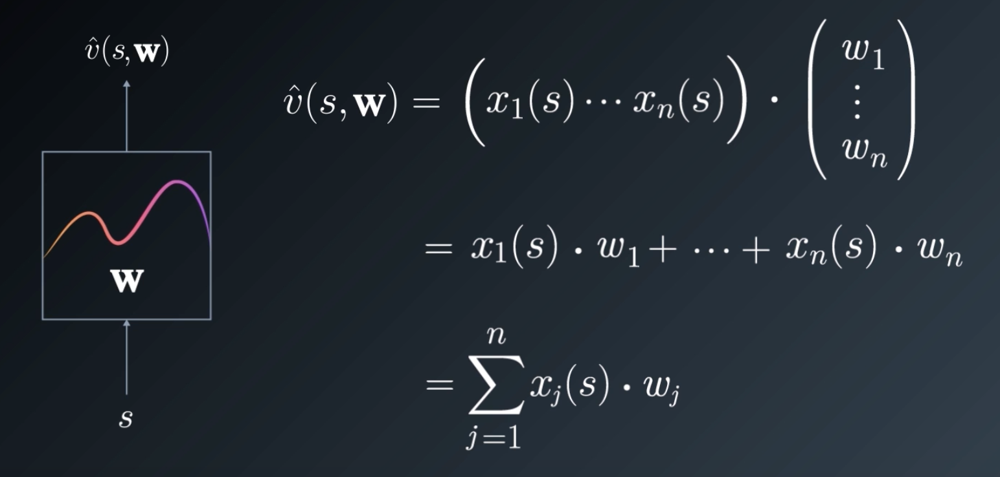

See the video [here](https://youtu.be/UTGWVY6jEdg).

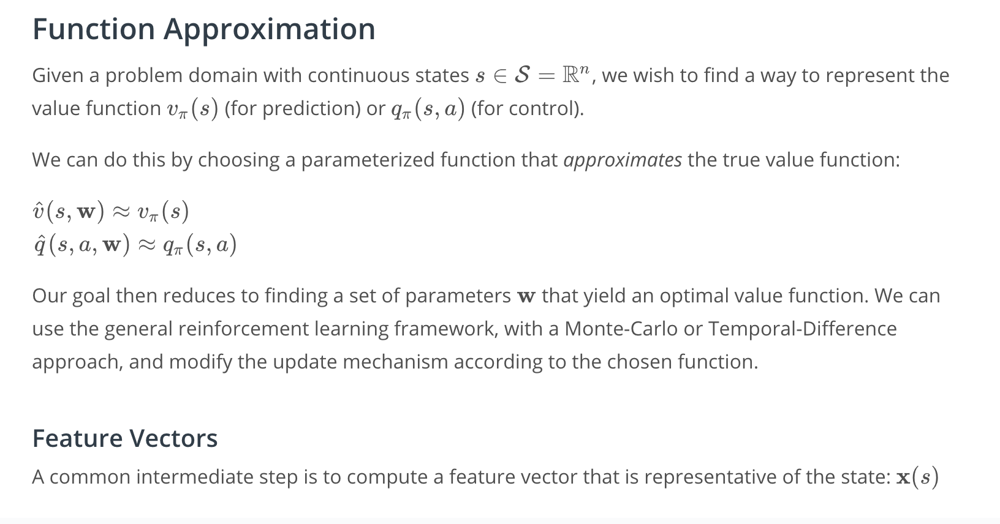

# Linear Function Approximation
Let's take a closer look at linear function approximation and how to estimate the parameter vector . 

As you've seen already, a linear function is a simple sum over all the features multiplied by their corresponding weights: 

Let's assume you have initialized these weights randomly and computed the value of a state . **How would you tweak  to bring the approximation closer and closer to the true function?**

Sound like a _**numerical optimization problem**_. Let's use _**gradient descent**_ to find the optimal parameter vector. 

Firstly, note that since   is a linear function, its derivative with respect to  is simply the feature vector . This is the nice thing about linear functions and why they are so popular. 

Now, let's think about **what are we trying to optimize?**

We want to reduce (minimize) the difference between the true value function  and the approximate value function . Let's write that down as a squared difference, since we are not concerned with the sign of the error and we simply want to drive the difference down toward zero. To be more accurate, since RL domains are typically stochastic, this is the **expected squared error**. 

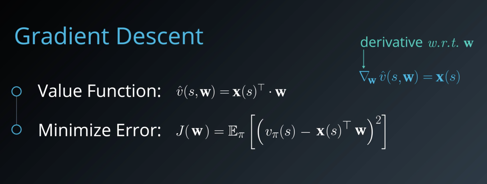

We now have an objective function to minimize. To do that using gradient descent, let's find the gradient of this function with respect to . Using the chain rule of differentiation, we get the following:

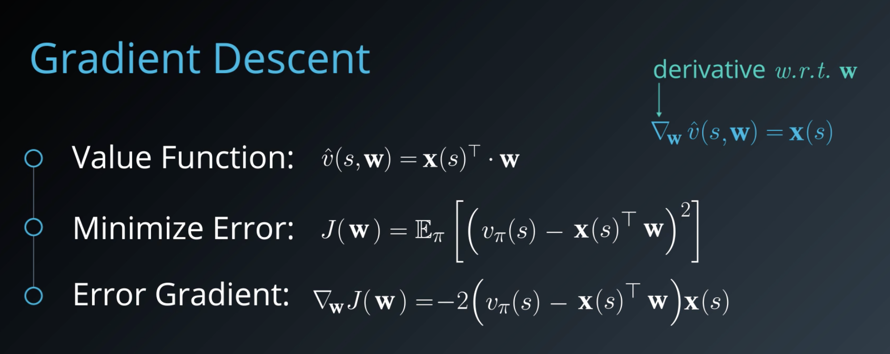

**NOTE:** Note that we remove the expectation operator here to focus on the error gradient indicated by a single state , which we assume has been chose stochastically.

If we are able to sample enough states, we can come close to the expected value. Let's plug this into the general form of a gradient descent update rule with  as a step size or learning rate parameter.

This is the basic formulation we will use to iteratively reduce the error for each sample state till the approximate and true function are almost equal.

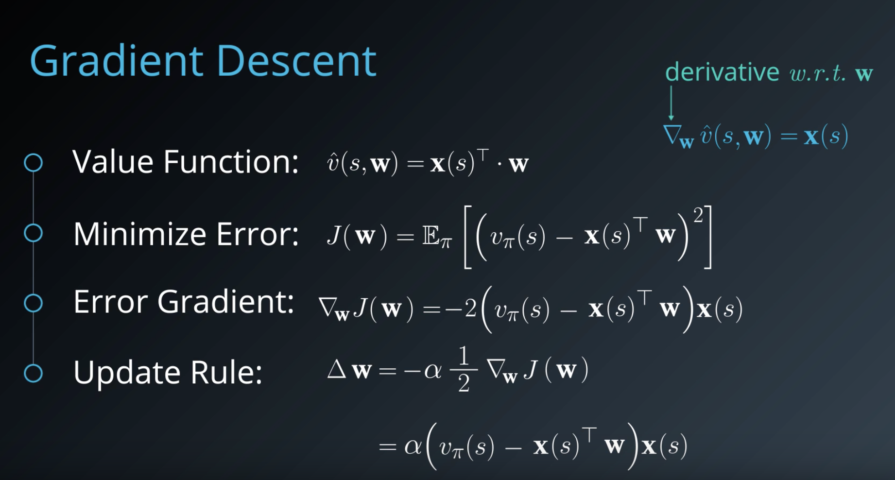

**NOTE:** Note that the -1/2 here is just to cancel out the -2 we got in the derivative. 

See the [video](https://youtu.be/OJ5wrB7o-pI) for some intuition on how gradient decent optimizes the parameter vector.

## Action Value Approximation
So far, we've only been talking about approximating the state-value function. **In order to solve a model-free control problem, i.e. to take actions in an unknown environment, we need to approximate the action-value function.**

We can do this by defining a feature transformation that utilizes both the state and action, then we can use the same gradient descent method as we did for the state-value function. 

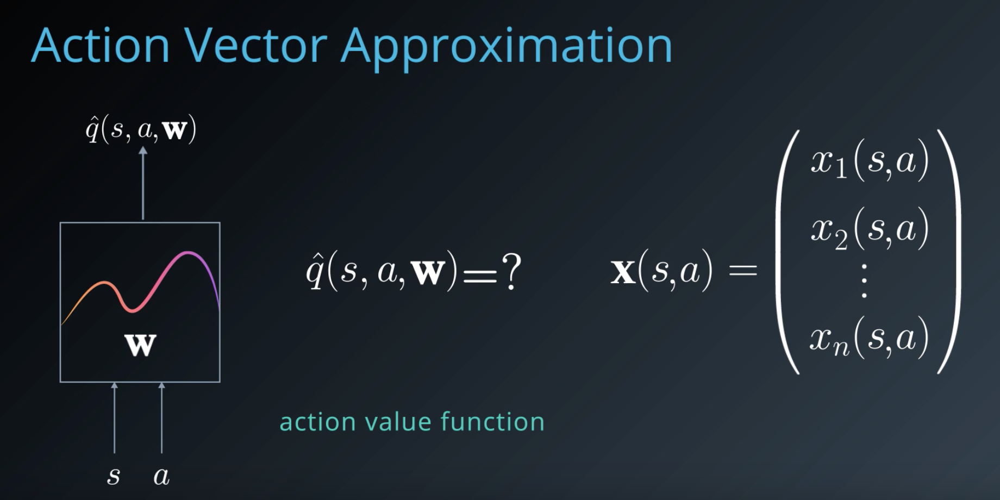

***
Finally, let's look at the case where we wish the approximation function to compute all of the action-values at once. We can think of this as **producing an action vector**. 

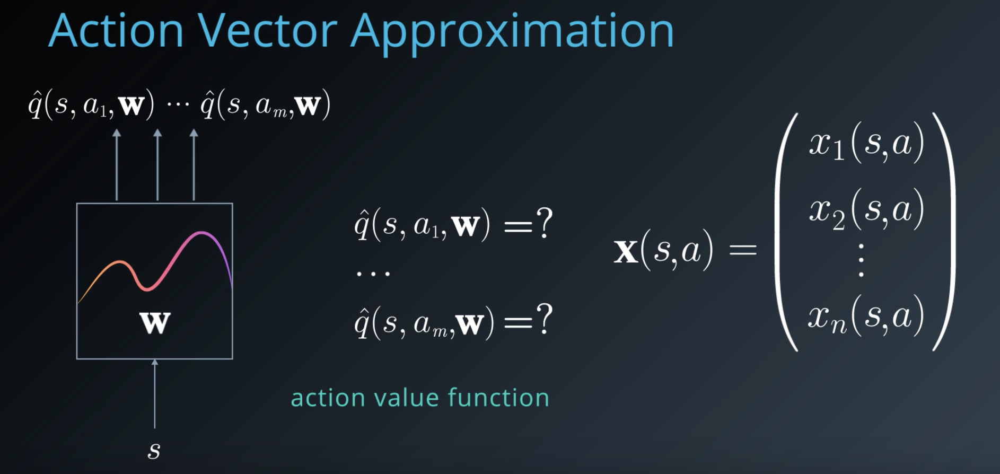

For this purpose, we can continue to use the same feature transformation as before, taking in both the state and action. But, **how do we generate the different action-values?**

One way of thinking about it is that we are trying to find  action-value functions, one for each action dimension. But, intuitively, we know that these functions are related. So, it makes sense to compute them together. We can do this by extending our weight vector and turning it into a matrix. Each column of the matrix emulates a separate linear function, but the common features computed from the state and action keep these functions tied to each other. 

If we have a problem domain with a continuous state space, but a discrete action space, which is very common, we can easily select the action with the maximum value. Without this sort of parallel processing, we would have to parcel each action one by one and then find their maximum. 

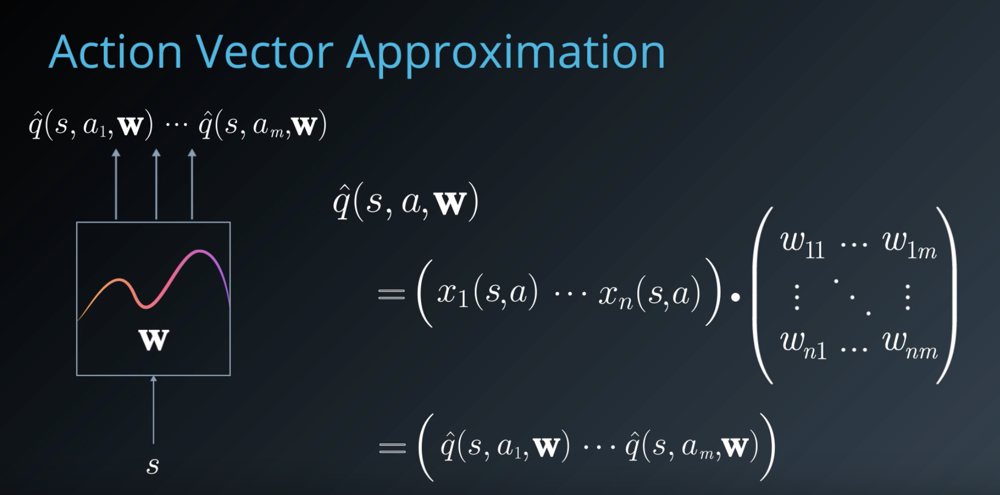

If our action space is also continuous, then this form allows us to output more than a single value at once. For example, if we were driving a car, we'd want to control both steering and throttle at the same time. 

The **primary limitation** of linear function approximation is that we can only represent linear relationships between inputs and outputs. With one-dimensional input, this is basically a line. In 2D, it becomes a plane, and so on. 

**What if our underlying value function has a non-linear shape?** A linear approximation may give a very bad result. That's when we need to start looking at non-linear functions.

See the video [here](https://youtu.be/OJ5wrB7o-pI).

# Kernel Functions
A simple extension to linear function approximation can help us capture non-linear relationships. At the heart of the approach is our feature transformation. 

Here is how we defined it in a generic sense. Something that takes a state or a action-state pair and produces a feature vector. 

Each elements of this vector can be produced by a separate function, which can be non-linear. For example, let's assume our state  is a single real number. Then, we can define, say , , etc. These are called **Kernel Functions** or **Basis Functions**. They transform the input state into a different space. But note that since our value function is still defined as a linear combination of these features, we can still linear function approximation. What this allows the value function to do is represent non-linear relationships between the input state and output value.

**Radial Basis Functions** are a very common form of kernels used for this purpose. Essentially, think of the current state  as a location in the continuous state space here depicted as a rectangular place (figure below).

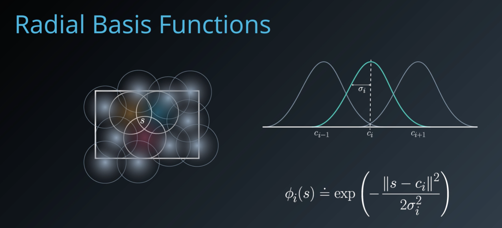

Each basis function is shown as a blob. The closer the state is to the center of the blob, the higher the response returned by the function. And the further you go, the response falls off gradually with the radius, hence the name _Radial Basis Function_. 

Mathematically, this can be achieved by associating a Gaussian kernel with each basis function with its mean serving as the center of the blob and standard deviation determining how sharply or smoothly the response falls off.

So, for any given state, we can reduce the state representation to a vector of responses from these radial basis functions. From that point onwards, we can use same function approximation method. 

See the video [here](https://youtu.be/RdkPVYyVOvU).

# Non-Linear Function Approximation
Non-linear approximation, this is what we've been building up to in this lesson. Recall from our previous discussion how we can capture non-linear relationships between input state and output value using arbitrary kernels like _radial basis functions_ as our feature transformation. 

In this model, our output value is still linear with respect to the features. **What if our underlying value function was truly non-linear with respect to a combination of these feature values?**

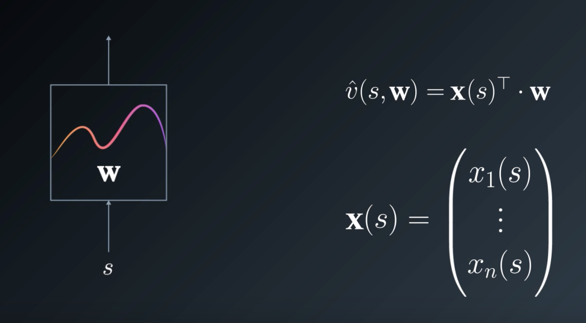

To capture such complex relationships, let's pass our linear response obtained using the dot product through some nonlinear function . **Does this look familiar?**

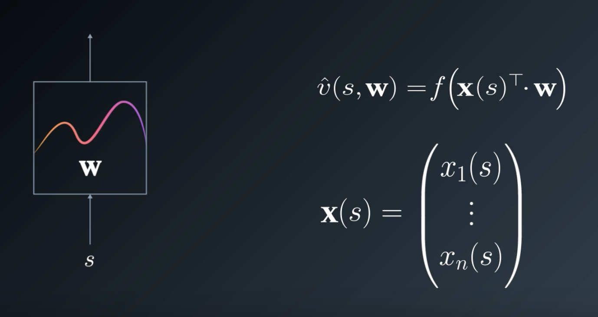

**Yes, it is the basis of _artificial neural networks_.** Such a non-linear function is generally called an _activation function_ and immensely increase the representational capacity of our approximator. 

We can iteratively update the parameters of any such function using _gradient descent_. 

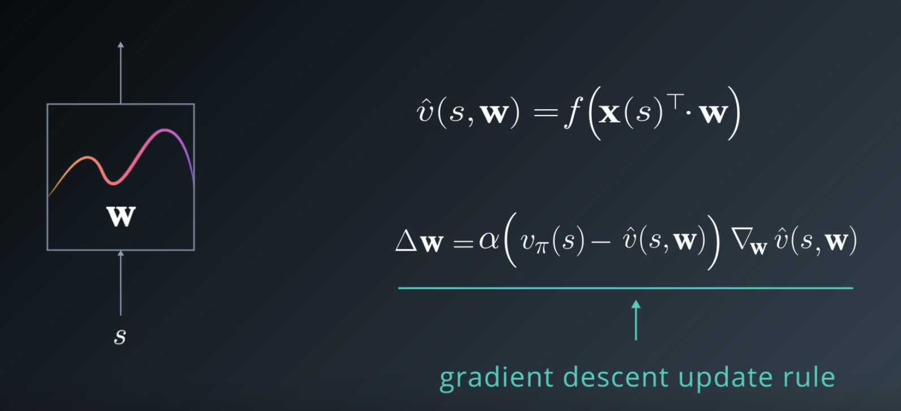

See the video [here](https://youtu.be/rITnmpD2mN8).

# Summary
Traditional RL techniques use a finite MDP to model an environment which limits us to environments with discrete state and action and spaces. 

In order to extend our learning algorithms to continuous spaces, we can do one of two things: 

- Discretize the state space
- Directly trying to approximate desired value functions.

Discertization can be performed using a constant grid, tile coding, or course coding. This indirectly leads to an approximation of the value function. 

Directly approximating a continuous value function can be done by first defining a feature transformation and then computing a linear combination of those features. 

Using non-linear feature transforms like radial basis functions, allows us to use the same linear combination framework to capture some non-linear relationships. 

In order to represent non-linear relationships across combinations of features, we can apply an activation function. This sets us up to use **deep neural networks** for RL. 

See the video [here](https://youtu.be/MTEBk43oByU).

