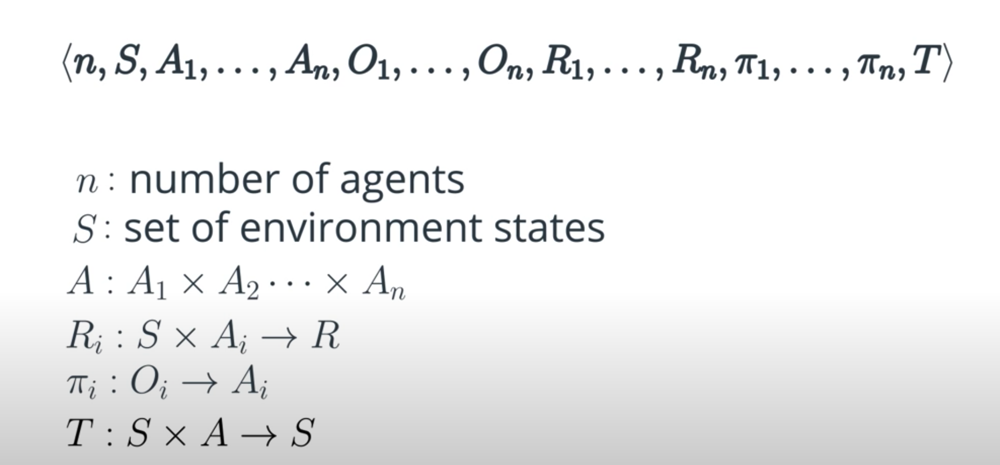

# Introduction to Multi-Agent Systems
Multi-agent systems are present everywhere around us, be it early in the morning when you're making your way through traffic to get to work or when your favorite soccer players are competing in a game or when a swarm of bees is trying to build a home in your garden. 

Let's consider a scenario where an autonomous car is driving you to office. The aim is to reach office quickly and safely. Anytime it wants to accelerate, brake or change lanes, it does so while considering the other cars in its vicinity. Other cars do the same. All of them are trying to enhance their driving skills on the go as they get more and more driving experience. 

Contrast this with a scenario where your car is the only car on the road. The fact that now it doesn't have to interact with other cars makes driving much simpler. 

This is nothing but a multi-agent system where multiple agents interact with one another. Agents may or may not know everything about all the others in the system. A multi-agent system is more complex than a single one as illustrated before. 

# Motivation for Multi-Agent Systems
Keep in mind that the ultimate goal of AI is to solve intelligence. We live in a multi-agent world, we do not become intelligent in isolation. As a baby, the closest interactions that shape us are with our parents. In school, we learn to collaborate and compete with others. We try to predict what might surprise our friends for their birthdays. We learn from others, and our own experiences and so on.

Our intelligence is therefore a result of our interactions with multiple agents over our lifetime. If we want to build intelligent agents that are used in the real world, they have to interact with humans, which are just another agent, and also with other agents. This leads to a **multi-agent scenario.**

If we really want to solve the problem of intelligence, our agents should be able to achieve their goals in very complex environments. The multi-agent case is a very complex kind of environment because all the agents are learning simultaneously and also interacting with one another. Just like we have in real life. There are different kinds of interactions going on between agents, from coordination to competition, to communication, to prediction, negotiation and so on.

To summarize, here are some of the motivations:

- We live in a multi-agent world.
- Intelligent agents have to interact with humans.
- Agents need to work in complex environments.

# Applications of Multi-Agent Systems
Here, we'll discuss some potential real life applications of multi-agent systems. A group of drones or robots whose aim is to pick up a package and drop it to the destination is a multi-agent system. In the stock market, each person who is trading can be considered as an agent and the profit maximization process can be modeled as a multi-agent problem. 

Interactive robots or humanoids that interact with humans and get some task done are nothing but multi-agent systems if we consider humans to be agents. Windmills in a wind farm can be thought of as multiple agents. It would be cool if all the agents, that is, the wind turbines figured out the optimal direction to face by themselves, and obtained maximum energy from the wind farm. The aim here is to collaborativelly maximize the profit obtained from the wind farm. 

# Benefits of Multi-Agent Systems
Having multiple agents in a system brings in a few benefits. The agents can share their experiences with one another making each other smarter, just as we learned from our teachers and friends. However, when agents want to share, they have to communicate, which leads to a cost of communication, like extra hardware and software capabilities. 

A multi-agent system is robust. Agents can be replaced with a copy when they fail. Other agents in the system can take over the tasks of the failed agent, but the substituting agent now has to do some extra work. 

Scalability comes by virtue of design, as most multi-agent systems allow insertion of new agents easily. But, if more agents are added to the system, the system becomes more complex than before. So, it depends on the assumptions made by the algorithm and the software and hardware capabilities of the agents, whether or not these advantages will be exploited. 

From here onwards, we'll learn about **multi-agent RL**, also known as **MARL**. When multi-agent systems use RL techniques to train the agents and make them learn their behaviors, we call the process **MARL**. 

# Markov Games
Consider an example of single agent RL. We have a drone with the task of grabbing a package. The possible actions are going right, left, up, down, and grasping. The reward is +50 for grasping the package, and -1 otherwise. 

The difference in MARL is that we have more than one agent. So, say, we have a second drone. Now, both the drones are collaboratively trying to grasp the package. They're both observing the package from their perspective positions. They both have their own policies that returned an action for their observations. Both also have their own set of actions. 

**The main thing about MARL is that there is also a joint set of actions.** Both the left drone and the right drone must begin action. For example, the `(D,L)` means the left drone moves _down_ and the right drone moves to the _left_. This example illustrates the **Markov game framework**, which we want to discuss now.

A **Markov game** is a tuple written as below:

where `n` is the number of agents, `S` is the set of states of the environment, `A_i` is the set of action of each agent `i`, `A` is the joint action space, `O_i` is the set of observations of agent `i`, `R_i` is the reward function of agent `i`, which returns a real value for acting an action in a particular state, `\pi_i` is the policy of each agent `i`, that given its observations, returns a probability distribution over the actions `A_i`, `T` is the state transition function. Given the current state and the joint action, it provides a probability distribution over the set of possible next states. 

Note that even here the state transitions are Markovian, just like in an MDP. Recall that Markovian means that the next state depends only on the present state and the actions taken in this state. 

However, the transition function now depends on the joint action. You may find slightly varying definitions at different places.

# Approaches to MARL
So, can we think about adapting the single-agent techniques we've learned about so far to the multi-agent case? Two extreme approaches come to mind. 

The simplest approach should be to train all the agents independently without considering the existence of other agents. In this approach, any agent considers all the others to be a part of the environment and learns its own policy. Since all are learning simultaneously, the environment as seen from the prospective of a single agent, changes dynamically. This condition is called **non-stationarity** of the environment. In most single agent algorithms, it is assumed that the environment is stationary, which leads to certain convergence guarantees. Hence, under non-stationarity conditions, these guarantees no longer hold. 

The second approach is the **meta-agent approach.** The meta-agent approach takes into account the existence of multiple agents. Here, a single policy is lowered for all the agents. It takes as input the present state of the environment and returns the action of each agent in the form of a single joint action vector. 

Typically, a single reward function given the environment state and the action vector returns a global reward. The joint action space, as we had discussed before, would increase exponentially with the number of agents. If the environment is partially observable or the agents can only see locally, each agent will have a different observation of the environment state, hence, it will be difficult to disambiguate the state of the environment from different local observations. So this approach works well only when each agent knows everything about the environment. 

# Cooperation, Competition, Mixed Environments
Let's pretend that you and your sister are playing a game of pong. You're given one bank of 100 coins from which you plan on buying a video game console. For each time either of you misses the ball, you lose one coin from the bank to your parents. Hence, you both will try to keep the ball in the game to have as many coins as possible at the end. This is an example of cooperative environment where the agents are concerned about accomplishing a group task and cooperate to do so. 

Consider that now you both have two separate banks. Whoever misses the ball gives a coin from their bank to the other. So, now instead of cooperating, you're competing with one another. One sibling's gain is the other's loss. This is an example of competitive environment where the agents are just concerned about maximizing their own rewards. 

Notice how in the cooperative setting both you and your sibling lose a coin while in the competitive setting, one loses a coin when the other gains a coin. So, the way reward is defind makes the agent's behavior apparently competitive or apparently collaborative. In many environments, the agents have to show a mixture of cooperative and competitive behaviors which leads to mixed cooperative-competitive environments. 

# Research Topics
