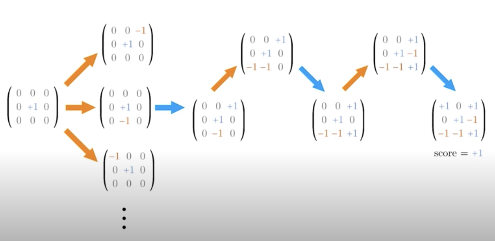
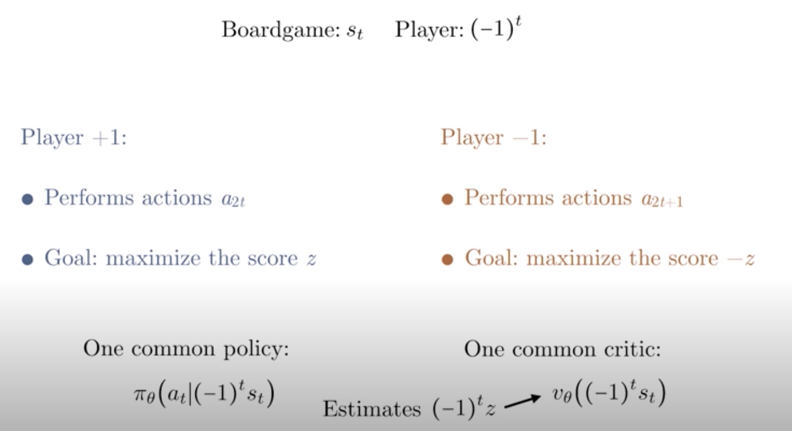
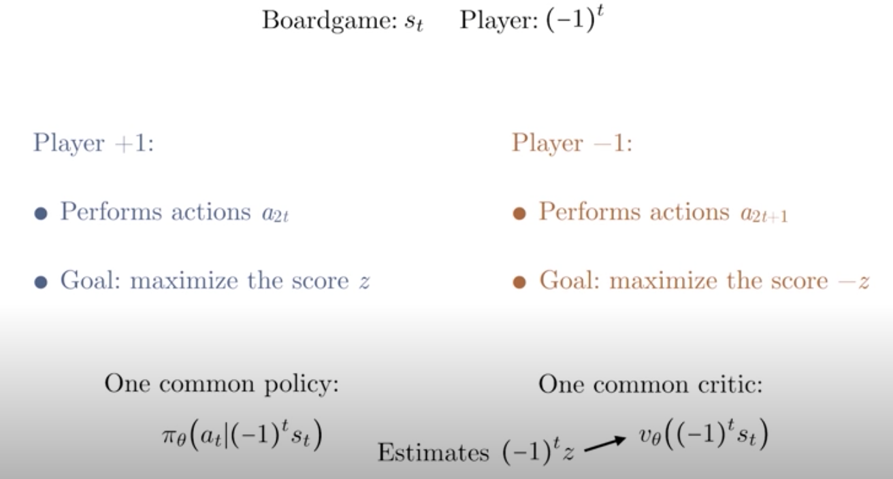

# AlphaZero Review
In 2016, researchers at DeepMind announced a new breakthrough -- the development of a new AI engine, alphago for the game of go.The AI was able to beat a professional player LeeSedol. The breakthrough was significant, because go was far more complex than chess: the number of possible games is so high, that a professional go engine was believed to be way out of reach at that point, and human intuition was believed to be a key component in professional play. Still, performance in alphago depends on expert input during the training step, and so the algorithm cannot be easily be transferred to other domains

This changed in 2017, when the team at DeepMind updated their algorithm, and developed a new engine called alphago zero. This time, instead of depending on expert gameplay for the training, alphago zero learned from playing against itself, only knowing the rules of the game. More impressively, the algorithm was generic enough to be adapted to chess and shogi (also known as japanese chess). This leads to an entirely new framework for developing AI engine, and the researchers called their algorithm, simply as the alphazero.

The best part of the alphazero algorithm is simplicity: it consists of a Monte Carlo tree search, guided by a deep neural network. This is analogous to the way humans think about board games -- where professional players employ hard calculations guides with intuitions.

In the following lesson, we will cover how the alphazero algorithm works, and implement it to play an advanced version of tic-tac-toe. So let’s get started!

(Much of the lesson material is derived from the original paper, for  [alphago zero](https://deepmind.com/documents/119/agz_unformatted_nature.pdf), and  [alphazero](https://arxiv.org/abs/1712.01815)  by the researchers at DeepMind. I encourage you to visit links -- click on the words-- to check out those papers)

# Zero-Sum Game
In order to talk aobut AlphaZero, we first need to formalize the concepts of games that AlphaZero specializes in, **zero-sum games.** 

We start with a board game environment, a grid for example, then two competing agents takes turns to perform actions to try to win the game. In the end, one agent's win is another agent's loss. Usually, we also assumed that the game contains no hidden information, so there's no element of luck, and winning or losing is entirely determined by skill. This concept is applicable to games as simple as tic-tac-toe to more complicated games such as chess and Go. 

Let's go back to our ic-tac-toe example. The goal is to get three in a row, so the first player might make a move, say at the center, then the second player makes a move. Now, there are usually multiple possibilities at each step. In this case, there are eight. Focusing on one of these possibilities, we might have a game sequence like below.

Now, in this case, the first player wins. We can represent all this information mathematically. The board can be represented by a matrix where 0 indicates empty space and +/-1 indicates the pieces of player one and two. Given that there are only circles and crosses in tic-tac-toe, each entry can then only be 0, +1, or -1.

We can also encode the final outcome by a score, where +1 indicates a win by the first player, and -1 indicates a win by the second player, and 0 indicates a draw. This way of representing the board is convenient because the board can easily be fed into a neural network. 

Also, if you want to switch other players' pieces, we can just multiply the matrix by -1. We can also flip the score by multiplying it by -1. This property will come in handy when we build an agent to play the game. 

Now that we've encoded the game mathematically, we can rephrase everything in the language of RL. We have a sequence of states for the board game denoted by `s_t`, and we have two players denoted by +/-1. Here, we've simplified the `(-1)^t`, assuming we start with `t=0`. 

Player +1 performs actions at all the even timesteps and tried to maximize the final score `+z`. While player -1 performs actions at all the odd timesteps and tries to maximize -1 time the final score, `-z`. 

Now, imagine we've constructed an intelligent agent who is able to play a perfect game as player +1, then is should be able to play a perfect game as player -1 as well. As long as we flipped the state, `s_t`, at all the odd timestep. Then we can have the agent play against itself with a common policy. Now, besides having a common policy, we can also have a common critic that can evaluate the expected outcome from the perspective of the current player. 

This essentially estimates the expected value of `{(1)^t} \times z`. We will see later that **this is basic idea behind AlphaZero,** where we have one agent playing against itself along with one critic that self-improves as more and more games are played.

See the video [here](https://youtu.be/uPw1dHVqdXQ).

