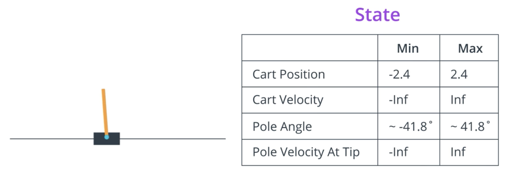
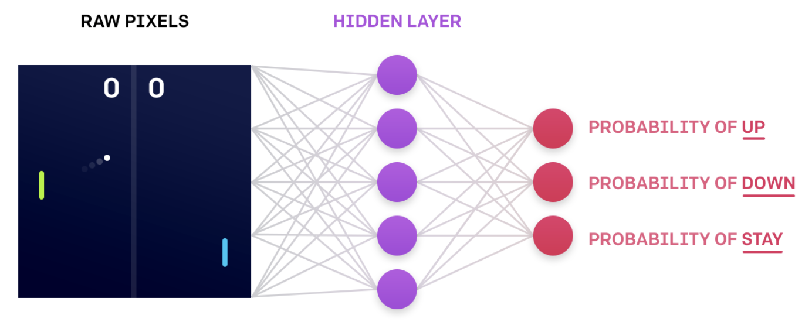
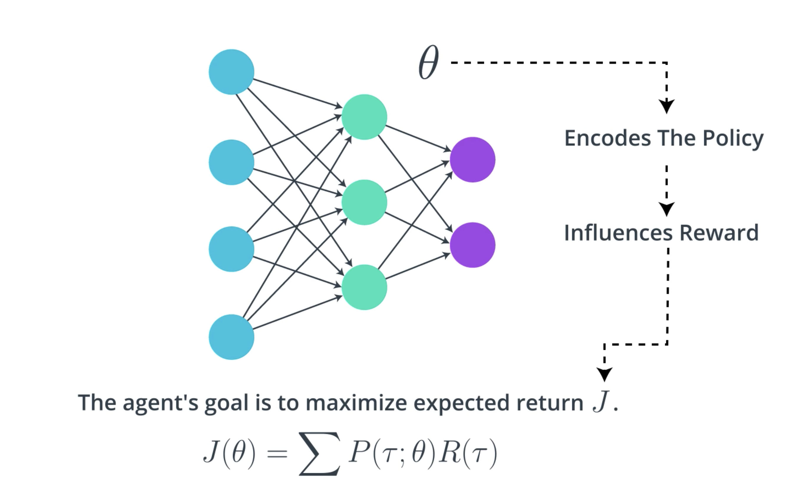
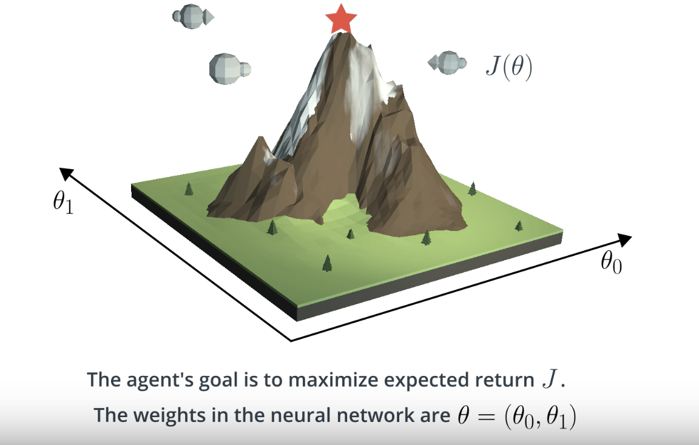
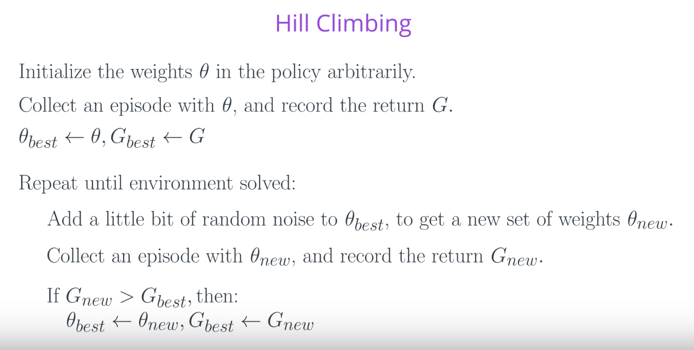
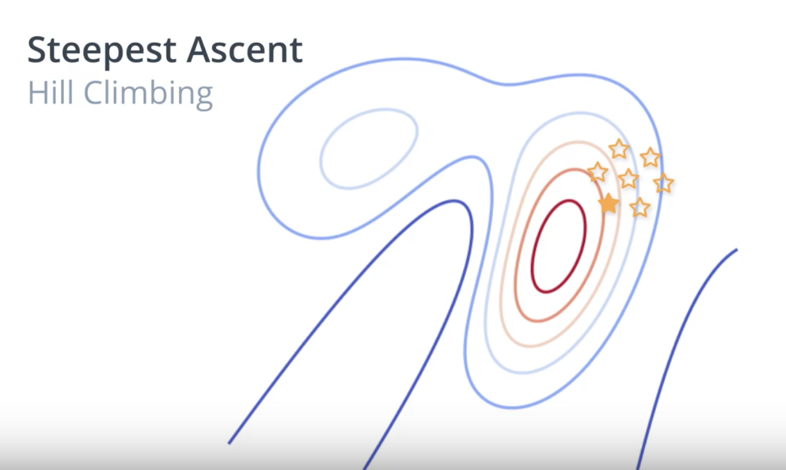

# Preface

#### Lesson: Introduction to Policy-Based Methods

In this lesson, you will learn about methods such as hill climbing, simulated annealing, and adaptive noise scaling. You'll also learn about cross-entropy methods and evolution strategies.

#### Lesson: Policy Gradient Methods

In this lesson, you'll study REINFORCE, along with improvements we can make to lower the variance of policy gradient algorithms.

#### Lesson: Proximal Policy Optimization

In this lesson, you'll learn about Proximal Policy Optimization (PPO), a cutting-edge policy gradient method.

#### Lesson: Actor-Critic Methods

In this lesson, you'll learn how to combine value-based and policy-based methods, bringing together the best of both worlds, to solve challenging reinforcement learning problems.

#### Lesson: Deep RL for Finance (_Optional_)

In this  **_optional_**  lesson, you'll learn how to apply deep reinforcement learning techniques for optimal execution of portfolio transactions.

#### Resources (_Optional_)

-   Read the most famous  [blog post](http://karpathy.github.io/2016/05/31/rl/)  on policy gradient methods.
-   Implement a policy gradient method to win at Pong in this  [Medium post](https://medium.com/@dhruvp/how-to-write-a-neural-network-to-play-pong-from-scratch-956b57d4f6e0).
-   Learn more about  [evolution strategies](https://blog.openai.com/evolution-strategies/)  from OpenAI.

# Introduction
In this lesson, you'll learn all about **policy-based methods**. Watch the video below to learn what policy-based methods are, and how they differ from value-based methods!

RL is uttimately about learning an optimal policy from interaction with the environment. So far, we've been looking at **value-based methods**, where we first tried to find an estimate of the optimal action value function. 

For small state spaces, this optimal value function was represented in a table with one row for each state and one column for each action. Then, we use the table to build the optimal policy one state at a time. For each state, we just pull its corresponding row from the table and the optimal action is just the action with the largest entry. 

But, **what about environments with much larger state spaces?** For instance, consider the cartpole environment, where the goal is to teach an agent to balance a pole that's attached to a moving cart. 

At each time step, the agent pushes the cart either to the left or to the right to try to keep the pole from failing down. The stated ending timestamp is a vector with four numbers containing the cart's position and velocity, along with the pole's angle and velocity. 

There's a huge number of possible states corresponding to every possible value that these board numbers (picture above) can have. So, without some sort of discretization technique, **it's impossible to represent the optimal action value function in a table**. This is **because** we would need a row for each possible state, and that would make the table way too big to be useful in practice. 

So, we investigated how to represent the optimal action value function with a nerual network which formed the basis for the **deep Q learning** algorithm. In this case, neural network took the ***environment state as input***. As _**output**_, it returned the value of each possible action. 

In the case of cartpole, for instance, the possible actions are to move the cart left or right. Then, identical to the previous setting where we used the table, we can easily obtain the best action for any state by just looking at the values of the input state produces in the network. It's just the action that maximizes these values.

But the **important message** here is that in both cases, whether we used a table for small state spaces or a neural network for much larger state spaces, we had to first estimate the optimal action value function before we could tackle the optimal policy.

But now the question is: **can we directly find the optimal policy without worrying about a value function at all?** The answer is yes, and we accomplish this through a class of algorithms known as **policy-based methods**.

See the video [here](https://youtu.be/mMnhi8yzwKk).

# Policy Function Approximation
**How might we approach this idea of estimating an optimal policy?** 

Let's consider the cartpole example. In this case, the agent has two possible actions, he can push the cart either left or right. So, at each time step, the agent picks one of these two options. We can construct a neural network that approximates the policy, that accepts the state as input. As output, it can return the probability that the agent selects each possible action. So, if there are two possible actions, the output layer will have two nodes. 

The agent uses the policy to interact with the environment by just passing the most recent state to the network. It outputs action probabilities and then the agent samples from those probabilities to select an action in response. 

Our objective then is to determine appropriate values for the network weights so that for each state that we pass into the network it returns action probabilities where the optimal action is most likely to be selected. 

This will help the agent with its goal to maximize expected return. This is an iterative process where the weights are initially set to random values. Then, as the agent interacts with the environment and learns more about what strategies are best for maximizing reward, it amends those weights. As a direct result, the agent starts to choose the appropriate action for each date and it gradually masters the task. 

See the video [here](https://youtu.be/v8tGjlc2aG4).

# More on the Policy

In the previous video, you learned how the agent could use a simple neural network architecture to approximate a  **stochastic policy**. The agent passes the current environment state as input to the network, which returns action probabilities. Then, the agent samples from those probabilities to select an action.

The same neural network architecture can be used to approximate a **deterministic policy**. Instead of sampling from the action probabilities, the agent need only choose the greedy action.

## What about continuous action spaces?
The CartPole environment has a discrete action space. So, how do we use a neural network to approximate a policy, if the environment has a continuous action space?

As you learned above, in the case of  **_discrete_**  action spaces, the neural network has one node for each possible action.

For  **_continuous_**  action spaces, the neural network has one node for each action entry (or index). For example, consider the action space of the  [bipedal walker](https://github.com/openai/gym/wiki/BipedalWalker-v2)  environment, shown in the figure below.

Action space of  `BipedalWalker-v2`  ([Source](https://github.com/openai/gym/wiki/BipedalWalker-v2))

In this case, any action is a vector of four numbers, so the output layer of the policy network will have four nodes.

Since every entry in the action must be a number between -1 and 1, we will add a  [tanh activation function](https://pytorch.org/docs/stable/nn.html#torch.nn.Tanh)  to the output layer.

As another example, consider the  [continuous mountain car](https://github.com/openai/gym/wiki/MountainCarContinuous-v0)  benchmark. The action space is shown in the figure below. Note that for this environment, the action must be a value between -1 and 1.

Action space of  `MountainCarContinuous-v0`  ([Source](https://github.com/openai/gym/wiki/MountainCarContinuous-v0))

# Hill Climbing
So far, you've learned how to represent a policy as neural network. This network takes the current environment state as input, then if the environment has a discrete action space it outputs the action probabilities that the agent uses to select its next action.

Here, we'll describe an algorithm that the agent can use to gradually improve the network weights. So, remember that the agent's goal is always to maximize expected return. Let's denote the expected return by .

We'll refer to the set of weights in the neural network as , there is some mathematical relationship between  and the expected return . This is because  encodes the policy which makes some actions more likely than others, and then depending on the action the influences the reward and then we sum up the rewards to get the return. 

Actually, it sounds potentially quite complicated. But **the main idea** is that it's possible to write the expected return  as a function of  and that function looks like this:

Now, this equation shouldn't make any sense to you yet, but we'll come back to it later on. For now, just know that it exists, and our goal is to find the values for , or the values for the weights that maximizes . 

To understand this better, let's draw a picture. Consider a case that the neural network has only two weights: . Then, we can plot the expected return  as a function of the values of both of the weights, for each weight gets a different axis, and once we have that function we can use it to find the value of  or the values of both of the weights that maximizes expected return. 

Maybe, you're familiar with one algorithm that could be useful for this called **gradient ascent**. 

**Gradient ascent** begins with an initial guess for the value of  that maximizes the function, then we evaluate the gradient at that point (gredient points to the steepest direction in a function), and so we can make a small step in that direction, in the hope that we end up at a new value of  or the value of the function is a little bit larger. Then, we repeat with evaluating the gradient and taking a step until we eventually reach the maximum of the function.

Now, in order to do this, we have to take the gradient of the function. We'll discuss this later. For now, we'll discuss a different algorithm called **Hill Climbing**, that's a little bit simpler.

As with gradient ascent, we begin with an initially random set of weights . We collect a single episode with the policy that corresponds to those weights and then record the return. This return is an estimation of what the surface looks like at that value of . 

Now, it's not going to be perfect estimate because the return we just collected is unlikely to be equal to the expected return, but in practice the estimates often turns out to be good enough. Then, we'll add a little bit of random noise to those weights to give us another set of candidate weights we can try.

To see how good those new weights are, we'll use the policy that they give us to again interact with the environment for an episode and add up the return. If the new weights give us more return than our current best estimate, we focus our attention  on that new value, and then we just repeat by iteratively proposing new policies in the hope that they outperform the existing policy. 

In the event that they don't, we just go back to our last best guess for the optimal policy and iterate until we end up with the optimal policy. 

See the video [here](https://youtu.be/5E86a0OyVyI).

## Gradient Ascent

**Gradient ascent**  is similar to gradient descent.

-   Gradient descent steps in the  **_direction opposite the gradient_**, since it wants to minimize a function.
-   Gradient ascent is otherwise identical, except we step in the  **_direction of the gradient_**, to reach the maximum.

While we won't cover gradient-based methods in this lesson, you'll explore them later in the course!

## Local Minima
In the video above, you learned that  **hill climbing**  is a relatively simple algorithm that the agent can use to gradually improve the weights  \thetaθ  in its policy network while interacting with the environment.

Note, however, that it's  **_not_**  guaranteed to always yield the weights of the optimal policy. This is because we can easily get stuck in a local maximum. In this lesson, you'll learn about some policy-based methods that are less prone to this.

## Additional Note
Note that  [hill climbing](https://en.wikipedia.org/wiki/Hill_climbing)  is not just for reinforcement learning! It is a general optimization method that is used to find the maximum of a function.

# Hill Climbing Pseudocode
Now that we have a mental picture of how the hill climbing algorithm should work, we're ready to dig into the pseudocode. 

- We begin with an initially random set of weights . 
- We'll collect an episode with the policy that correspond to those weights, and then record the return .
- At the start, this value  is our first best guess for the weights, which we'll record as . We'll also record the return as the highest return we've gotten so far, .
- Then, we add a little bit of random noise to these weights to give us another set of candidate weights we can try out. Let's call them . 
- To see how good those new weights are, we'll use the policy that they give us to interact with the environment, then we calculate the return we got which we refer to as.  
- If the new weights give us more return than our current best estimate ,, we update the best weights to that new value, .
- Then, we just repeat these steps until we solve the environment. That's it!

See the video [here](https://youtu.be/0XzzqIXyax0).

## What's the difference between _G_ and _J_?
You might be wondering: what's the difference between the return that the agent collects in a single episode (,  _from the pseudocode above_) and the expected return ?

Well ... in reinforcement learning, the goal of the agent is to find the value of the policy network weights  that maximizes **_expected_** return, which we have denoted by .

In the hill climbing algorithm, the values of  are evaluated according to how much return  they collected in a **_single episode_**. To see that this might be a little bit strange, note that due to randomness in the environment (and the policy, if it is stochastic), it is highly likely that if we collect a second episode with the same values for , we'll likely get a different value for the return . Because of this, the (sampled) return  is not a perfect estimate for the expected return , but it often turns out to be **_good enough_** in practice.

# Beyond Hill Climbing

In the previous section, you learned about the hill climbing algorithm.

We denoted the expected return by . Likewise, we used  to refer to the weights in the policy network. Then, since  encodes the policy, which influences how much reward the agent will likely receive, we know that  is a function of .

Despite the fact that we have no idea what that function  looks like, the _hill climbing_ algorithm helps us determine the value of  that maximizes it. Watch the video below to learn about some improvements you can make to the hill climbing algorithm!

**Note:** We refer to the general class of approaches that find  through randomly perturbing the most recent best estimate as **stochastic policy search**. Likewise, we can refer to  as an  **objective function**, which just refers to the fact that we'd like to _maximize_ it!

With an objective function in hand, we can now think about finding a policy that maximizes it. An objective function can be quite complex. Think of it as a surface with many peaks and valleys. 

Here, it's a function of two parameters with the height indicating the policy's objective value . But the same idea extends to more than two parameters. 

Now, we don't know anything about this surface. So, **how do we find the spot where the objective value is at its maximum?** 

Our first approach is to search for the best policy by repeatedly nudging it around. Let's start with some arbitrary policy , defined by its parameters , and evaluate it by applying that policy in the environment. This gives us an objective value. So you can imagine the policy lying somewhere on the objective function surface. 

Now, we can change the policy parameters slightly so that the objective value also changes. This can be achieved by adding some small **Guassian noise** to the parameters. 

If the new policies value is better than our best value so far, we can set this policy to be our bew best policy and iterate. 

This general approach is known as **hill climbing**. You literally walk the objective function surface till you reach the top of a hill. 

_**The best part is that you can use any policy function. It does not need to be differentiable or even continuous, but because you're taking random steps, this may not result in the most eficient path up the hill.**_

One small improvement to this approach is to choose a small number of neighboring policies at each iteration and pick the best among them. 

It's easier to understand this by looking at a contour plot. Again, starting with an arbitrary policy, evaluate it to find out where it lies. Generate a few candidate policies by perturbing the parameters randomly and evaluate each policy by interacting with the environment. This gives us an idea of the neighborhood of the current policy. 

Now, pick the candidate policy that looks most promising and iterate. This variation is known as **steepest ascent hill climbing** and it helps reduce the risk of selecting a next policy that may lead to a suboptimal solution. 

You could still get stuck in local optima. But there are some modifications that can help mitigate that, for example, by using random restarts or **simulated annealing**. 

**Simulated annealing** uses a predefined schedule to control how the policy space is explored. Starting with a large noise parameter, that is a broad neighborhood to explore, we gradually reduce the noise or radius as we get closer to the optimal solution. This is somewhat like annealing an iron by heating it up and then letting it cool down gradually. It allows iron molecules to settle into an optimal arrangement resulting in a hardened metal, hence the name. 

We can also make our approach more adaptive to the changes in policy values being observed. Here's the intuition. 

**Adaptive Noise Scaling:**

Whenever we find a better policy than before, we're likely getting closer to the optimal policy. So, it makes sense to reduce our search radius for generating the next policy. This translates to reducing or decaying the variance of the Gaussian noise we add. So far, it's just like simulated annealing. But, if we don't find a better policy it's probably a good idea to increase our search radius and continue exploring from the current best policy. This small tweak to stochastic policy search makes it much less likely to get stuck, especially in domains with a complicated objective function. 

See the video [here](https://youtu.be/QicxmyE5vTo).

# More Black-Box Optimization

All of the algorithms that you’ve learned about in this lesson can be classified as  **black-box optimization**  techniques.

**Black-box**  refers to the fact that in order to find the value of  that maximizes the function , we need only be able to estimate the value of  at any potential value of .

That is, both hill climbing and steepest ascent hill climbing don't know that we're solving a reinforcement learning problem, and they do not care that the function we're trying to maximize corresponds to the expected return.

These algorithms only know that for each value of , there's a corresponding **_number_**. We know that this **_number_** corresponds to the return obtained by using the policy corresponding to  to collect an episode, but the algorithms are not aware of this. To the algorithms, the way we evaluate  is considered a black box, and they don't worry about the details. The algorithms only care about finding the value of  that will maximize the number that comes out of the black box.

In the video below, you'll learn about a couple more black-box optimization techniques, to include the  **cross-entropy method**  and  **[evolution strategies](https://blog.openai.com/evolution-strategies/)**.

So far, you've learned about a couple of different algorithms that we can use to optimize the weights of the policy networks. 

Hill climbing begins with a best guess for the weights, then it adds a little bit of noise to propose one new policy that might perform better. Steepst ascent hill climbing does a little bit more work by generating several neighboring policies at eac iteration. But, in both cases, only the best policy prevails. For steepest ascent hill climbing there's a lot of useful information that we're throwing out. 

Here, we're going to learn about some methods that leverage useful information from the weights that aren't selected as best. So what if instead of selecting only the best policy, we select the top 10 or 20 percent of them, and took the average? This is what the **Cross Entropy Method** does.

Another approach is to look at the return that was collected by each candidate policy. The best policy will be a weighted sum of all of these, where policies that got higher return are given more say or get a higher weight. This technique is called **Evolution Strategies**. The name originally comes from the idea of biological evolution, where the idea is that the most successful individuals in the policy population, who have the most influence on the next generation or iteration. 

That said, it's best to think of evolution strategies as just another black-box optimization technique. 

See the video [here](https://youtu.be/2poDljPvY58).

