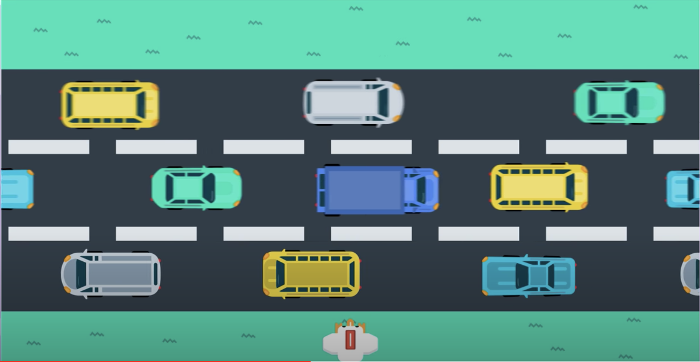

# What are Policy Gradient Methods?

Policy gradient methods are a subclass of policy-based methods. In the previous section, we learned about policy-based methods. 

**Policy-based methods** are a class of algorithms that search directly for the optimal policy without simultaneously maintaining value function estimates. We learned how to represent the policy as a neural network, and in that setting, the agent's goal is to find the best ways to maximize expected return. 

**Policy gradient methods** are a subclass of policy-based methods that estimate the weights of an optimal policy through gradient ascent. Here, we'll learn about the theory behind this before training our agent with the policy gradient method. 

For now, to set the stage, we'll explore an example that will help us understand how these methods work. So, first, remember the cartpole example. This is a classic benchmark task where the goal is to balance a pole on a moving cart. 

To solve it, we can represent the policy with neural network that takes the states as input. As output, it returns the probability of each potential action and then the agent can sample from those probabilities to select an action. 

Now, let's consider a much more challenging task where the goal is to teach a chicken to cross a road. At each time step, our chicken agent can move up, down, left, or right, and the goal is to get there safely. So, we have to avoid getting hit by a car or truck. Say, there's a time limit of 5 seconds, and if we make it safely to the other side in time, we win, otherwise, we lose.

Just as in cartpole example, we can represent the agent's policy with a neural network. It takes the game states as input and returns the probability that the chicken selects each possible action. In this case, the output layer will have 4 nodes because there are 4 possible actions. 

Now, we are training our agent to learn from raw pixels, probably, a convolutional neural network is the best bet. Basically, that would provide the state of the game as input to a neural network. As output, the network will return action probabilities. Our **goal** is to find the weights of the neural network that yield the optimal policy. 

We begin with an initially random set of weights and use the corresponding policy to interact with the environment. So, for instance, say the agent plays the game for a single round or episode and ends up making it to the other side safely and within the time limit. 

But then, when it plays the game for another episode, it chooses an unwise series of actions that leads to it losing the round. Then, in order to to teach the agent to win, we'll give a reward of +1 if it won and -1 if it lost and see that reward is only delivered at the end of the game. 

Now, so far, everything we've discussed is along the lines of what we did in the previous lesson when we talked about several policy-based methods. The difference, which we'll talk about in the next part. 

See the video [here](https://youtu.be/ZEhQRASU5O4).

In the  **Introduction to Policy-Based Methods**  lesson, you learned about many policy-based methods that could approximate either a deterministic or stochastic policy.

In this lesson, we'll confine our attention to stochastic policies.

# The Big Picture

Continuing on chicken game from last section, say, the reward is delivered only at the end of the game and is +1 if the agent wins and -1 if the agents loses. **So, how can we use this information to improve the network weights to get us closer to the optimal policy?** 

For now, say that we collected a single episode for the agent one. Well, the _**policy gradient method**_ that we'll discuss in this lesson. We'll look at each state action pair separately, beginning with the first one, and we'll recall how the agent ultimately selected action left from the state. It just passed that through the network which return action probabilities. The agent then sampled from those probabilities which ultimately led to selecting action left.

So **the idea** is this, since the agent won the game, that's an indication that it was a good decision to select action left when in this game state. So, we can change the network weights just a little bit to make it even more likely to select action left from that game state in the future. Then, we move on to the next state action pair and look at the probabilities that lead to selecting action up, and we amend the network weights again, just a little to make it slightly more likely to select action up from the corresponding game state. 

Once, we've done all of those updates for every state action pair in the episode, we can collect another episode. Say, in the second episode we lost. We'll again consider each of the state action pairs one at a time abd begin with the first one. Say, the action probabilities corresponding to the state are given here (left -> 0.3, right -> 0.2, up -> 0.3, down -> 0.2). Then, it makes sense that since this choice to select action up was part of an episode where we eventually lost the game, we'll amend the network weights to now put less probability on that action. We'll do the same for all other state action pairs in the episode where we want to amend the network to make it less likely to repeat these bad decisions in the future. 

We'll continue with collecting more episodes and making these modifications to the network. But, that's it. In this lesson, we'll dig more deeply into this process but it's useful to keep the big picture in mind. We just collect a lot of episodes and then for each episode we amend the network weights to make all the state action pairs more likely if we won the game, and to make them all less likely if we lost the game. This method isn't perfect but it's a start. Later, we'll learn about some ways to improve it.

See the video [here](https://youtu.be/zoOgRoaxGiU).

# Connections to Supervised Learning

**Policy gradient methods are very similar to supervised learning.**

Before moving on, let's talk a little bit more about what we just did and how it's related to supervised learning. As we discussed in the previous section, we begin by playing the game for an episode. If we make it to the other end of the street safely and in time, then we win the game. Then, for each state action pair in the episode, we modify the network just a little bit to make it slightly more likely to select that action when it encounters the corresponding state. 

The idea is that if we won, those must have been good actions to select from their corresponding states. So, let's modify the network to reflect that by making it more likely to experience like gameplay in the future. 

So, remember how we use supervised learning for image classification. We have a data set of images along with their corresponding labels. And if we want to train a neural network to predict the label corresponding to any image. What we do is pass that image through the network to get a prediction. If the prediction is incorrect, we change the network weights just a little bit so that the prediction is slightly more correct. And if it's correct, we also nudge the weights again just a little bit, so that the network is more certain of the correct label. And we just loop over the dataset until eventually the neural network gets as close as possible to give us accurate predictions for each image. 

Now, this is really similar to what we described with RL. Namely, each has a dataset of input output pairs that we'll use to train the corresponding networks. One important difference is that when we do image classification. Typically, we work with the dataset that doesn't change over time. So for instance, we download the ImageNet dataset once and then we just pull random batches to train the network. 

However, in this RL setting, the dataset varies by episode, so we use the policy to collect an episode, that gives us a dataset or a bunch of matched state action pairs, and then we use that dataset once to do a batch of updates. 

After those updates are done, we'll discard the dataset and then collect another episode which gives us another dataset and so on.

So the dataset changes pretty frequently. And furthermore, it's highly likely that we will experience a situation where the dataset has multiple conflicting opinions about what the best output should be for an input or in other words, what the best action is to take from a game state. 

The equivalent for image classification would be if the same image appeared twice in the dataset, where one entry said the image was of a dog and the other entry said the image contained a cat. This is something that we won't encounter with image classification, and it does make our current situation more complex. 

See the video [here](https://youtu.be/dJz_p4FKE-g).

## (Optional) Learn More

To further explore the connections between policy gradient methods and supervised learning, you're encouraged to check out Andrej Karpathy's  [famous blog post](http://karpathy.github.io/2016/05/31/rl/).

Learn more about the connections between supervised learning and reinforcement learning. ([Source](http://karpathy.github.io/2016/05/31/rl/))

