# Lesson Preview

State-of-the-art RL algorithms contain many important tweaks in addition to simple value-based or policy-based methods. One of these key improvements is called Proximal Policy Optimization (PPO) -- also closely related to Trust Region Policy Optimization (TRPO). It has allowed faster and more stable learning. From developing agile robots, to creating expert level gaming AI, PPO has proven useful in a wide domain of applications, and has become part of the standard toolkits in complicated learning environments.

In this lesson, we will first review the most basic policy gradient algorithm -- REINFORCE, and discuss issues associated with the algorithm. We will get an in-depth understanding of why these problems arise, and find ways to fix them. The solutions will lead us to PPO. Our lesson will focus on learning the intuitions behind why and how PPO improves learning, and implement it to teach a computer to play Atari-Pong, using only the pixels as input (see video below). Let's dive in!

_The idea of PPO was published by the team at OpenAI, and you can read their paper through this  [link](https://arxiv.org/abs/1707.06347)._

# Beyond REINFORCE

Here, we briefly review key ingredients of the REINFORCE algorithm.

REINFORCE works as follows: First, we initialize a random policy , and using the policy we collect a trajectory -- or a list of (state, actions, rewards) at each time step:

Second, we compute the total reward of the trajectory , and compute an estimate the gradient of the expected reward, :

Third, we update our policy using gradient ascent with learning rate :

The process then repeats.

What are the main problems of REINFORCE? There are three issues:

1.  The update process is very  **inefficient**! We run the policy once, update once, and then throw away the trajectory.
    
2.  The gradient estimate  gg  is very  **noisy**. By chance the collected trajectory may not be representative of the policy.
    
3.  There is no clear  **credit assignment**. A trajectory may contain many good/bad actions and whether these actions are reinforced depends only on the final total output.
    

In the following concepts, we will go over ways to improve the REINFORCE algorithm and resolve all 3 issues. All of the improvements will be utilized and implemented in the PPO algorithm.

# Noise Reduction
Here, we will explain why the policy gradient is noisy, and discuss ways to reduce this noise.

The way we optimize the policy, is by maximizing the average reward, . To do that, we use gradient ascent. 

Mathematically, the gradient is given by an average of the terms in the parentheses, over all the possible trajectories labeled by .

Now, the number of trajectories could easily be over millions, even for simple discrete problems, an infinite for continuous problems. So, for practical purposes, we simply take on trajectory, and compute a gradient, and then update our policy. 

A lot of times, the results of a sample trajectory, simply comes down to chance, and doesn't really contain that much information about our policy. **How does learning happen then?**

Well, the hope is that after training for really long time, these tiny signal accumulates. Still, it would be great if we could reduce these random noise in the sample trajectories. The easiest option is to simply sample more trajectories. 

Using distributed computing, we can even collect these trajectories in parallel, so that it won't take too much time. Then, we can estimate the policy gradient, by simply averaging across all the different trajectories, by the formula below:

There's another bonus for running multiple trajectories, is that we can collect all the total rewards, and get a sense of how they are distributed. 

In many cases, the distribution of rewards shifts, as learning happens. An episode with total reward equals 1 might be really good early on in the training, but really bad after a 1000 training episodes. 

Learning can be improved if we normalize the rewards like below, where  is the mean, and  the standard deviation.

**Dispatch normalization technique** is also used in many other problems in AI, such as image recognition, where normalizing the input can improve learning.

See the video [here](https://youtu.be/GCGqT2knFJ0).

# Credit Assignment
Here, we'll learn how to modify the reward function so that we can better differentiate good versus bad actions within a trajectory. 

Going back to the gradient estimate, we can take a closer look at the total reward , which is just the sum of reward at each step.

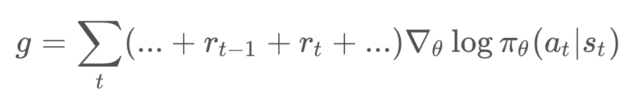

Now, let's think about what happens at time step t. Even before an action, , is decided, the agent has already received all the rewards up until time step .

**NOTE:** At this point, the "latex.codecogs.com" equation renderer that I use for all the math equations in the notes is not working. So, from this point on, I will write the latex codes directly. _Probably, most the equations I wrote using this website is not rendering throughout the notes, so they need to be fixed at some point as well._

So, we can think of that part of the total reward as a reward from the past, labeled by `{R_t}^{past}`. The rest of the reward can be denoted by the future reward, `{R_t}^{future}`.

Now, because we have a Markov process, the action at time step `t` can only affect the future rewards, so the past rewards should not really be contributing to the policy gradient here. 

So, for the properly assigned credit to the action at time step `t`, we should just ignore the past reward, so that a better policy gradient will simply have the future reward as a coefficient like this.

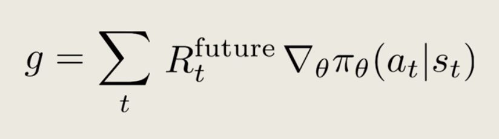

See the video [here](https://youtu.be/tfZw1moB25Y).

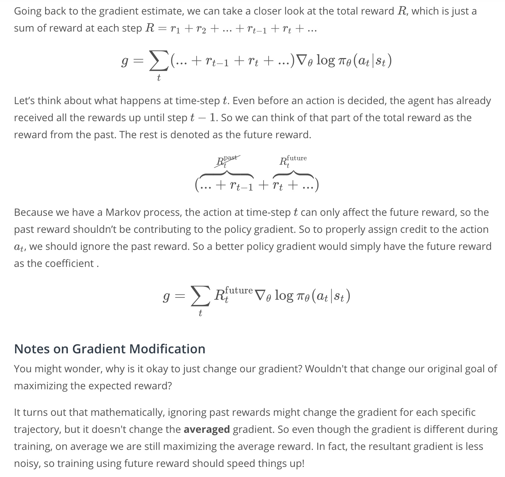

# Pong with REINFORCE, A Coding Exercise

For a walkthrough of the code, watch [this video](https://youtu.be/eKIjPrQWIgg).

For the codes refer to [this folder](codes/pong_PPO/pong-REINFORCE.ipynb)

## Additional Notes

-   **The performance for the REINFORCE version may be poor. You can try training with a smaller tmax=100 and more number of episodes=2000 to see concrete results.**
-   Try normalizing your future rewards over all the parallel agents, it can speed up training
-   Simpler networks might perform better than more complicated ones! The original input contains 80x80x2=12800 numbers, you might want to ensure that this number steadily decreases at each layer of the neural net.
-   Training performance may be significantly  _worse_  on local machines. I had worse performance training on my own windows desktop with a 4-core CPU and a GPU. This may be due to the slightly different ways the emulator is rendered. So please run the code on the workspace first before moving locally
-   It may be beneficial to train multiple epochs, say first using a small tmax=200 with 500 episodes, and then train again with tmax  = 400 with 500 episodes, and then finally with a even larger tmax.
-   Remember to save your policy after training!
-   for a challenge, try the 'Pong-v4' environment, this includes random frameskips and takes longer to train.

# Importance Sampling
Here, we'll learn how to utilize importance sampling to use trajectories. This will improve the efficiency of policy-based methods.

Let's go back to the REINFORCE algorithm. We start with a policy, `\pi_{\theta}`. Then, using that policy we generate some trajectories. Afterwards, using those trajectories, we compute a policy gradient, `g`, and update `\theta` to `\theta'`. Now, we have a new policy `\pi_{\theta}'`. 

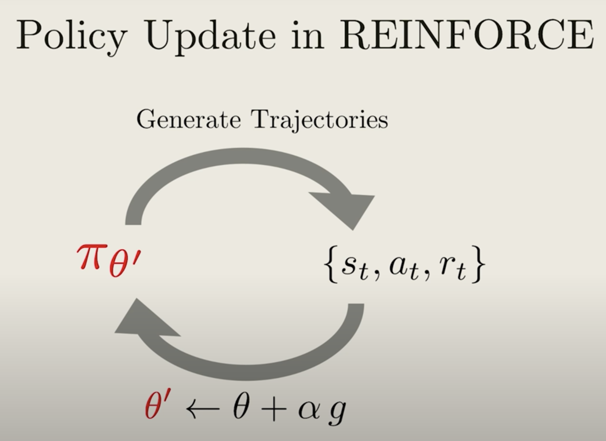

At this point, the trajectories we've just generated are simply thrown away. If we want to update our policy again, we would need to generate new trajectories once more using the updated policy. You might ask, **"Why is all this necessary?"**

Well, it's because we need to compute the gradient for the current policy, and to do that the trajectories need to be representative of the current policy. **But, this sounds a little wasteful.**

What if we could just somehow recycle all trajectories by modifying them, so that they're representative of the new policy. So, instead of just throwing them away, we recycle them. 

Then, we could just reuse the recycled trajectories to compute gradients, and to update our policy again and again, which will make updating the policy a lot more efficient. **So, how exactly would that work?**

This is where **importance sampling** comes in. Let's look at the trajectories we generated using the policy `\pi_\theta`. It had a probability `P(\tau;\theta)` to be sampled. 

Now, just by chance the same trajectory can be sampled under the new policy, but with a slightly different probability `P(\tau;\theta')`.

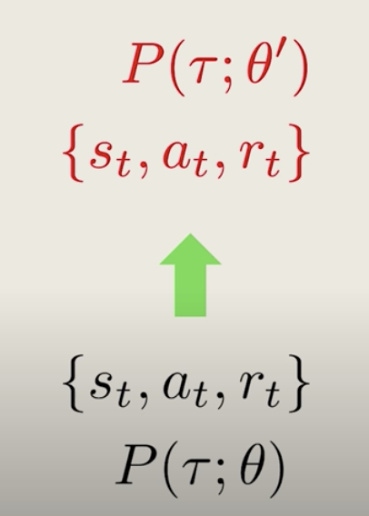

Imagine we want to compute the average of some quantity, say `f(\tau)`, under the new policy. 

The easiest way we could do this is to simply generate trajectories from the new policy, then compute `f(\tau)` and average them up.

Mathematically, this is equivalent to adding a `f(\tau)` over all possible trajectories, weighted by some probability factor, `P(\tau;\theta')`.

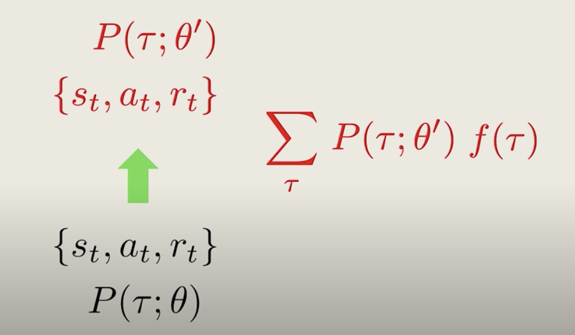

Now, we can modify this equation by multiplying and dividing by the same number `P(\tau;\theta)`, and then we can rearrange the terms like below:

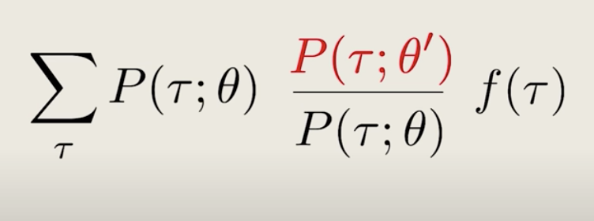

Now, it doesn't look like we've done much, but written in this way, we can reinterpret the first part as the coefficient of sampling under the old policy. With an extra re-weighting factor, 

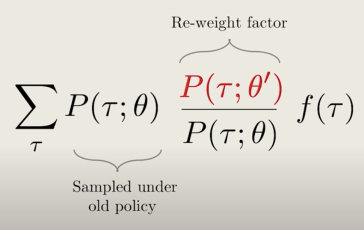

Intuitively, this tells us we can use all trajectories for computing averages for new policies, as long as we add this extra re-weighting factor, which basically takes into account how under- or over-represented each trajectory is under the new policy compared to the old one.

The same trick, has been used frequently across statistics, where the re-weighting factor is included to unbias surveys and voting predictions. 

**So, in order to reuse samples for computing gradients for new policy, all we need to do is include this extra re-weight factor.** 

Now, let's take a closer look at the re-weighting factor, because each trajectory contains many steps. The probability contains a chain of products of the policy at each step, like below:

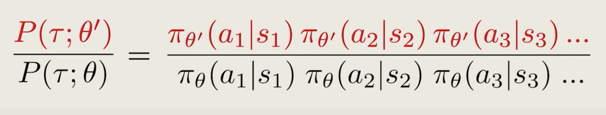

This formula is a little bit complicated, but there's actually a bigger problem. When some of the policy gets close to 0, the re-weighting factor can easily become very close 0, or worse very close to one over zero, which diverges to infinity. 

When this happens, the re-weighting trick becomes very unreliable. So, in practice, we always want to make sure that the re-weighting factor is not too far from 1, when we utilize importance sampling. 

See the video [here](https://youtu.be/cYPvWriOPIk).

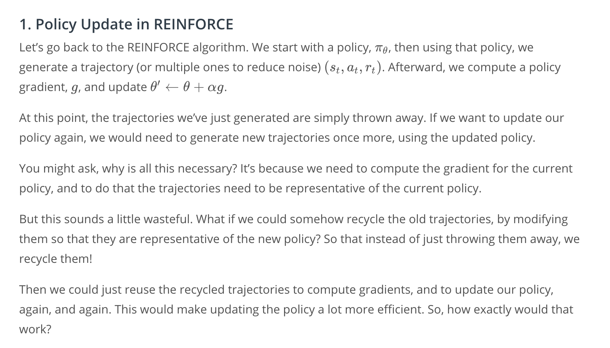

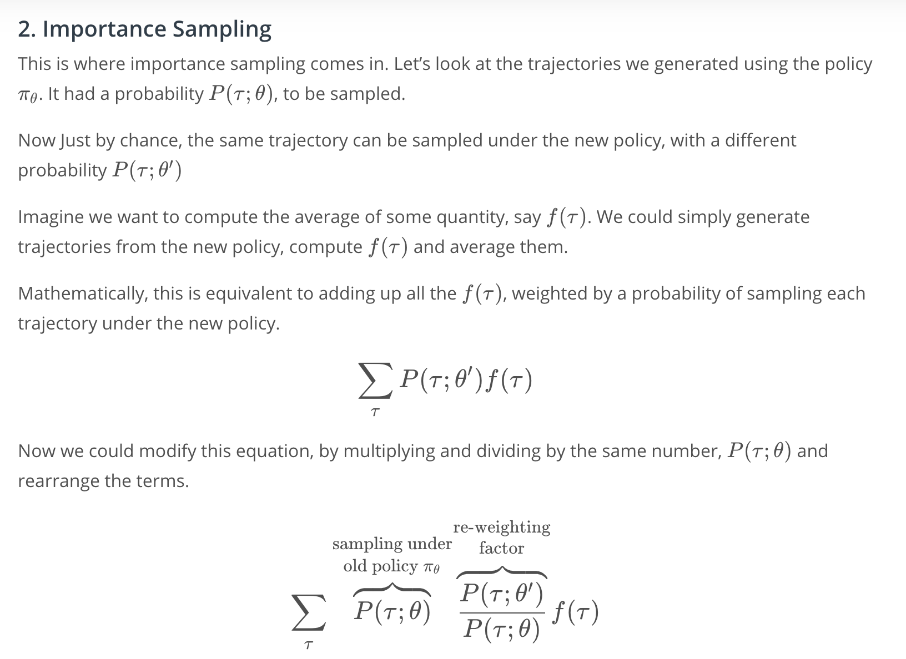

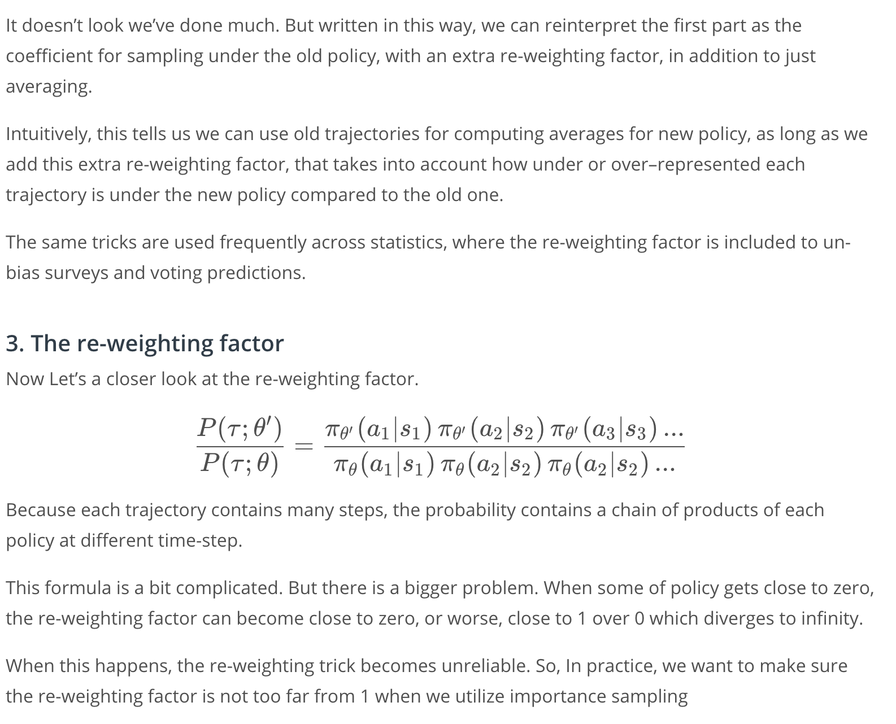

# PPO Part 1: The Surrogate Function
Here, we'll learn how to use importance sampling in the context of policy gradient, which will lead us to the surrogate function. 

Say, we're trying to update our policy, `\pi_{\theta'}`. To do that, we need to estimate a gradient, `g`, but we only have trajectories generated by an older policy, `\pi_{\theta}`. **How do we compute the gradient then?**

Mathematically, we could utilize importance sampling, and the answer is just what a normal policy gradient would be, times a re-weighting factor.

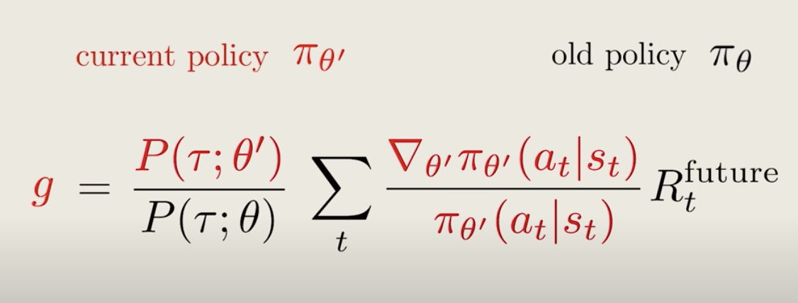

We can rearrange these equations, and the re-weighting factor is just the product of all the policy across each step. 

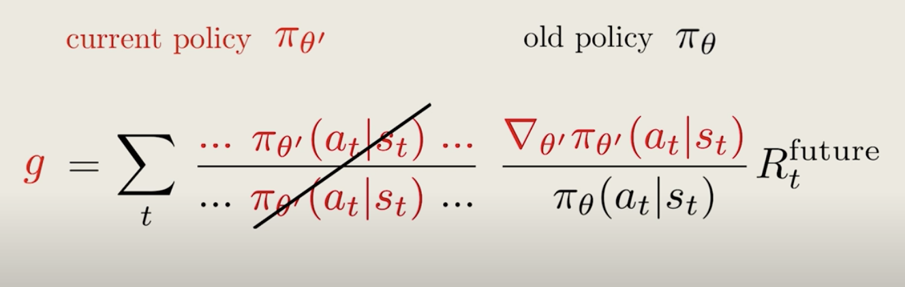

**Can we somehow simplify this expression further?**

Well, this is where the idea of **proximal policy** comes in. 

If the old and current policy is close enough to each other, all these factors will be pretty close to 1. Then, perhaps we can ignore them.

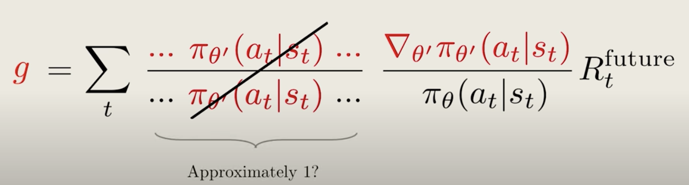

So, now the equation simplifies even further. 

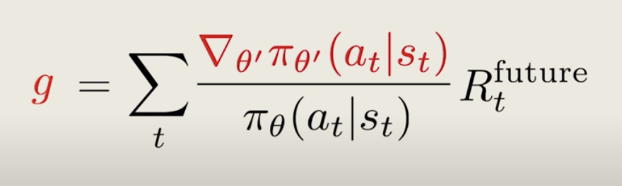

It looks very similar to the old policy gradient. In fact, if the current policy is the same as the old policy, we would have exactly the same vanilla policy gradient, but remember, this expression is different because we comparing two different policies. 

Now that we have the approximate form of the gradient, we can think of it as the gradient of a new object called the **surrogate function.**

So, using this new gradient, we can perform gradient ascent to update our policy, which we can think of as directly maximizing the surrogate function. 

But, there's still one important issue we have not addressed yet. If we keep re-using old trajectories and updating our policy, at some point the new policy might become different enough from the old one, so all the approximations we made could become invalid.

We need to find a way to make sure this doesn't happen. We'll talk about this in the next section.

See the video [here](https://youtu.be/Y-boYZlpO7g).

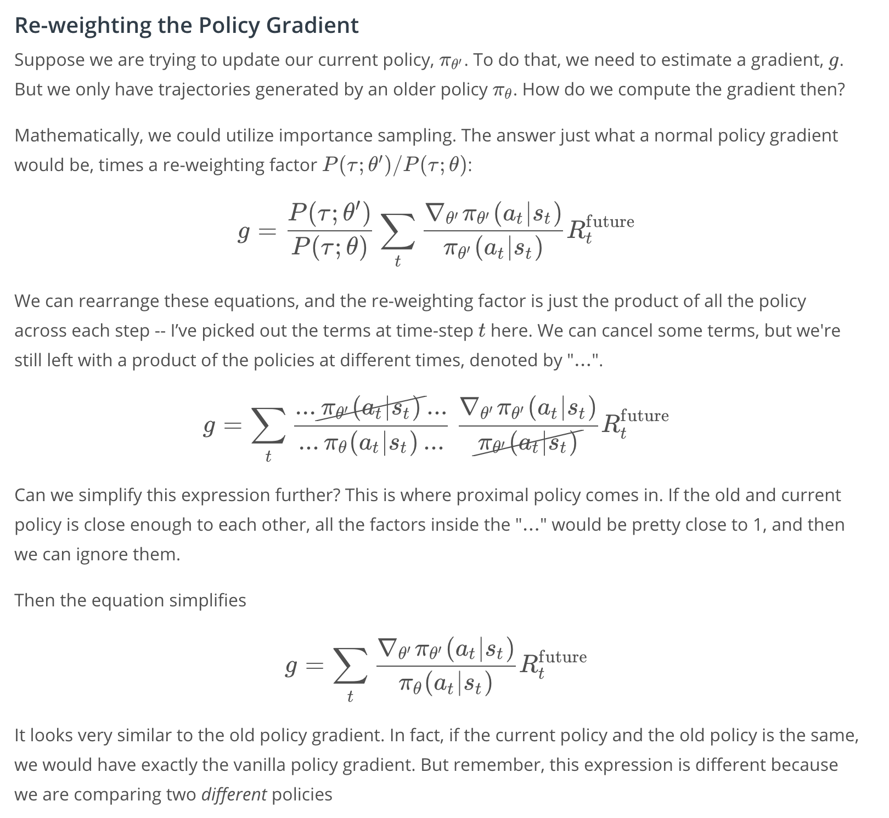

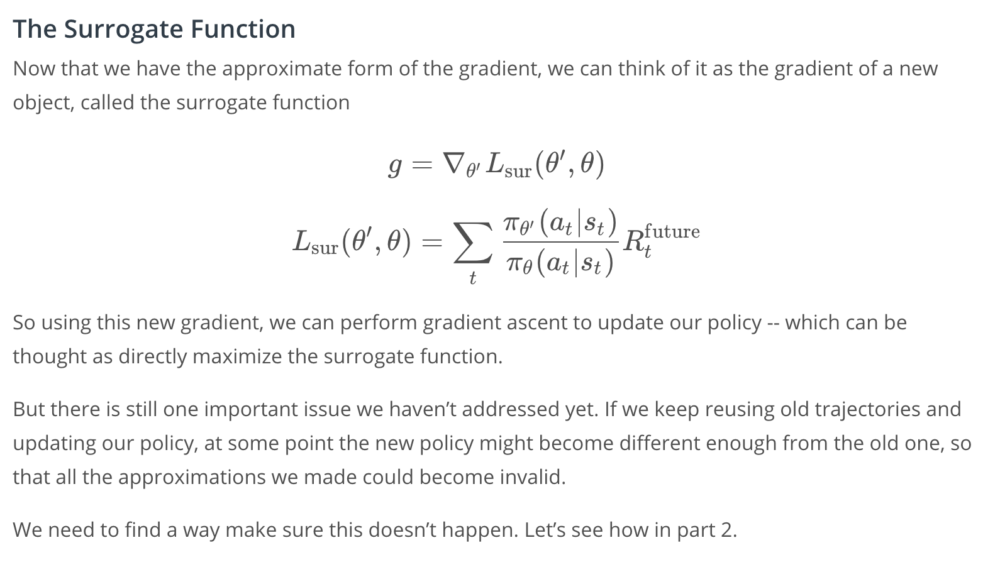

# PPO Part 2: Clipping Policy Updates
Here, we'll learn how to clip the surrogate function to ensure that the new policy remains close to the old one. 

**So, really, what is the problem of updating our policy and ignoring the fact that the approximations may not be valid anymore or the problem basically lead to a really bad policy?**

Let's see that in action.

Say we have some policy parametrized by `\theta'` shown on the left, with the reward function shown on the right. 

The current policy is labeled by the red dot and the goal is to update the policy to the optimal one, they're both labeled by green star. 

To update the policy, you can compute a surrogate function shown by the red curve. So, this function approximates that we worked pretty well around the current policy but far away from the current policy diverges. 

So, if we continually update the policy by performing gradient ascent, we might get something like next red dots shown in the picture.

The **big problem** here is that at some point we hit a cliff, where the policy changes by a large amount from the perspective of the surrogate function. The average reward is really great, but in reality the actual reward is actually really bad.

The **worst part** is the policy is now stuck in a deep and flat bottom. So the future updates won't be able to bring the policy back up, and now we're stuck with a really bad policy.

**How do we fix this?**

Wouldn't it be great if we could somehow stop the gradient ascent so that our policy doesn't fall off the cliff?

**Here is an idea**; What if we just flatten the surrogate function like this?

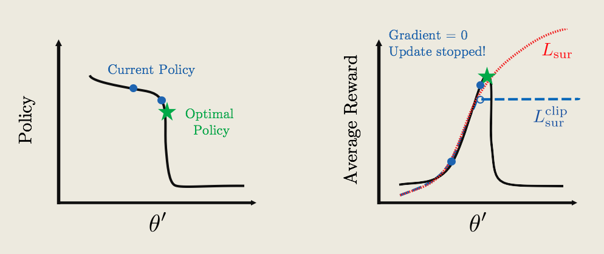

Now, what would the policy update look like then?

So, starting with the current policy, now labeled by the blue, we can apply gradient ascent. The updates remain the same until we hit the plateau. Now, because the reward function is flat, the gradient is zero and the policy update will stop now.

So, keep in mind that right now we're only showing a two dimensional figure with one `\theta'` direction. In most cases, there are thousands of parameters in the policy. So, there could be thousands of high dimensional cliffs in many different directions and applying this clipping mathematically will automatically take care of all these cliffs.

**How do we formalize this clipping procedure then?**

We can write the clipped surrogate function this way:

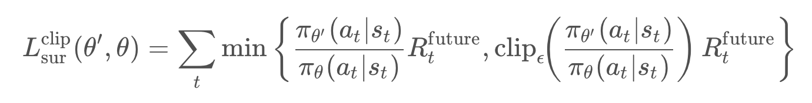

Now, the formula looks a little bit complicated but the idea is pretty simple. Let's dissect the formula by looking at one specific term in the sum and set the future reward to 1 to make things easier.

First, we start with the original surrogate function. Shown in the red, which is basically just the ratio of `\pi_{\theta'}` over `\pi_{\theta}`. 

The black dot shows the location with the current policy as the same as the old one. 

Now, we want to make sure that two policies are similar or that the ratio is close to 1. So, we can choose a small `\epsilon`, usually 0.1 or 0.2, and apply the clip function to force this ratio to be within a small `\epsilon` window of 1.

But, we actually only want to clip the top part and not the bottom part of the function. To do that, we can compare the clipped function to the original one and take the minimum, like in the blue dashed line.

Now, with this minimum function, this also ensures that the clipped surrogate function is always less than the original one. This way when we try to maximize the clipped surrogate function, we're also indirectly maximizing the surrogate function. 

So, in a sense, we have a more conservative optimization procedure. Now, comparing all the curves together looks something like below,

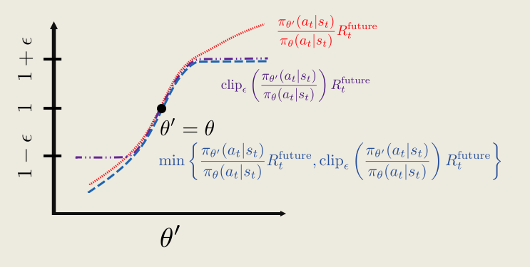

So, that's it. The essence of the PPO algorithm is simply computing the clipped surrogate function and performing updates multiple times using gradient ascent on the clipped surrogate function.

See the video [here](https://youtu.be/NRzjGGX6c34).

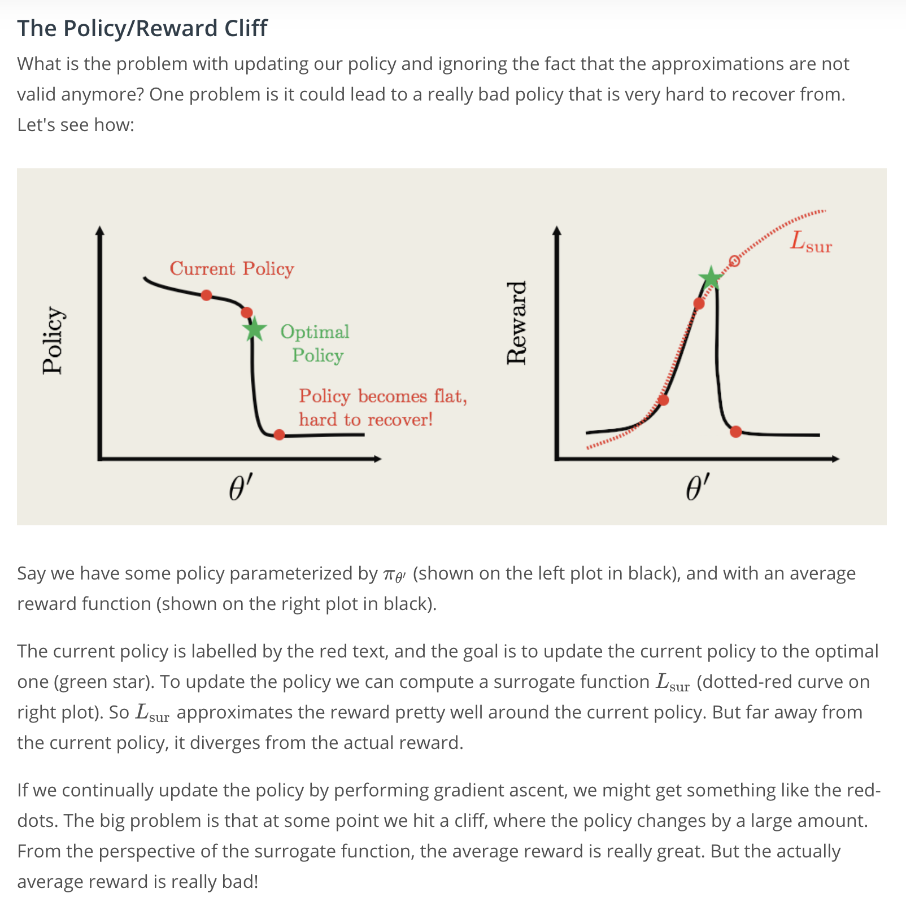

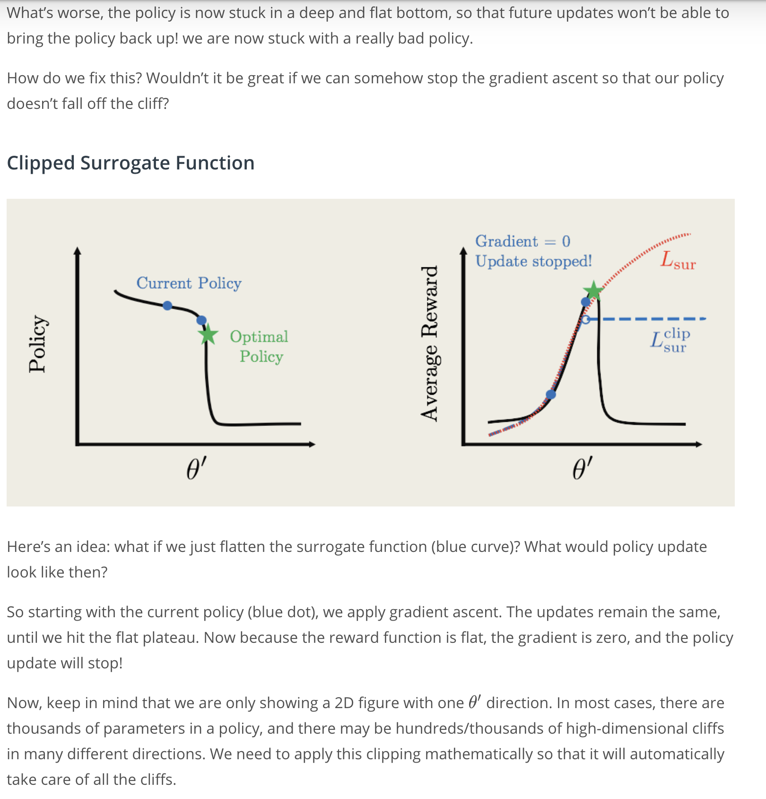

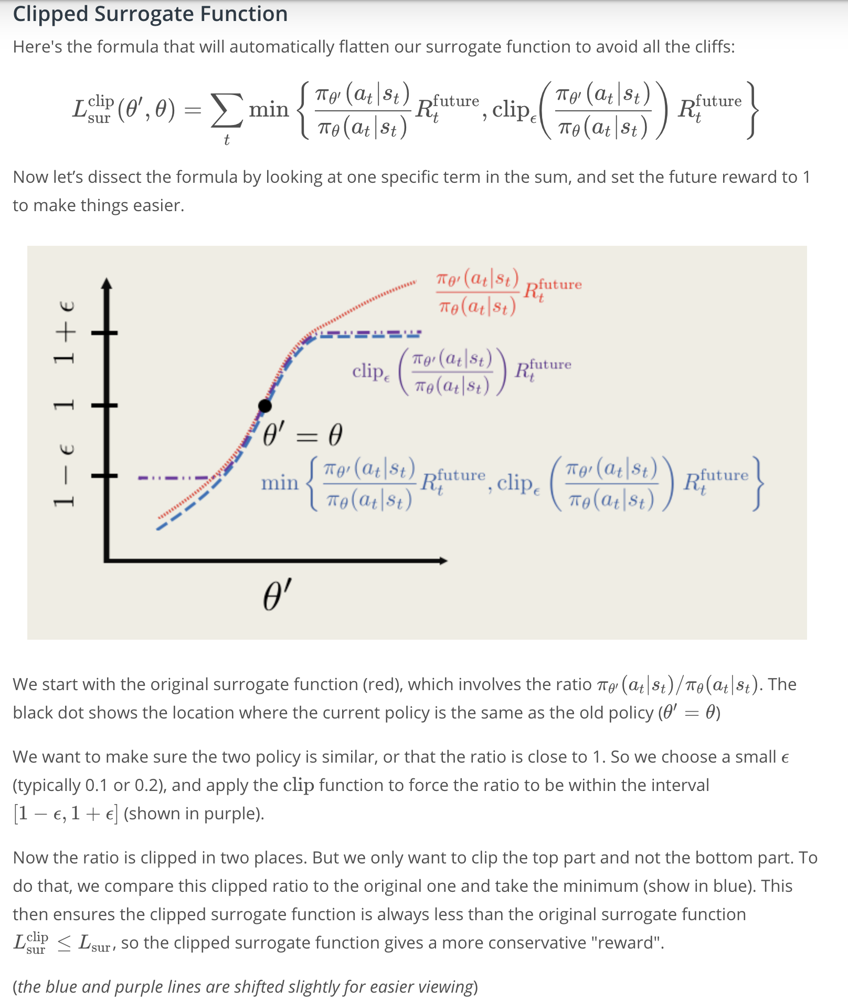

# PPO Summary
After learning importance sampling and the clip surrogate function, we can finally summarize the PPO algorithm.

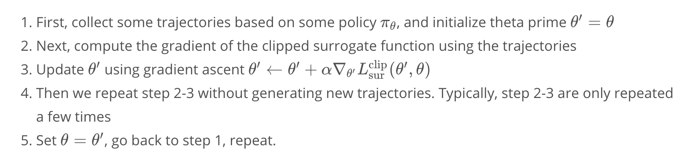

_The details of PPO was originally published by the team at OpenAI, and you can read their paper through this  [link](https://arxiv.org/abs/1707.06347)._

# Pong code with PPO

The code is [here](codes/pong_PPO/PPO_solution.policy).

Watch [this video](https://youtu.be/XhfhR7Z01S0) for a walktrough of the code.

## Additional Notes

-   Try normalizing your future rewards over all the parallel agents, it can speed up training
-   Simpler networks might perform better than more complicated ones! The original input contains 80x80x2=12800 numbers, you might want to ensure that this number steadily decreases at each layer of the neural net.
-   Training performance may be significantly  _worse_  on local machines. I had worse performance training on my own windows desktop with a 4-core CPU and a GPU. This may be due to the slightly different ways the emulator is rendered. So please run the code on the workspace first before moving locally
-   It may be beneficial to train multiple epochs, say first using a small tmax=200 with 500 episodes, and then train again with tmax  = 400 with 500 episodes, and then finally with a even larger tmax.
-   Remember to save your policy after training!
-   for a challenge, try the 'Pong-v4' environment, this includes random frameskips and takes longer to train.

