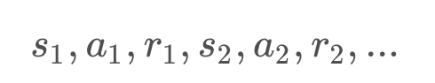
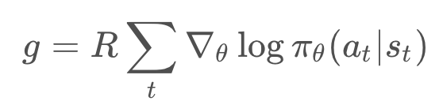
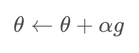
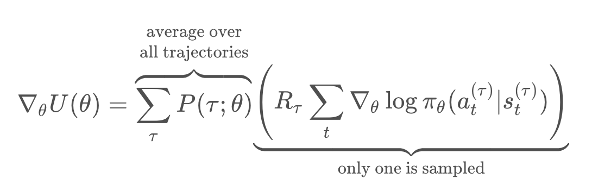
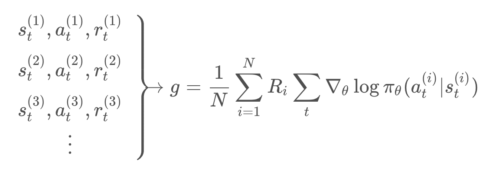
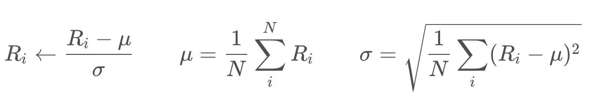
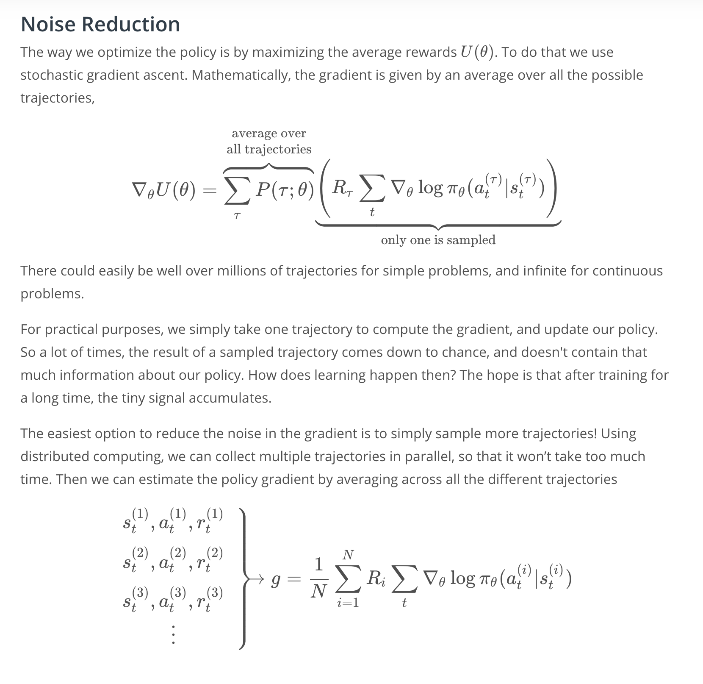
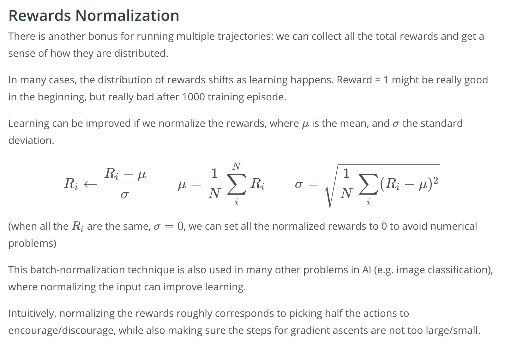

# Lesson Preview

State-of-the-art RL algorithms contain many important tweaks in addition to simple value-based or policy-based methods. One of these key improvements is called Proximal Policy Optimization (PPO) -- also closely related to Trust Region Policy Optimization (TRPO). It has allowed faster and more stable learning. From developing agile robots, to creating expert level gaming AI, PPO has proven useful in a wide domain of applications, and has become part of the standard toolkits in complicated learning environments.

In this lesson, we will first review the most basic policy gradient algorithm -- REINFORCE, and discuss issues associated with the algorithm. We will get an in-depth understanding of why these problems arise, and find ways to fix them. The solutions will lead us to PPO. Our lesson will focus on learning the intuitions behind why and how PPO improves learning, and implement it to teach a computer to play Atari-Pong, using only the pixels as input (see video below). Let's dive in!

_The idea of PPO was published by the team at OpenAI, and you can read their paper through this  [link](https://arxiv.org/abs/1707.06347)._

# Beyond REINFORCE

Here, we briefly review key ingredients of the REINFORCE algorithm.

REINFORCE works as follows: First, we initialize a random policy , and using the policy we collect a trajectory -- or a list of (state, actions, rewards) at each time step:

Second, we compute the total reward of the trajectory , and compute an estimate the gradient of the expected reward, :

Third, we update our policy using gradient ascent with learning rate :

The process then repeats.

What are the main problems of REINFORCE? There are three issues:

1.  The update process is very  **inefficient**! We run the policy once, update once, and then throw away the trajectory.
    
2.  The gradient estimate  gg  is very  **noisy**. By chance the collected trajectory may not be representative of the policy.
    
3.  There is no clear  **credit assignment**. A trajectory may contain many good/bad actions and whether these actions are reinforced depends only on the final total output.
    

In the following concepts, we will go over ways to improve the REINFORCE algorithm and resolve all 3 issues. All of the improvements will be utilized and implemented in the PPO algorithm.

# Noise Reduction
Here, we will explain why the policy gradient is noisy, and discuss ways to reduce this noise.

The way we optimize the policy, is by maximizing the average reward, . To do that, we use gradient ascent. 

Mathematically, the gradient is given by an average of the terms in the parentheses, over all the possible trajectories labeled by .

Now, the number of trajectories could easily be over millions, even for simple discrete problems, an infinite for continuous problems. So, for practical purposes, we simply take on trajectory, and compute a gradient, and then update our policy. 

A lot of times, the results of a sample trajectory, simply comes down to chance, and doesn't really contain that much information about our policy. **How does learning happen then?**

Well, the hope is that after training for really long time, these tiny signal accumulates. Still, it would be great if we could reduce these random noise in the sample trajectories. The easiest option is to simply sample more trajectories. 

Using distributed computing, we can even collect these trajectories in parallel, so that it won't take too much time. Then, we can estimate the policy gradient, by simply averaging across all the different trajectories, by the formula below:

There's another bonus for running multiple trajectories, is that we can collect all the total rewards, and get a sense of how they are distributed. 

In many cases, the distribution of rewards shifts, as learning happens. An episode with total reward equals 1 might be really good early on in the training, but really bad after a 1000 training episodes. 

Learning can be improved if we normalize the rewards like below, where  is the mean, and  the standard deviation.

**Dispatch normalization technique** is also used in many other problems in AI, such as image recognition, where normalizing the input can improve learning.

See the video [here](https://youtu.be/GCGqT2knFJ0).

# Credit Assignment
Here, we'll learn how to modify the reward function so that we can better differentiate good versus bad actions within a trajectory. 

Going back to the gradient estimate, we can take a closer look at the total reward , which is just the sum of reward at each step.

Now, let's think about what happens at time step t. Even before an action, , is decided, the agent has already received all the rewards up until time step .

this is a test:  and there is  and it is.
