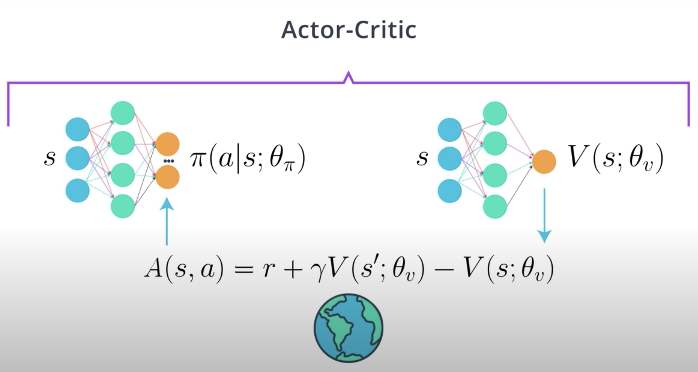
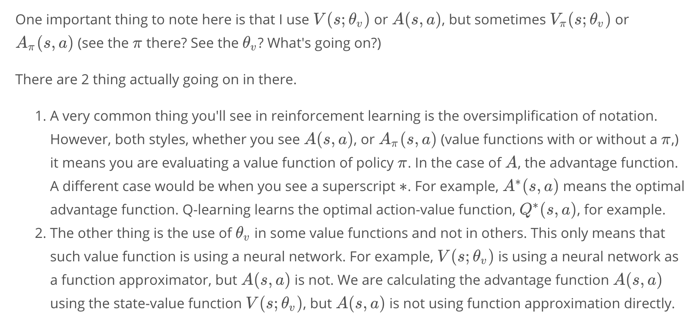

# Motivation
**Actor-Critic methods** are at the intersection of value-based methods such as DQN and policy-based methods such as REINFORCE. 

If a deep RL agent uses a deep neural network to approximate a value function, the agent is said to be **value-based**. If an agent uses a deep neural network to approximate a policy, the agent is said to be **policy-based**.

The DQN agent you learned about, is a value-based agent because it learns about the optimal action value function. This is just one of the many functions you can approximate. You can learn about the state value function `V_{\pi}`, the action value function `Q_{\pi}`, the advantage function `A_{\pi}`, and the optimal versions of these. If your agent learns a value function well, deriving a good policy from it is straight forward. 

The REINFORCE agent previously learned about is a policy-based agent. These agents parametrizes the policy and learns to optimize it directly. The policy is usually stoachastic in this setting. But you can also learn about deterministic policies. 

Remember that stochastic policies, taking a state and returned a probability distribution over the actions. Though what you often see is slightly different notation, in which you taking a state and an action and return the probability of taking that action in that state. But, they're pretty much the same though. Given the same state, the policy could prescribe a different action. This policy is stochastic. 

Deterministic policies on the other hand, prescribe a single action for any given state. So, they take in a state and return an action. There's no stochasticity. The policy is deterministic.

Finally, you also learned about using baselines to reduce the variance of policy-based agents. **Did you notice that you can use a value function as a baseline?**

So, think about it. If we train a neural network to approximate a value function and then use it as a baseline, would this make for a better baseline? And if so, would a better baseline further reduce the variance of policy-based methods? 

Indeed. **In fact, that's basically all actor-critic methods are trying to do, to use value-based techniques to further reduce the variance of policy-based methods. 

See the video [here](https://youtu.be/dpFPlDtdxyQ).

# Bias vs. Variance
In machine learning, we're often presented there with a tradeoof between bias and variance. Let's talk about some intuition first.

Let's say you're practicing your soccer shooting skills. The thing you want to do is to put the ball in the top right corner of the goal. You want to be able to repeatedly kicked the ball there. If after a day of training, you place the ball most of the time in the middle right, this means that you have a bias to shoot the ball lower. If also means that you have low variance because the shots where clumped together. Now, say the average of your shots were center on the top right corner, but most of your shots were spread around that spot. Then, you have low bias because you were mostly center where you were aiming in high variance because of the spread. 

Obviously, you want to avoid both high bias and high variance, and you want to have both low bias and low variance. The thing is, this is very hard to achieve, but we'll look at several techniques that are designed to accomplish this. 

We have to consider the bias-variance tradeoff in RL, when an agent tries to estimate value functions or policies from returns. 

A return is calculated using a single trajectory. However, value functions which is what we're trying to estimate are calculated using the expectation of returns. 

A big part of the effort in RL and research is an attempt to reduce the variance of algorithms while keeping bias to a minimum. 

You know by now that a RL agent tries to find policies to maximize the total expected reward. But since we're limited to sampling the environment, we can only estimate these expectation. **The question is, what's the best way to estimate value functions for our actor-critic methods.**

See the video [here](https://youtu.be/_vnkkwm46uU).

# Two Ways For Estimating Expected Returns
Let's explore two very distinct and complimentary ways for estimating expected returns. On the one hand, you'd have the **Monte-Carlo estimate.** 

The **Monte-Carlo estimate** consists of rolling out an episode in calculating the discounted total reward from the rewards sequence. For example, in an episode A, you state in state `S_t`, take action `A_t`. The environment then transitions and gives you a reward `R_{t+1}` and sends you to a new state `S_{t+1}`. Then, you continue with a new action `A_{t+1}` and so on until you reach the end of the episode. 

The **Monte-Carlo estimate** just adds all the rewards up, whether discounted or not. When you then have a collection of episodes A, B, C, and D, some of those episodes will have trajectories that go through the same states. Each of these states episodes can give you a different Monte-Carlo estimate for the same value function. 

To calculate the value function, all you need to do is average the estimates.

Obviously, the more estimates you have when taking the average, the better your value function will be. 

On the other hand, you have the **temporal difference** or **TD estimate**. Say, we're estimating a state value function `V`. For estimating the value of the current state, it uses a single reward sample. In an estimate of the discounted total return, the agent will obtain from the next state onwards. So, you're estimating with an estimate. 

For example, in episode A, you start in state `S_t`, take action `A_t`, the environment then transitions and gives you a reward `R_{t+1}`, and sends you to a new state `S_{t+1}`. But, then you can actually stop there. By the magic of **dynamic programming**, you're allowed to do what is called **bootstrapping**, which basically means that you can leverage the esimtate you're currently have for for the next state in order to calculate a new estimate for the value function of the current state. 

Now, the estimates of the next state will probably be off, particularly early on, but that value will become better and better as your agenct sees more data, making it turn other values better, clever right?

After doing this many many times, you will have estimated desired value function well. As you can imagine, Monte-Carlo estimates will have high variance because estimates for a state can vary greatly across episodes. `G_{t,A}` here could be -100, while `G_{t,B}` could be +100, and `G_{t,C}` could be +1000. 

The **reason** these high variance is likely, is because you are compounding lots of random events that happened during the course of a single episode. But Monte-Carlo methods are unbiased. You are not estimating using estimates. You're only using the true rewards you obtained. So, given lots and lots of data, your estimates will be accurate. 

**TD estimates** are low variance because you're only compounding a single time step of randomness instead of a full rollout. Though because you're bootstrapping on the next state estimates and those are not true values, you're adding bias into your calculations. Your agent will learn faster, but we'll have more problem converging. 

See the video [here](https://youtu.be/2W6yIBDvfsQ).

# Baselines and Critics
**You now know that the Monte-Carlo estimate is unbiased but has high variance, and that the TD estimate has low variance but it is biased.**

What are these facts good for?

We you studies REINFORCE, you learned that the return `G` was calculated as the total discounted return. This way of calculating `G`, which is simply a Monte-Carlo estimate, has high variance. You then use a baseline to reduce the variance of the REINFORCE algorithm. However, this baseline was also calculated using a Monte-Carlo approach. 

Let's now assume you use deep learning to learn this baseline. Even if you still use the Monte-Carlo approach which has high variance, using function approximation still gives you an advantage. Namely, you now gain the power of generalization. That means when you encounter a new state `S'`, whether you had visitor or not, your deep neural network will potentially come up with better estimates, since it's been trained to generalize from similar data. 

Note that at this point, we're still not using a critic even though we are using function approximation. This might be confusing as the literature is often not consistent. They recall a Monte-Carlo estimate has high variance and no bias, and that the TD esimtate has low variance but is biased. 

Now, the word **critic** implies that bias has been introduced and the Monte-Carlo estimate is unbiased. If instead of using Monte-Carlo estimates to train baselines, we used TD estimates, then we can say we have a critic. 

Sure, we will be introducing bias but we will be reducing variance thus improving our convergence properties and speeding up learning. 

In **actor-critic methods**, all we are trying to do is to continue to reduce the high-variance commonly associated with policy-based agents. By using a TD critic instead of a Monte-Carlo baseline, we further reduce the variance of policy-based methods. This leads to faster learning than policy-based agents alone and we also see better and more consistent convergence than value-based agents alone. 

See the video [here](https://youtu.be/wqmqoiUuQHI).

The argument you often hear as to why to call a neural network trained with Monte-Carlo estimates a "Critic" is because function approximators, such as a neural network, are biased as a byproduct that they are not perfect. That's a fair point, though, I prefer the distinction based on whether we pick a Monte-Carlo or a TD estimate to train our function approximator. Now, definitely we should not be calling Actor-Critic methods every method that uses 2 neural networks. You'll be surprised!

The important takeaway for you, though, is that there are inconsistencies out there. You often see methods named "Actor-Critic" when they are not. I just want to bring the issue to your attention.

# Policy-based, Value-based and Actor-Critic
Now that you have some foundational concepts down, let's talk about some intuition.

Let's say you want to get better at tennis. The **actor or policy-based** approach you roughly learns this way. You play a bunch of matches. You then go home, lay on the couch, and commit to yourself to do more of what you did in matches you won, and less of what you did in matches you lost. After many many times repeating this process, you will have increased the probability of actions that led to a win, and decreased the probability of actions that led to losses. 

But you can see how these approaches are rather **inefficient** as it needs lots of data to learn a useful policy. Many of the actions that occur within the game that ended up in a loss could have been really good actions. So, decreasing the probability of good actions taking in a match only because you lost is not the best idea.

Sure, if you repeat this process infinitely, you're likely to end up with a good policy, but at the cost of slow learning. 

It is clear that **policy-based agents have high variance.** The **critic or value-based** approach learns differently. 

You start playing a match, and even before you get started, you start guessing what the final score is going to be like. You continue to make guesses throughout the match. At first, your guesses will be off. But as you get more and more experience, you will be able to make pretty solid guesses. The better your guesses, the better you'll tell good from bad actions. The better you can make these distinctions, the better you'll perform. Of course, given that you select good actions. 

Though this is not a perfect approach either, **guesses introduce a bias** because they'll sometimes be wrong, particularly because of a lack of experience. **Guesses are prone to under or overestimation.** Though, guesses are more consistent through time. If you think you'll win a match five minutes into it, chances are you'll still think so 10 minutes into it. This is what makes the **TD estimate** have lower variance.

_**As you can see, in a policy-based approach, the agent is learning to act, and it is good at that. Whereas in a value-based approach, the agent is learning to estimate situations and actions, and it's pretty good at that. Combining these two approaches sounds like a great idea, and it often yields better results.**_

**Actor-critic agents** learn by playing games and adjusting the probabilities of good and bad actions just as with the actor alone. But this time, you'll also use a critic to be able to tell good from bad actions more quickly, and speed up learning. 

In the end, **actor-critic agents** are moer stable than value-based agents, and need fewer samples than policy-based agents. 

See the video [here](https://youtu.be/iyin896PNEc).

# A Basic Actor-Critic Agent
**You know now that an actor-critic agent is an agent that uses function approximation to learn a policy any value function. So, we will then use two neural networks; One for the actor and one for the critic.** 

The **critic** will learn to evaluate the state value function `V_{\pi}` using TD estimate. Using the critic, we will calculate the advantage function and train the actor using this value. A very basic online actor-critic agent is as follows:

_You have two networks. One network, the **actor**, takes in a state and outputs the distribution over actions. The other network, the **critic** takes in a state and outputs a state value function of policy `\pi`, `V({\pi})`._

The **algorithm** goes like this.

Input the current state into the actor and get the action to take in that state. Onserve next state and reward to get your experience tuple `(s,a,r,s')`. 

Then, using the TD estimate which is the reward `r` plus the critic's estimate for `s'`. So, `r + \gamma V(s';\theta_v)`. You train the critic. 

Next, to calculate the advantage `A_{\pi}(s,a)` (equation in the picture above). We also use the critic. 

Finally, we train the actor using the calculated advantage as a baseline. We'll focus on few of the most popular actor-critic agents in the next sections.

See the video [here](https://youtu.be/KdHQ24hBKho).

# A3C: Asynchronous Advantage Actor-Critic, N-step Bootstrapping
**A3C** stands for **Asynchronous Advantage Actor-Critic**. As you can probably infer from the name, we'll be calculating the advantage function, `A_{\pi}(s,a)`, and the critic will be learning to estimate `V_{\pi}` to help with that just as before. 

If you're using images as inputs to your agent, **A3C** can use a single convolutional neural network with the actor and critic sharing weights, in two separate heads, one for the actor, and one for the critic. 

Note that A3C does not have to be used exclusively with CNN's and images. But if you were to use it, sharing weights to some more efficient, more complex approach, and can be harder to train. 

It's a good idea to start with two separate networks, and change it only to improve performance. 

Now, one interesting aspect of A3C, is that instead of using a TD estimate, it will use another estimate commonly referred to as **N-step bootstrapping.**

**N-step bootstrapping** is simply an abstraction and a generalization of a TD and Monte-Carlo estimates. 

TD is a one-step bootstrapping. Your agent goes out and experiences one-time-step of real rewards, and then bootstraps right there. 

Monte-Carlo goes out all the way, and it does not bootstrap because it doesn't need to. Monte-Carlo estimate is an infinite step bootstrapping. 

**But, how about going more than one step, but not all the way out?**

This is called _**n-step bootstrapping**, and A3C uses this kind of return to train the critic. 

For example, in our tennis example, n-step bootstrapping means that you will wait a little bit before guessing what the final score will look like. Waiting to experience the environment for a little longer before you calcualte the expected return of the original state, allows you to have less bias in your prediction, keeping variance under control. 

**In practice**, only a few steps out, say 4- or 5-step bootstrapping, are often the best. 

By using n-step bootstrapping, A3C propagates values to the last end states visited, which allows for faster convergence with less experience required while still keeping variance under control. 

See the video [here](https://youtu.be/twNXFplIAP8).

# A3C: Asynchronous Advantage Actor-Critic, Parallel Training
Unlike in DQN, A3C does not use a replay buffer. The main reason we needed a replay buffer was so that we could de-correlate experience tuple. 

In RL, an agent collects experience in a squential manner. The experience collected at time step `t+1` will be correlated to the experience collected at time step `t` because it is the action taken at time step `t` that is partially responsible for the reward and the state observed at time step `t+1`, and that state will influence all our future decisions. There's no way out of that. 

The replay buffer allows us to collect these experiences sequentially by adding them one at a time to the replay buffer for later processing. 

So, independent from the data collection process, we can randomly select experiences from the replay buffer into mini batches. 

The experiences in the mini batches will not show the same correlation. This allows us to train our network successfully. 

Interestingly, A3C replaces the replay buffer with **parallel training**. By creating multiple instances of the environment and agent and running them all at the same time, your agent will receive mini batches of the correlated experiences just as we need. 

Samples will be de-correlated because agents will likely be experiencing different states at any given time. 

On top of that, this way of training allows us to use **on-policy learning** in our learning algorithm, which is often associated with more stable learning. 

See the video [here](https://youtu.be/kKRbAKhjACo).

# A3C: Asynchronous Advantage Actor-Critic, Off-policy vs. On-policy
In case you're not clear on what **on-policy vs. off-policy learning** is, let's review it here.

**On-policy learning** is when the policy used for interacting with the environment is also the policy being learned. 

**Off-policy learning** is when the policy used for interacting with the environment is different than the policy being learned. 

**Sarsa** is a good example of an **on-policy** learning agent. A Sarsa agent uses the same policy to interact with the environment as the policy it is learning. On the other hand, **Q-learning** is a good example of a **off-policy** learning agent. A Q-learning agent learns about the optimal policy, though the policy that generates behavior is an exploratory policy, often **epsilon-greedy.**

Looking at the update equations for these two methods, helps us understand them better. 

As you can see below, in Sarsa the action used for calculating the TD target and the TD error is the action the agent will take in the following time step, `A'`. In Q-learning, however, the action used for calculating the target is the action with the highest value. But this action is not guaranteed to be used by the agent for interaction with the environment in the following time step. In other words, this is not necessarily `A'`. The Q-learning agent choose an exploratory action the next step. In Sarsa that action, exploratory or not, is already been chosen. 

<>

Q-learning learns a deterministic optimal policy even if its behavior policy is totally random. Sarsa learns the best exploratory policy, that is the best policy that still explores. 

**DQN** is also an **off-policy** learning method. Your agent behaves with some exploratory policy, say epsilon-greedy, where it learns about the optimal policy. 

When using off-policy learning, agents are able to learn from many different sources including experiences generated by all versions of the agent itself, thus the replay buffer. However, **off-policy learning is known to be unstable and often diverge with deep neural networks.** 

**A3C** on the other hand is an **on-policy** learning method. With on-policy learning, you only use the data generated by the policy currently being learned about, and anytime you imrpove the policy, you toss out old data and go out collect some more. 

**On-policy learning** is a bit **inefficient** in the use of experiences, but it often has more stable and consistent convergence properties. 

A simple analogy of on- and off-policy goes this way. **On-policy** is learning from your own hands-on experience. For example, the projects in this Nano-degree. As you can imagine that is a pretty good way of learning, but it is somewhat data inefficient, you can only do so many projects before you run out of time. 

**Off-policy** on the other hand, is learning from someone else's experience and as such it is more sample efficient because you can learn from many different sources. However, this way of learning is more prone to misunderstandings. I might not be able to explain things in a way that you understand well. The Nano-degree analogy in the off-policy case is learning from watching the lessons for example. You learn much faster this way but again, perhaps not as good as you would from your own hands-on experience. 

Usually a good balance between these two ways of learning allows for the best performing deep RL agents and perhaps the best performing humans too, maybe?!

Now, if you want to learn more about agents who combine on- and off-policy learning, you can read the paper titled "**Q-Prop: Sample-Efficient Policy Gradient with An Off-Policy Critic**" linked [here](../../docs/Q-prop-paper.pdf).

See the video [here](https://youtu.be/AZiy5R0DESU).

