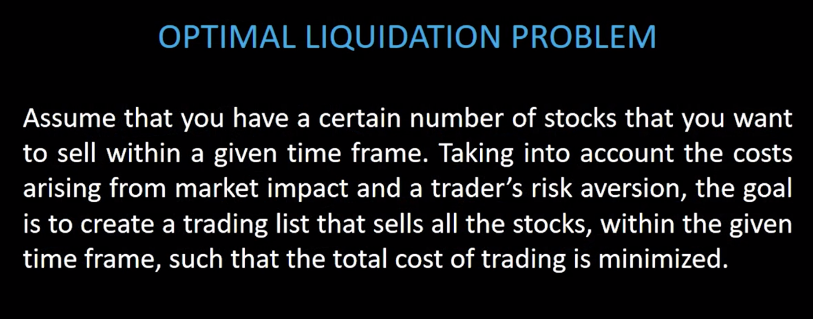
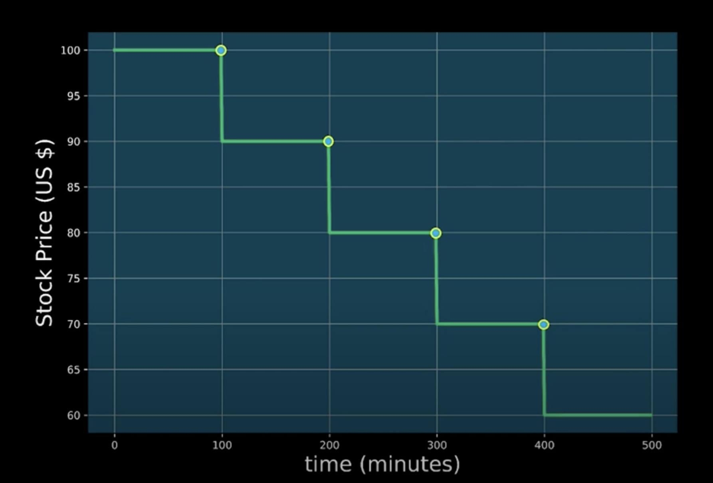
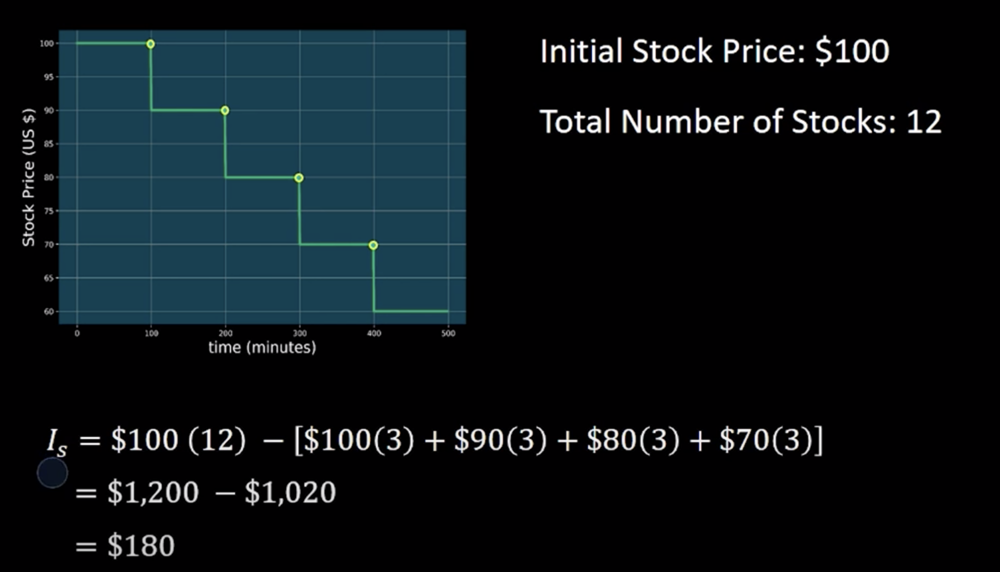
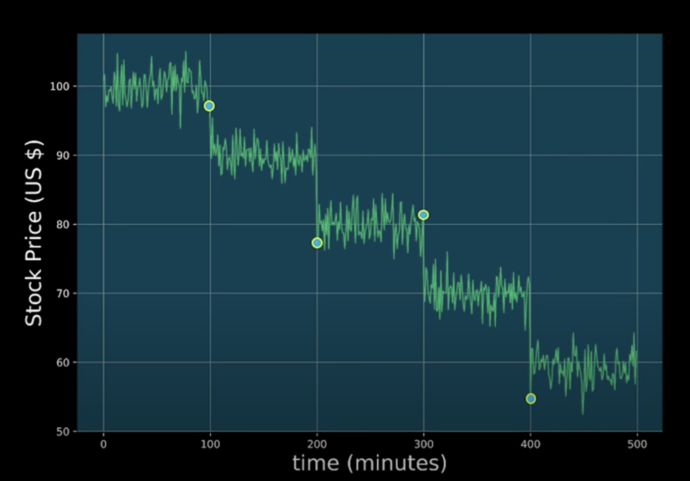
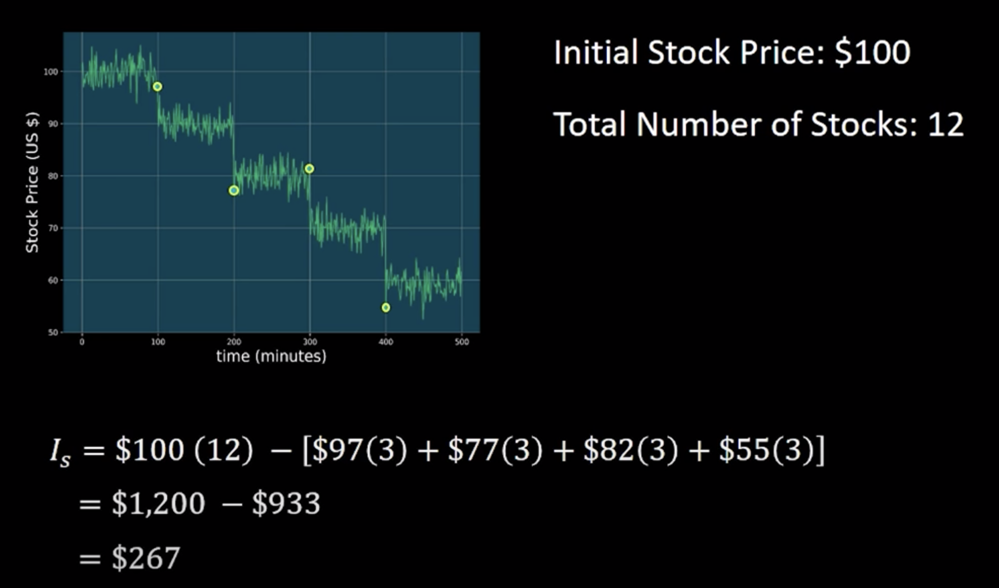
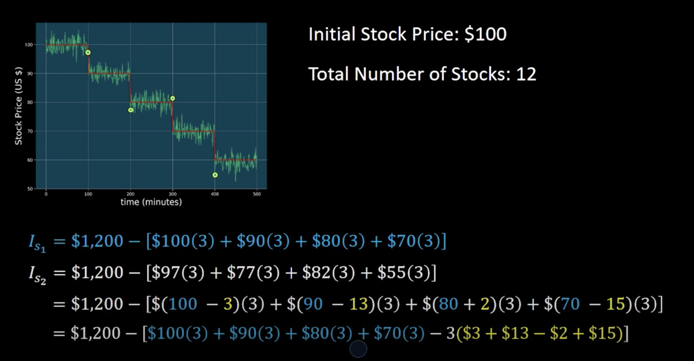
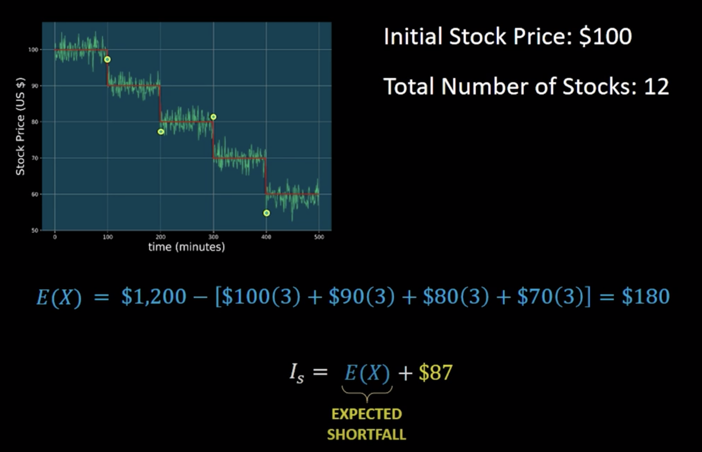
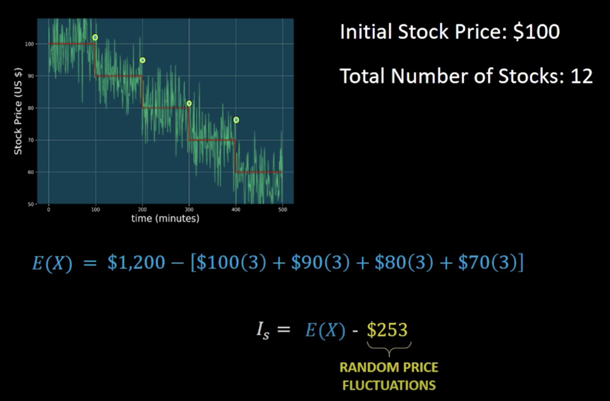
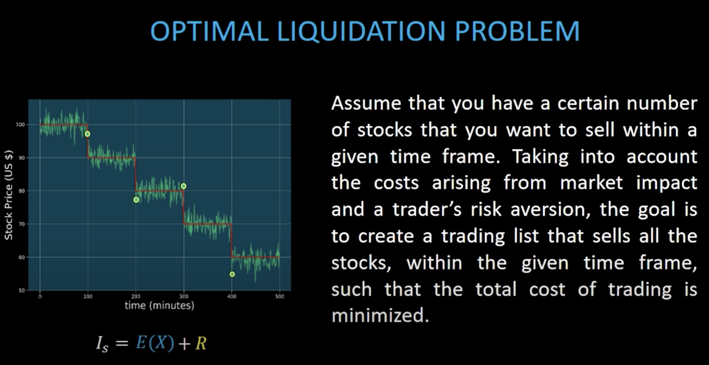

# Introduction
Now that you've learned how actor-critic methods work, here, we'll look at a particular problem in finance, and formulate it so that it can be solved through RL. In particular, we'll be using the **deep deterministic policy gradients algorithm** to determine the optimal execution of portfolio transactions. 

Before we dive in, let's get some intuition on why RL is a good alternative to current trading algorithms, and why it's better than other machine learning techniques such as supervised learning. 

# High Frequency Trading
Founded by the National Association of Securities Dealers, the NASDAQ became the world's first electronic stock market when it began trading on February 8th, 1971. Since then, people have used computers to sell and buy stocks at speeds and frequency that are unmatched by any human trader. 

The use of computers with pre-programmed algorithms to perform trades in the stock market has become known as **algorithmic trading.** In the past decade, **high-frequency trading or HFT** has become one of the most popular methods of algorithmic trading. 

HFT consists of using powerful computers, with dedicated connections to the stock exchanges to analyze stock data and execute a large number of transactions across multiple markets at extremely high speeds. 

Despite its success, HFT has been losing popularity due to many factors including; a) the decline in profit margins, attributed to a decrease in volatility and trading volume, b) high maintenance costs, and c) a large amount of competition among trading firms that use HFT algorithms to try to detect and outbid each other. 

Trading algorithms such as HFT make decisions on nano seconds time scales, taking human decisions and interaction out of the loop. By contrast, people often look at the news, use high-level analysis, and sometimes intuition before they make any decisions about a particular transaction. 

Ideally, one would like to create an algorithm that falls somewhere in the middle of these two extremes. For example, it'll be ideal to create an algorithms that can analyze stock data faster than any person possibly could, but that make smart decisions like a human trader would. Allowing you to perform better than any other trading algorithms such as HFT. 

Due to its success in many fields, it's not surprising that machine learning techniques such as RL, has gained popularity in creating such fully automated and smart trading algorithms. **But, why use RL? Why not use more conventional ML techniques such as supervised learning?**

# Challenges of Supervised Learning
Let's try to create a trading algorithm using a supervised learning approach. We can try for example to use supervised learning to teach a computer to predict stock prices within a given time frame. Being able to predict stock pricesm however, will not guarantee that we will make money. 

There are many reasons for this. One of them is **network latencies.** Network latencies result in delays between the time an order is placed and the time the order is delivered over a network. Therefore, even if your algorithm can accurately predict the price of a particular stock, at a specific time, by the time the order is delivered over the network and executed, the stock price might have changed. The net result is that the orders that you place will be executed at a different price than the one predicted by the algorithm. 

Another problem you will see is **trading fees.** Trading fees are associated with each transaction and can vary greatly and ultimately affecting the price per share. 

These factors and many others are uncertain and vary with each transaction making them very hard to predict. Consequently, training a supervised learning algorithm to take all of these uncertainties into account will be extremely difficult. But even if we manage to train our system to accurately predict stock prices and take all the uncertainties into account, that wouldn't be enough. We also need a **trading strategy.** 

A **trading strategy** is a set of rules that determine when to buy, hold or sell a stock. For example, suppose the price of a stock goes up for awhile and then begins to drop. What will you do? Sell or keep the stock and hope that it goes back up again in the future? 

Having a trading strategy will allow the computer to automatically decide, what the best action should be. The trading strategy could also include rules that determine the amount of shares to sell or buy in a particular transaction. 

**Training a supervised learning algorithm to learn a trading strategy can be challenging for a couple of reasons.** **One reason** is that trading strategies can vary greatly depending on market conditions. This means that supervised learning algorithm has to learn not just one trading strategy, but many in order to be robust to varying market conditions. **Another reason** is that, it's often not clear what the best strategy should be. Consequently, training a supervised learning algorithm can be very difficult, since it's not always clear what strategy we should optimize for. 

# Advantages of RL for Trading
Let's see how RL can get around many of the problems we encounter while trying to create a trading algorithm using a supervised learning approach. The main benefit of using RL for trading is that we don't need to use mathematical models or hand-code a trading strategy, because the deep reinforcement agent learns this on its own. 

All you have to do is to train your deep RL algorithm to optimize the metric of your choice. For example, you might want to optimize for **net profit** or for **risk-adjusted return**. **Net profit** is simply how much money your investment made, or lost, over some period of time, taking into account trading fees and any other costs. **Risk-adjusted return** is a measure of how much money your investment made relative to the amount of risk of having made that investment. This means that if you're already optimizing for risk-adjusted return, the policies learned by the deep RL algorithm will already take riskes into account. 

In addition, since deep RL algorithms are trained on simulated environments, we can create environments that capture all the complexity of the financial markets. For example, we can simulate all the things we mentioned earlier and much more, such as transaction fees, network latencies, the number of stocks available for sale (liquidity), different agents making transactions, different market conditions, etc. 

Therefore, deep RL algorithms can be trained to be robust to all these factors. Moreover, because deep RL agents produce actions, then in principle we could teach the algorithms to produce actions that indicate when to buy or, hold, and sell by rewarding the agent appropriately depending on the action taken. In fact, deep RL agents could go even further than that, not just learning when to buy/hold/sell, but also learning the number of stocks to sell or buy at each transaction.

These are just a couple of reasons why deep RL could play a major role in the financial markets, and may even outperform other trading algorithms such as HFT. 

# Optimal Liquidation Problem
We will now take a look at a very common problem in finance known as the **optimal liquidation problem** or how to sell stocks with minimal loss. 

**So, what is the optimal liquidation problem?**

Let's begin by understanding **market impact.**

In the below picture, we have the price of a single stock over a period of time. **Market impact** is the effect that a market participant has when he buys or sells a number of stocks. 

Since the optimal liquidation problem only deals with selling stocks, for the rest of this lesson, we will only focus on what happens to the stock price when we sell stocks. 

Let's suppose you sell a particular number of stocks at \$100 and minute 100. In general, when you sell a stock, its price decreases. In our model, we will assume that the **price drops due to two factors**. **Temporary market impact** and **permanent market impact**. In the picture, we see the permanent market impact on the stock price due to your action of selling. In this example, the action of selling has caused the stock price to drop from \$100 to \$90. This permanent impact occurs every time you sell a stock. So, if you sell the same number of stocks at \$90 and minute 200, then you will see the same market impact as before and similarly, for next ones. 

As we can see, by selling stocks in this particular fashion, the stock price has decreased from \$100 to \$60 due to the induced permanent market impact. Since the stock price decreases every time we sell, this means that we're going to lose money. 

**Let's take a look at a concrete example to see how much money we would have lost by selling in this fashion.**

Let's assume you have a total of 12 stocks and that the initial price of each stock is a \$100. You will choose to sell your shares in four trades, and in each trade, you will sell three shares. For illustration purposes, we will assume that the stock price decreases \$10 every time we sell three shares. Here's the calculation of money you made by looking at the initial holding vs selling stocks in this fashion.

This means that we lost \$180 due to the costs of trading. This difference between initial holdings and the money that you made by selling the stocks also known as the **capture** is called the **implementation shortfall**, which we will denote with `I_s`.

In reality, the stock price fluctuates in-between trades and is not as smooth as it is shown above. Let's take a look at a more realistic price model. 

Stock prices often fluctuate and are not smooth as we saw previously. So, if we perform the same trades as we did before, we can see that the price at which each trade was executed is now different due to the fluctuations in stock price.

So, let's calculate the implementation shortfall for this case.

Now, if we compare these two results (\$180 vs. \$267), we can see the the implementation shortfall in this case is bigger due to the random fluctuations in stock price. 

We can think of this more realistic price model as the original price model, but with some noise added to it. So, let's see if we can write this out mathemtically. In particular, we'd like to try to write the 2nd implementation in terms of the 1st one.

And after simplificatin we can rewrite it as,

Note that the **expectation shortfall** will depend on how we sell our shares. For example, if we had decided to sell our shares in the fashion below, we'll have a different implementation shortfall. 

The way in which we decide to sell our stocks is called a **trade list.** The **trade list** tells us the number of trades and the quantity of shares to be sold at each trade. 

The second term only depends on the random price fluctuations. The absolute value of this term gives us an idea of how much the stock price is fluctuating. This term will therefore represent how much money we can gain or lise due to the random price fluctuations. In finance, this random price fluctuations are referred to as **price volatility** or **risk.**

**Risk** is usually quantified by the variance of the price fluctuations. So, if the price fluctuations of a particular stock are very big, we say that is a risky investment. 

Now let's look at the problem again. 

However, we're bound to certain constraints. One of them is that we need to sell these shares within a given time frame. So, we need to set a limited number of trades within the liquidation period. 

The other is that we need to take into account the **trader's risk aversion**. The trader's risk aversion that says how much a particular trader is willing to tolerate risk. For example, suppose the stock we're selling is experiencing a large volatility in the stock price. In this scenario, a trader that doesn't like to take risks would rather sell his shares as quickly as possible. On the other hand, a trader that does like to take risks will rather sell these shares at a constant rate over the whole liquidation period, even if the price volatility is high. 

See the video [here](https://youtu.be/N2LP-wg1jEI).

# Almergen and Chriss Model

Watch [this video](https://youtu.be/rokcEQ4LXbU).

Find the scripts under the codes folder.

# Trading Lists

Watch [this video](https://youtu.be/cGT-ADpHR74).

Find the scripts under the codes folder.

# The Efficient Frontier

Watch [this video](https://youtu.be/EwM7Ksbs-ds).

Find the scripts under the codes folder.

# DRL for Optimal Execution of Porfolio Transactions

Find the scripts under the codes folder.