# Introduction
For this lesson, we'll confine our attention to a problem that's slightly easier than the RL problem. Instead of working in a setting where the agent has to learn from interaction, we'll assume that the agent already knows everything about the environment.

So the agent knows how the environment decides the next state, and it knows how the environment decides reward. The goal will remain the same. Given this information, the agent would like to find the optimal policy. 

Solving the simpler problem first will prove incredibly useful for building intuition before we tackle the full RL problem. 

See the video [here](https://youtu.be/ek2PD9RDrWw).

In the  **dynamic programming**  setting, the agent has full knowledge of the Markov decision process (MDP) that characterizes the environment. (This is much easier than the  **reinforcement learning**  setting, where the agent initially knows nothing about how the environment decides state and reward and must learn entirely from interaction how to select actions.)

This lesson covers material in  **Chapter 4**  (especially 4.1-4.4) of the  [textbook](http://go.udacity.com/rl-textbook).

# OpenAI Gym: FrozenLakeEnv

In this lesson, you will write your own Python implementations of all of the algorithms that we discuss. While your algorithms will be designed to work with any OpenAI Gym environment, you will test your code with the FrozenLake environment.

[](https://classroom.udacity.com/nanodegrees/nd893/parts/23d1307b-b908-436f-bdfe-78b6c5712b04/modules/9765795d-fea0-43f7-b49e-0bddba750950/lessons/62060219-95b0-4d08-8269-3b963c1c27bb/concepts/c0916676-e356-46df-9b22-cd63cc17e0a5#)


Source:  [http://eskipaper.com/images/frozen-lake-6.jpg](http://eskipaper.com/images/frozen-lake-6.jpg)

In the FrozenLake environment, the agent navigates a 4x4 gridworld. You can read more about the environment in its corresponding  [GitHub file](https://github.com/openai/gym/blob/master/gym/envs/toy_text/frozen_lake.py), by reading the commented block in the  `FrozenLakeEnv`  class. For clarity, we have also pasted the description of the environment below:

```
    """
    Winter is here. You and your friends were tossing around a frisbee at the park
    when you made a wild throw that left the frisbee out in the middle of the lake.
    The water is mostly frozen, but there are a few holes where the ice has melted.
    If you step into one of those holes, you'll fall into the freezing water.
    At this time, there's an international frisbee shortage, so it's absolutely imperative that
    you navigate across the lake and retrieve the disc.
    However, the ice is slippery, so you won't always move in the direction you intend.
    The surface is described using a grid like the following
        SFFF
        FHFH
        FFFH
        HFFG
    S : starting point, safe
    F : frozen surface, safe
    H : hole, fall to your doom
    G : goal, where the frisbee is located
    The episode ends when you reach the goal or fall in a hole.
    You receive a reward of 1 if you reach the goal, and zero otherwise.

    """"

```

## The Dynamic Programming Setting

Environments in OpenAI Gym are designed with the reinforcement learning setting in mind. For this reason, OpenAI Gym does not allow easy access to the underlying one-step dynamics of the Markov decision process (MDP).

Towards using the FrozenLake environment for the dynamic programming setting, we had to first download the  [file](https://github.com/openai/gym/blob/master/gym/envs/toy_text/frozen_lake.py)  containing the  `FrozenLakeEnv`  class. Then, we added a single line of code to share the one-step dynamics of the MDP with the agent.

```
# obtain one-step dynamics for dynamic programming setting
self.P = P

```

The new  `FrozenLakeEnv`  class was then saved in a Python file  **frozenlake.py**, which we will use (instead of the original OpenAI Gym file) to create an instance of the environment.

# Your Workspace

You will write all of your implementations within the classroom, using an interface identical to the one shown below. Your Workspace contains five files:

-   **frozenlake.py**  - contains the  `FrozenLakeEnv`  class
-   **Dynamic_Programming.ipynb**  - the mini project notebook where you will write all of your implementations (_this is the  **only**  file that you will modify!_)
-   **Dynamic_Programming_Solution.ipynb**  - the instructor solutions corresponding to the mini project notebook
-   **check_test.py**  - contains unit tests that you will use to verify that your implementations are correct
-   **plot_utils.py**  - contains a plotting function for visualizing state-value functions

The  **Dynamic_Programming.ipynb**  notebook can be found below.

> Note that it is broken into parts, which are designed to be completed at different parts of the lesson. For instance, you will complete Parts 0 and 1 in the concept titled  **Mini Project: DP (Parts 0 and 1)**. Then, you should wait to complete Part 2 until you reach the  **Mini Project: DP (Part 2)**  concept. DO NOT COMPLETE THE ENTIRE NOTEBOOK ALL AT ONCE! :)

To peruse the other files, you need only click on "jupyter" in the top left corner to return to the Notebook dashboard.

[](https://classroom.udacity.com/nanodegrees/nd893/parts/23d1307b-b908-436f-bdfe-78b6c5712b04/modules/9765795d-fea0-43f7-b49e-0bddba750950/lessons/62060219-95b0-4d08-8269-3b963c1c27bb/concepts/dd004fdc-62cf-4a5f-9d9d-3b433681117a#)


Please do not write or execute any code just yet. We'll get started with coding within the Workspace in a few concepts!

Review the codes under the [codes folder](codes/Dynamic_Programming_Solution.ipynb).

# Another Grid World Example
Watch the video [here](https://youtu.be/n9SbomnLb-U).

In this simple gridworld example, you may find it easy to determine the optimal policy by visual inspection. Of course, solving Markov decision processes (MDPs) corresponding to real world problems will prove far more challenging! :)

To avoid over-complicating the theory, we'll use this simple example to illustrate the same algorithms that are used to solve much more complicated MDPs.

# An Iterative Method, Part 1
Watch the video [here](https://youtu.be/AX-hG3KvwzY).

# An Iterative Method, Part 2

<p align="center">
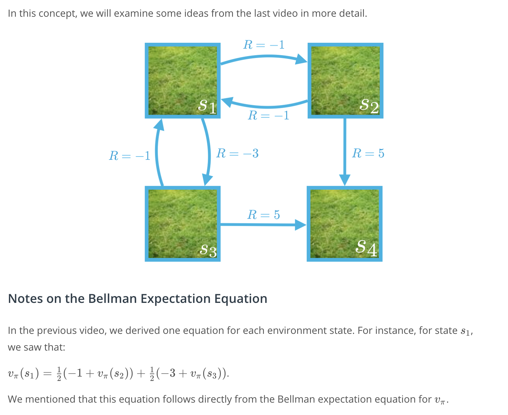
</p>

<p align="center">
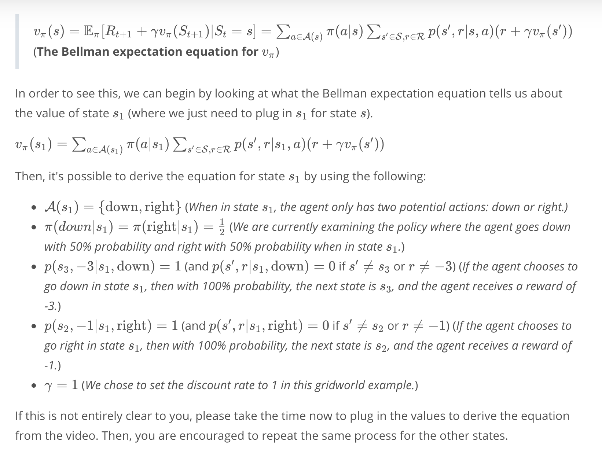
</p>

<p align="center">
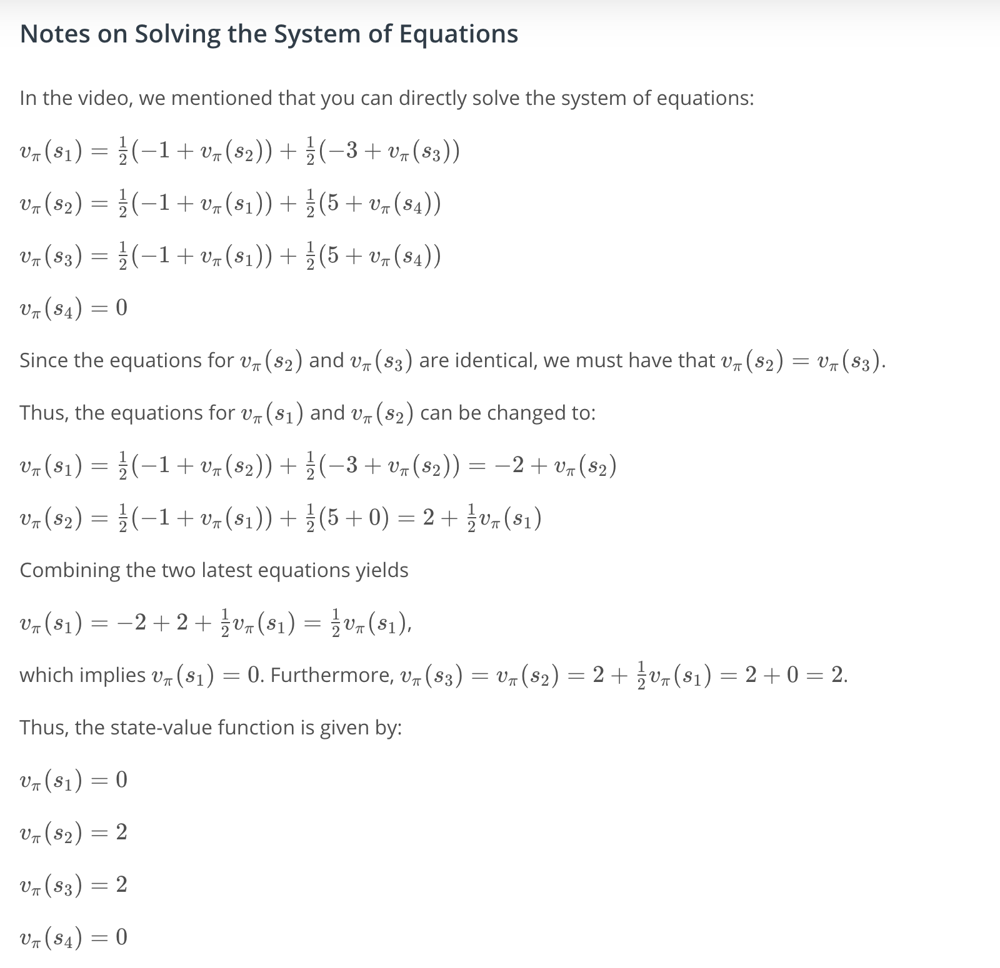
</p>

**Note**. This example serves to illustrate the fact that it is **_possible_** to _directly_ solve the system of equations given by the Bellman expectation equation for v_\pivπ​. However, in practice, and especially for much larger Markov decision processes (MDPs), we will instead use an _iterative_ solution approach.

# Quiz: An Iterative Method
<p align="center">
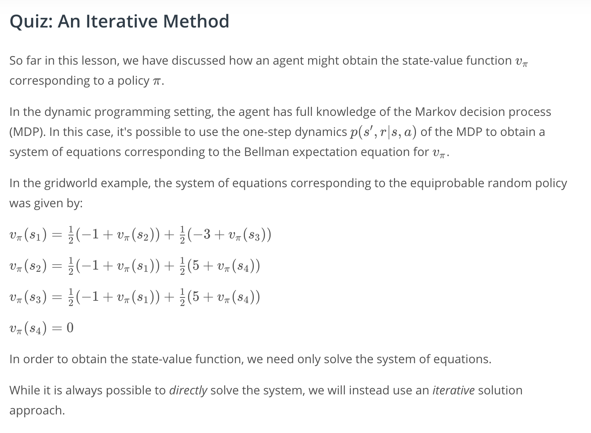
</p>

## An Iterative Method
<p align="center">
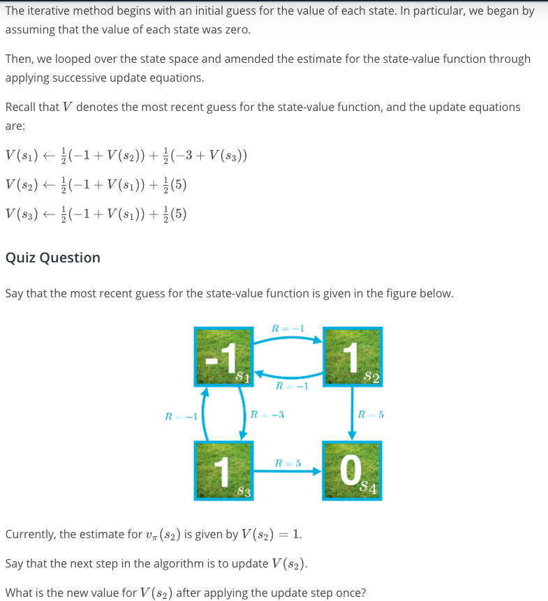
</p>

# Iterative Policy Evaluation
Watch the video [here](https://youtu.be/fVUpoyZDyGE).

# Implementation: Iterative Policy Evaluation
<p align="center">
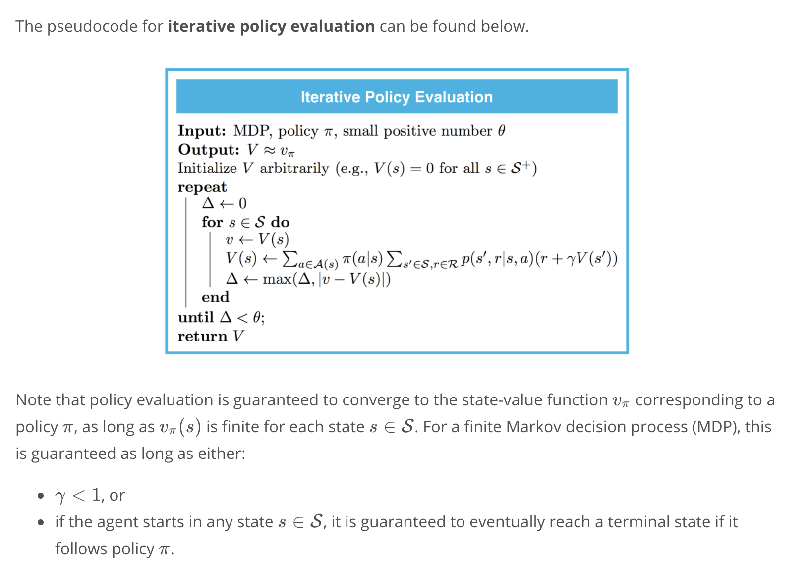
</p>

Please use the next concept to complete  **Part 0: Explore FrozenLakeEnv**  and  **Part 1: Iterative Policy Evaluation**  of  `Dynamic_Programming.ipynb`. Remember to save your work!

If you'd like to reference the pseudocode while working on the notebook, you are encouraged to open  [this sheet](https://github.com/udacity/rl-cheatsheet/blob/master/cheatsheet.pdf)  in a new window.

Feel free to check your solution by looking at the corresponding sections in  `Dynamic_Programming_Solution.ipynb`. (_In order to access this file, you need only click on "jupyter" in the top left corner to return to the Notebook dashboard._)

[](https://classroom.udacity.com/nanodegrees/nd893/parts/23d1307b-b908-436f-bdfe-78b6c5712b04/modules/9765795d-fea0-43f7-b49e-0bddba750950/lessons/62060219-95b0-4d08-8269-3b963c1c27bb/concepts/90db191c-be3f-42d8-ac98-11fe6ad8d1de#)


To find  `Dynamic_Programming_Solution.ipynb`, return to the Notebook dashboard.

### (Optional) Additional Note on the Convergence Conditions

To see intuitively  _why_  the conditions for convergence make sense, consider the case that neither of the conditions are satisfied, so:

<p align="center">
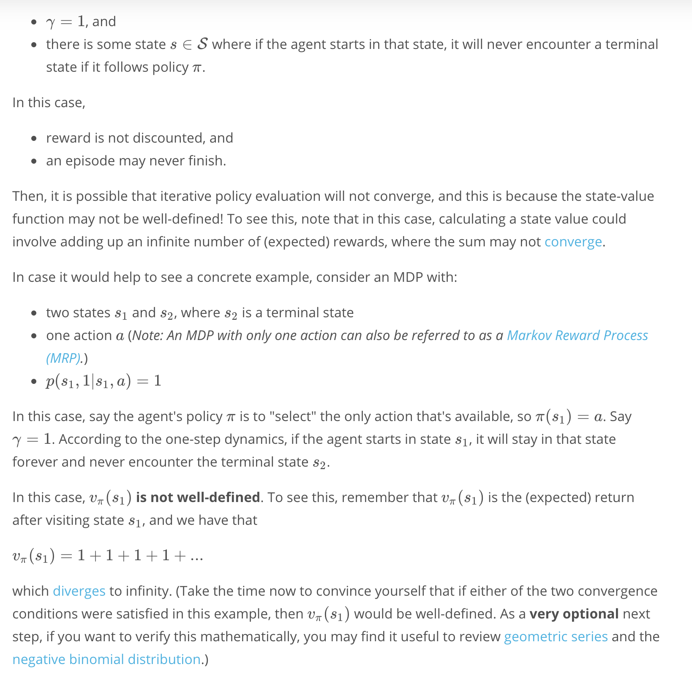
</p>

# Mini Project: DP (part 0 and 1)
Refer to the [codes section here](codes/DP_mini_project_part1/Dynamic_Programming_Solution.ipynb)

# Action Values
<p align="center">
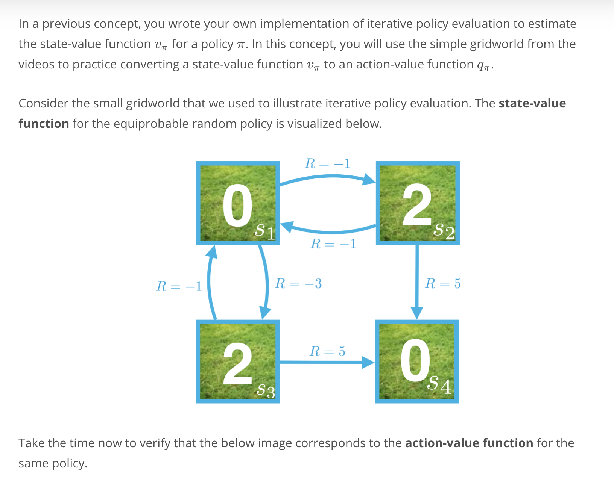
</p>

<p align="center">
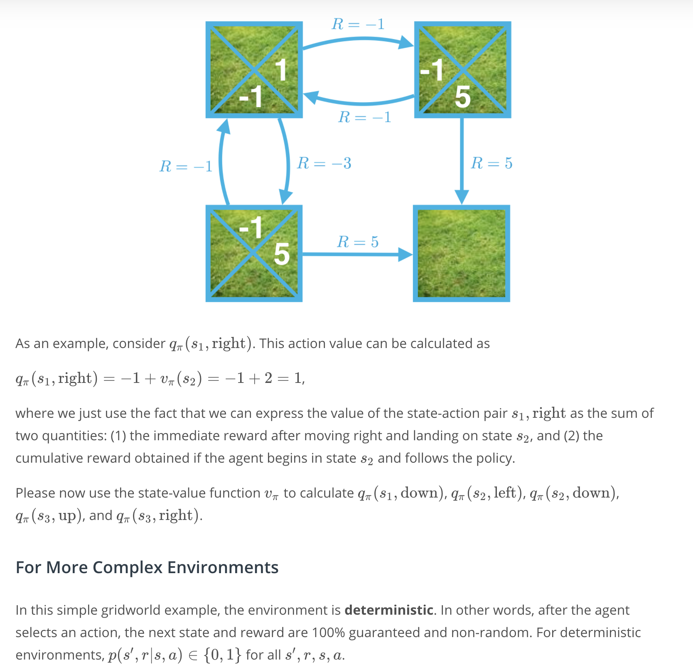
</p>

<p align="center">
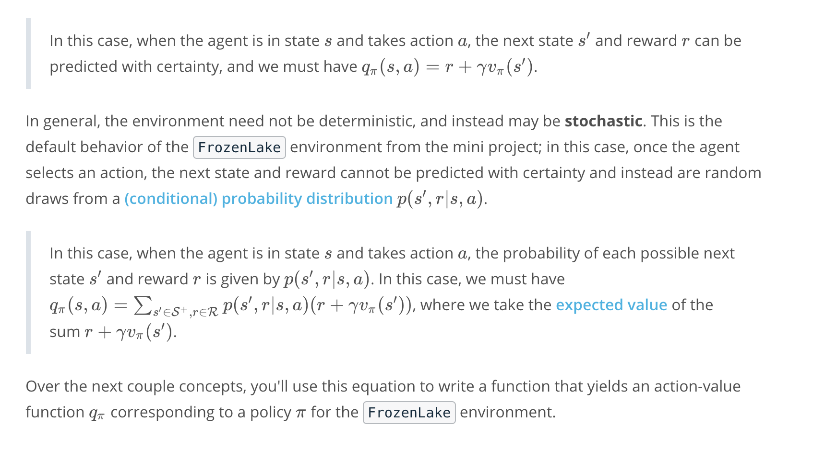
</p>

# Implementation: Estimation of Action Values
<p align="center">
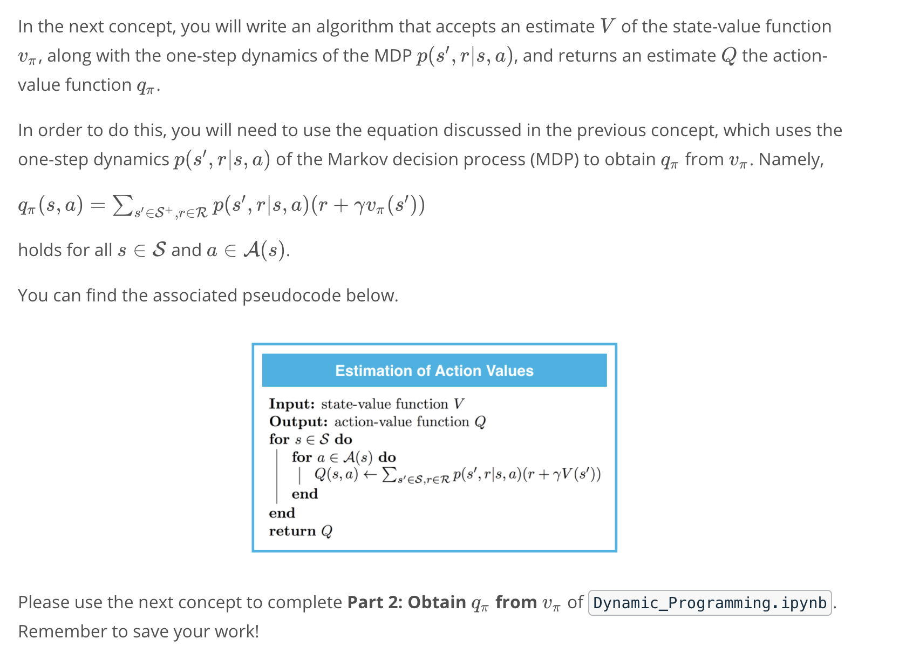
</p>

If you'd like to reference the pseudocode while working on the notebook, you are encouraged to open  [this sheet](https://github.com/udacity/rl-cheatsheet/blob/master/cheatsheet.pdf)  in a new window.

Feel free to check your solution by looking at the corresponding section in  `Dynamic_Programming_Solution.ipynb`.

# Mini Project: DP, Part 2
See the codes [here](codes/DP_mini_project_part2/Dynamic_Programming_Solution.ipynb)

# Policy Improvement
Watch the video [here](https://youtu.be/4_adUEK0IHg).

# Implementation: Policy Improvement
<p align="center">
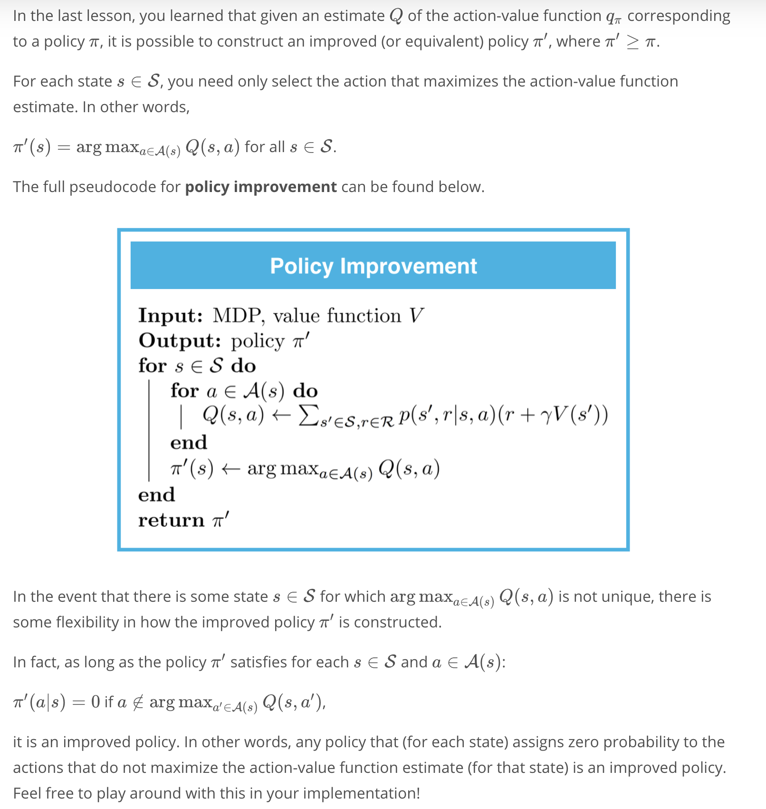
</p>

Please use the next concept to complete  **Part 3: Policy Improvement**  of  `Dynamic_Programming.ipynb`. Remember to save your work!

If you'd like to reference the pseudocode while working on the notebook, you are encouraged to open  [this sheet](https://github.com/udacity/rl-cheatsheet/blob/master/cheatsheet.pdf)  in a new window.

Feel free to check your solution by looking at the corresponding section in  `Dynamic_Programming_Solution.ipynb`.

# Mini Project: DP, Part 3
See the codes [here](codes/DP_mini_project_part3/Dynamic_Programming_Solution.ipynb)

# Policy Iteration
Watch the video [here](https://youtu.be/gqv7o1kBDc0).

# Implementation: Policy Iteration
<p align="center">
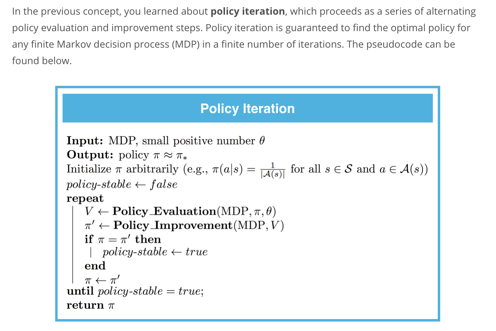
</p>

# Mini Project: DP, Part 4
See the codes [here](codes/DP_mini_project_part4/Dynamic_Programming_Solution.ipynb)

# Truncated Policy Iteration
Watch the video [here](https://youtu.be/a-RvCxlPMho).

# Implementation: Truncated Policy Iteration
In the previous concept, you learned about  **truncated policy evaluation**. Whereas (iterative) policy evaluation applies as many Bellman updates as needed to attain convergence, truncated policy evaluation only performs a fixed number of sweeps through the state space.

The pseudocode can be found below.

<p align="center">
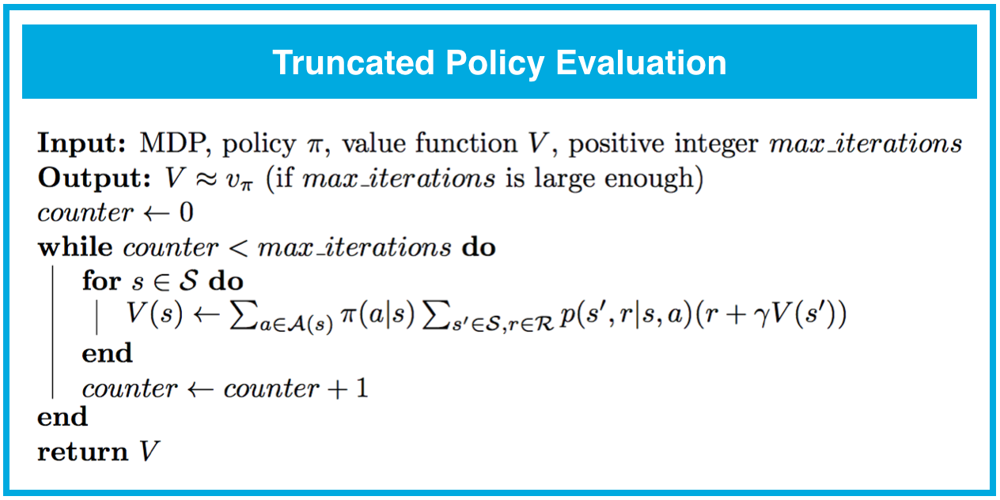
</p>

We can incorporate this amended policy evaluation algorithm into an algorithm similar to policy iteration, called  **truncated policy iteration**.

The pseudocode can be found below.

<p align="center">

</p>

You may also notice that the stopping criterion for truncated policy iteration differs from that of policy iteration. In policy iteration, we terminated the loop when the policy was unchanged after a single policy improvement step. In truncated policy iteration, we stop the loop only when the value function estimate has converged.

You are strongly encouraged to try out both stopping criteria, to build your intuition. However, we note that checking for an unchanged policy is unlikely to work if the hyperparameter  `max_iterations`  is set too small. (To see this, consider the case that  `max_iterations`  is set to a small value. Then even if the algorithm is far from convergence to the optimal value function  v_*v∗​  or optimal policy  \pi_*π∗​, you can imagine that updates to the value function estimate  VV  may be too small to result in any updates to its corresponding policy.)

Please use the next concept to complete  **Part 5: Truncated Policy Iteration**  of  `Dynamic_Programming.ipynb`. Remember to save your work!

If you'd like to reference the pseudocode while working on the notebook, you are encouraged to open  [this sheet](https://github.com/udacity/rl-cheatsheet/blob/master/cheatsheet.pdf)  in a new window.

Feel free to check your solution by looking at the corresponding section in  `Dynamic_Programming_Solution.ipynb`.

# Mini Project: DP, Part 5
See the codes [here](codes/DP_mini_project_part5/Dynamic_Programming_Solution.ipynb)

# Value Iteration
Watch the video [here](https://youtu.be/XNeQn8N36y8).

# Implementation: Value Iteration
<p align="center">
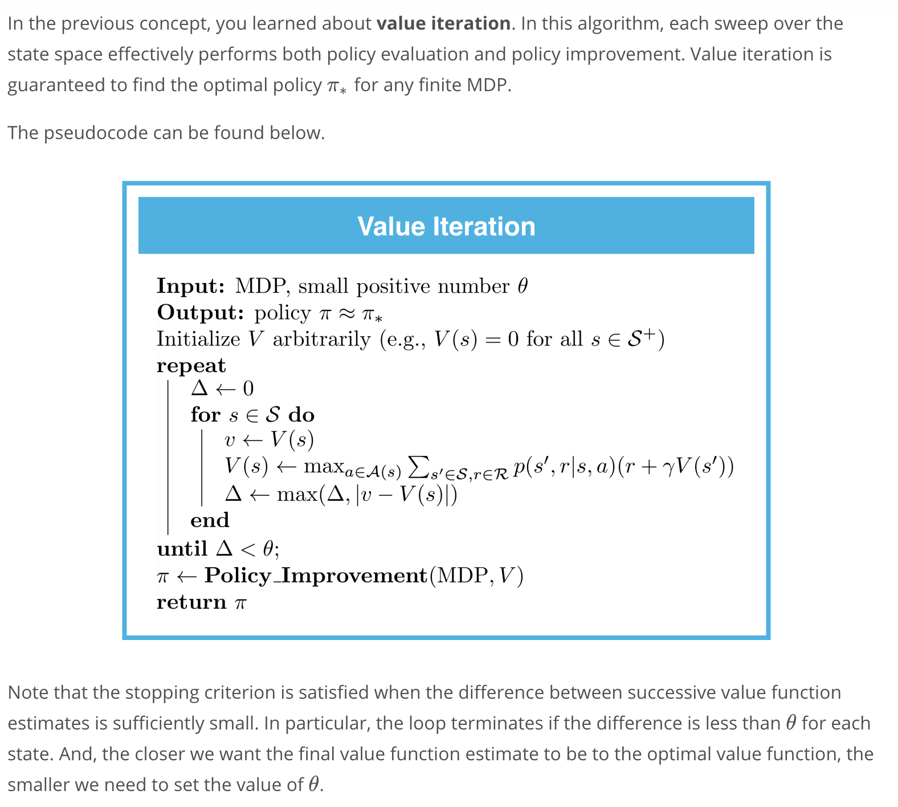
</p>

<p align="center">
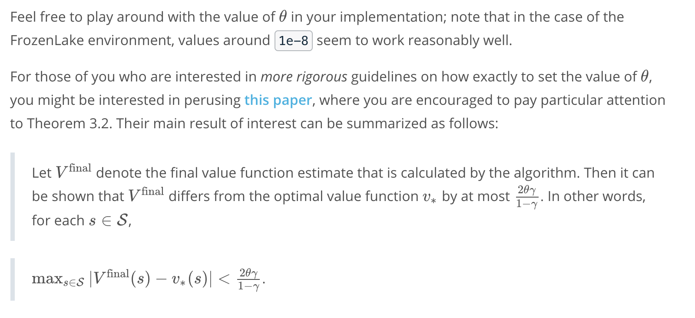
</p>

Please use the next concept to complete  **Part 6: Value Iteration**  of  `Dynamic_Programming.ipynb`. Remember to save your work!

If you'd like to reference the pseudocode while working on the notebook, you are encouraged to open  [this sheet](https://github.com/udacity/rl-cheatsheet/blob/master/cheatsheet.pdf)  in a new window.

Feel free to check your solution by looking at the corresponding section in  `Dynamic_Programming_Solution.ipynb`.

# Mini Project: DP, Part 6
See the codes [here](codes/DP_mini_project_part6/Dynamic_Programming_Solution.ipynb)

# Check Your Understanding

Congratulations! At this point in the lesson, you have written your own implementations of many classical dynamic programming algorithms. This is no easy feat, and you should be proud of all of your hard work!

We encourage you to take your time with this content. Tinker more with the mini project to develop your intuition, and read Chapter 4 (especially 4.1-4.4) of the  [textbook](http://go.udacity.com/rl-textbook)  to supplement your understanding.

**You are strongly encouraged to take your own notes**. You may find it useful to compare your notes with the next concept, which contains a summary of the main ideas from the lesson.

When you're ready, answer the question below to check your memory of the terminology.

# Summary
<p align="center">

</p>

<p align="center">
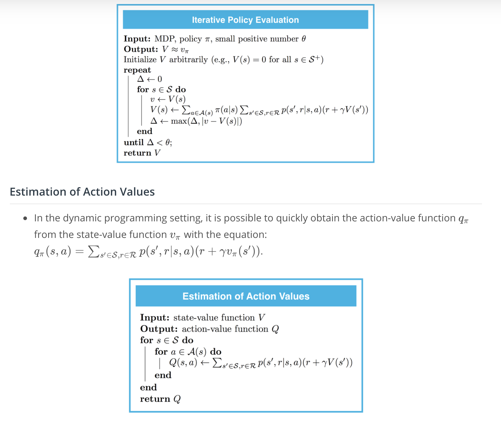
</p>

<p align="center">
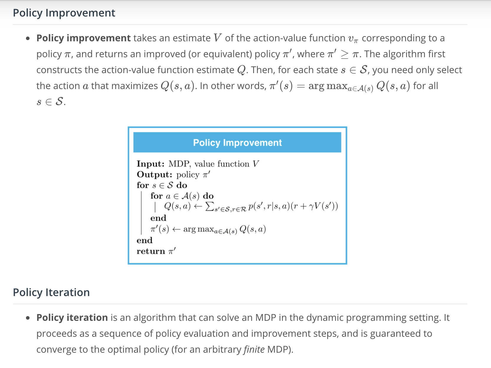
</p>

<p align="center">
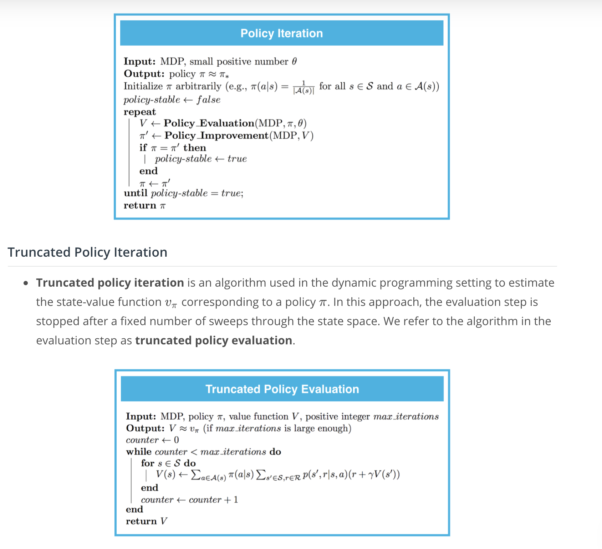
</p>

<p align="center">
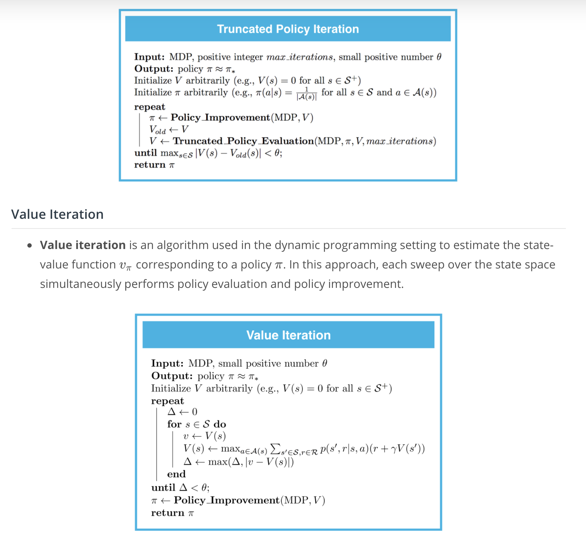
</p>

