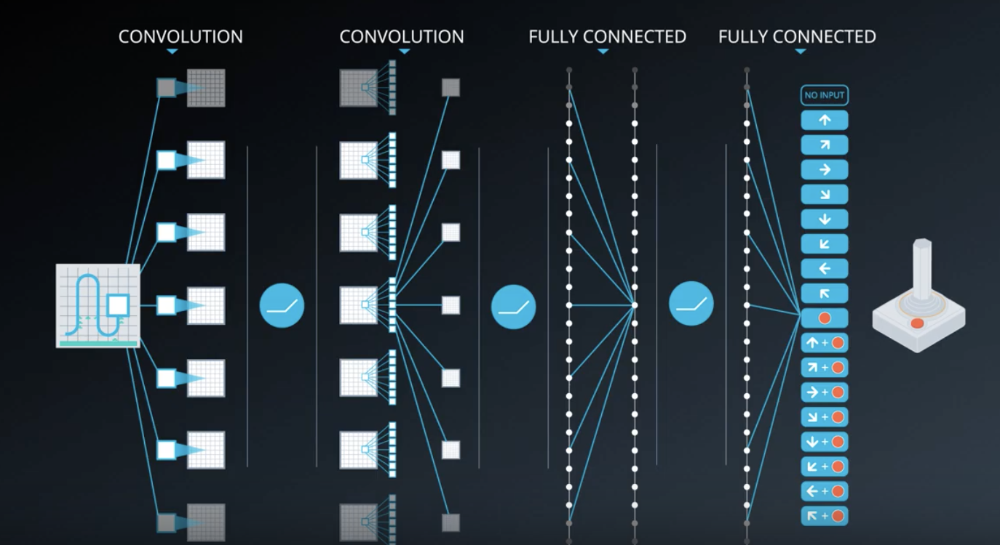
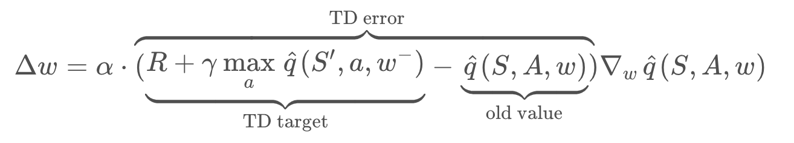
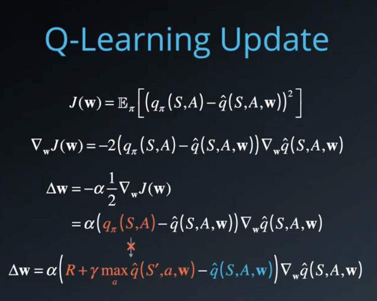
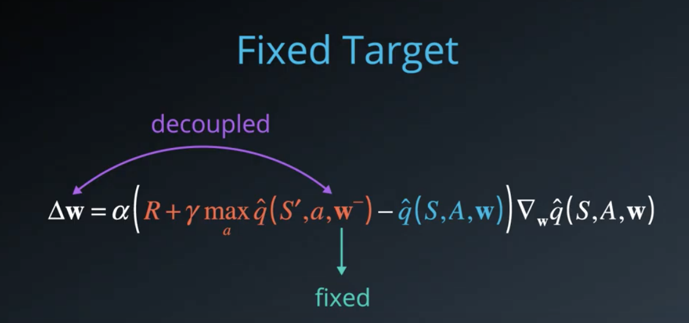
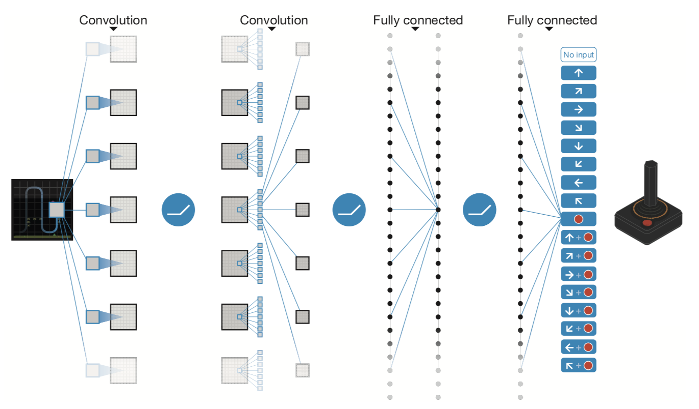
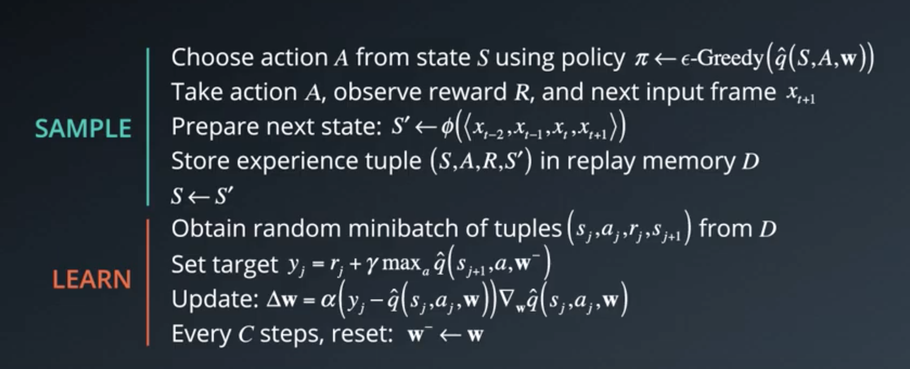
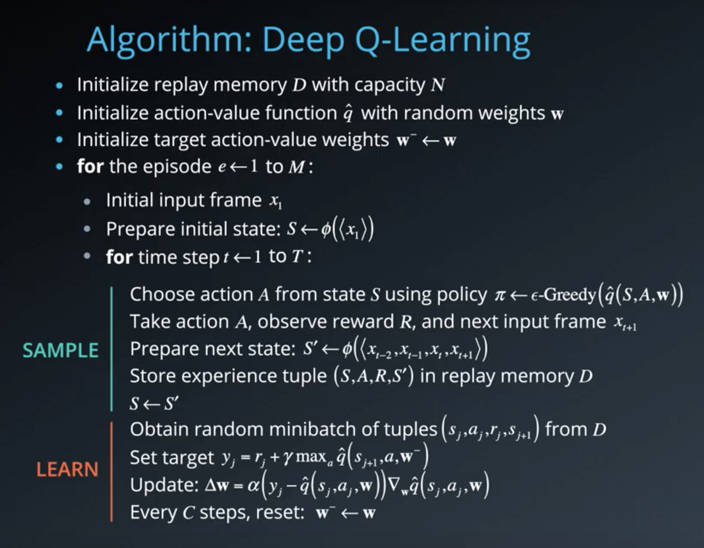
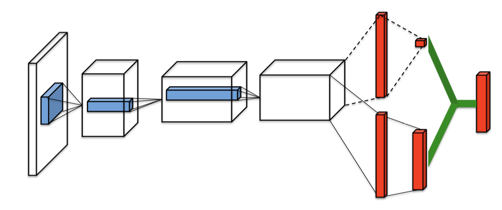
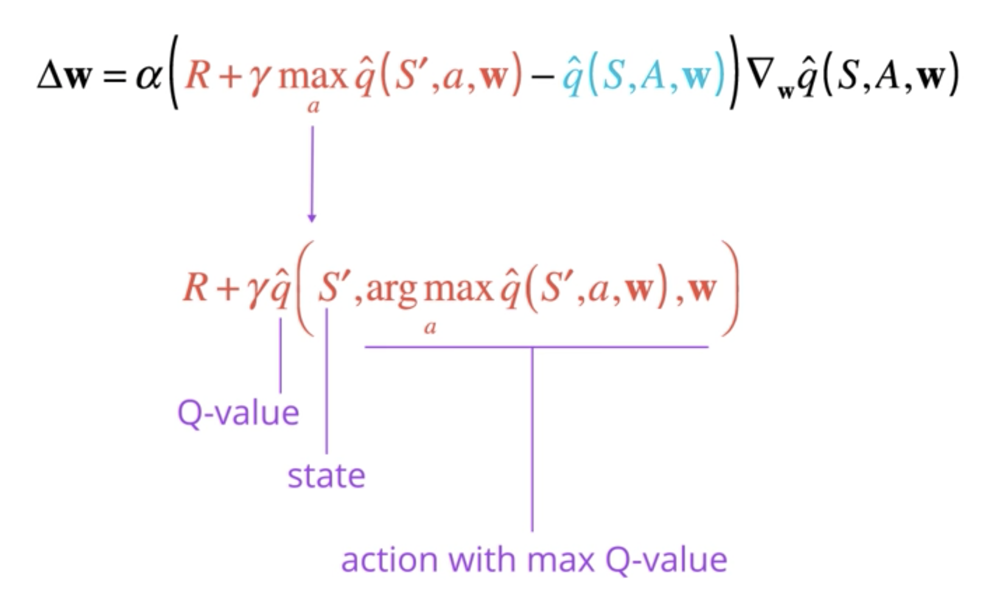
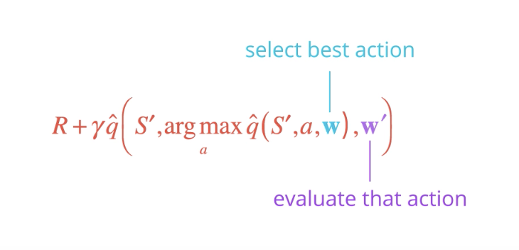

# From RL to Deep RL

So far, you've solved many of your own reinforcement learning problems, using solution methods that represent the action values in a small table. Earlier in the nanodegree, we referred to this table as a  **Q-table**.

In the video below,  **Kelvin Lwin**  will introduce you to the idea of using neural networks to expand the size of the problems that we can solve with reinforcement learning. This context is useful preparation for exploring the details behind the Deep Q-Learning algorithm later in this lesson!

_Kelvin is a Senior Deep Learning Instructor at the  [NVIDIA Deep Learning Institute](https://www.nvidia.com/en-us/deep-learning-ai/education)._

RL is a branch of machine learning where an agent outputs an action and the environment returns an observation or the state of the system and a reward. 

The **goal of an agent** is to best determine the best action to take. Usually, RL is described in terms of this agent interacting with the previously unknown environment, trying to maximize the overall or total reward. Now then, **what is Deep RL?**

In some sense, it is using nonlinear function approximators to calculate the value actions based directly on observations from the environment. We represented it as a **Deep Neural Network**. We then deep learning to find the optimal parameters for these function approximators. 

You have already worked with some deep learning neural networks for classification, detection, and semantic segmentation. However, these deep learning applications use labeled training data for supervised learning. The inference engine then produces the best guess label, not an action, as the output. 

When an RL agent handles the entire end-to-end pipeline, it's called **pixels-to-action**, referring to the network's ability to take raw sensor data and choose the action it thinks will best maximize its reward. 

Overtime, RL agents have a uncanny knack for developing intuitive human-like behaviors like learning to walk or peeking behind corners when they're unsure. They naturally incorporate elements of exploration and knowledge gathering, which makes them good for imitating behaviors and performing path planning. 

Robots operating in unstructured environments tend to greatly benefit from RL agents, which gives them a way to make sense of the environment, which can be hard to model in advance. 

See the video [here](https://youtu.be/7HLJ0uaR1F0).

As you'll learn in this lesson, the Deep Q-Learning algorithm represents the optimal action-value function  as a neural network (instead of a table).

Unfortunately, reinforcement learning is  [notoriously unstable](http://citeseerx.ist.psu.edu/viewdoc/download?doi=10.1.1.73.3097&rep=rep1&type=pdf)  when neural networks are used to represent the action values. In this lesson, you'll learn all about the Deep Q-Learning algorithm, which addressed these instabilities by using  **two key features**:

-   Experience Replay
-   Fixed Q-Targets

The **Deep Q-Network (DQN) algorithm** has caused a lot of buzz around deep RL since 2013. It's more or less an online version of a neural fitted value iteration paper from 2005 by Reed Miller and Martin, which introduced training of Q value function represented by a multilayer perceptron.

There are a few very useful additions and tweaks though in DQN. 

- The first addition is the use of a rolling history of the past data via **replay pool**. By using the replay pool, the behavior distribution is averaged over many of its previous states, smoothing out learning and avoiding oscillations. The has the **advantage** that each step of the experience is potentially used in many weight updates. 

- The other big idea is the use of a target network to represent the old Q function, which will be used to compute the loss of every action during training. **Why not use a single network?** Well, the issue is that at each step of training, the Q function's values change and then the value estimates can easily spiral out of control.

These additions enable RL agents to **converge more reliably during training**.

See the video [here](https://youtu.be/WgiAvr7COR0).

## Additional References

-   Riedmiller, Martin. "Neural fitted Q iteration–first experiences with a data efficient neural reinforcement learning method." European Conference on Machine Learning. Springer, Berlin, Heidelberg, 2005.  [http://ml.informatik.uni-freiburg.de/former/_media/publications/rieecml05.pdf](http://ml.informatik.uni-freiburg.de/former/_media/publications/rieecml05.pdf)
    
-   Mnih, Volodymyr, et al. "Human-level control through deep reinforcement learning." Nature518.7540 (2015): 529.  [http://www.davidqiu.com:8888/research/nature14236.pdf](http://www.davidqiu.com:8888/research/nature14236.pdf)

# Deep Q-Network
In the video below, Arpan will tell you all about how DeepMind leveraged a **Deep Q-Network (DQN)** to build the Deep Q-Learning algorithm that learned to play many Atari video games better than humans.

In 2015, DeepMind made a breakthrough by designing an agent that learned to play video games better than humans. It's probably easy to write a program that plays pong perfectly if you have access to the underlying game state, position of the ball, paddles, etc. But this agent was only given raw pixel data, what a human player would see on screen. It learned to play a bunch of different Atari games, all from scratch. They called this agent a **Deep Q Network**. Let's see how it works.

True to its name, at the heart of the agent is a deep neural network that acts as a function approximator. You pass in images from your favorite video game one screen at a time, and it produces a vector of action values, with the max value indicating the action to take. 

As a RL signal, it is fed back the change in game score at each time step. In the beginning when the neural network is initialized with random values, the actions taken are all over the place. 

Over time it begins to associate situations and sequences in the game with appropriate actions and learns to actually play the game well. 

Consider how complex the input space is. Atari games are displayed at a resolution of 210x160 pixles, with 128 possible colors for each pixel. **This is still technically a discrete state space but very large to process as is**.

**To reduce complexity,** the DeepMind team decided to perform some minimal processing, convert the frames to grayscale, and scale them down to a square 84x84 pixel block. Square images allowed them to use more optimized neural network operations on GPUs. 

In order to give agent access to a sequence of frames, they stacked four such frames together resulting in a final state space size of 84x84x4. 

There might be other approaches to dealing with sequential data but this was a simple approach that seemed to work pretty well. 

On the output side, unlike a traditional RL setup where only one Q value is produced at a time, the Deep Q Network is designed to produce a Q value for every possible action in a single forward pass. Without this, you would have to run the network individually for every action. Instead, you can now simply use this vector to take an action, either stochastically, or by choosing the one with the maximum value. 

These innovative input and output transformations support a powerful yet simple neural network architecture undeer the hood. The screen images are first processed by convolutional layers. This allows the system to exploit spatial relationships, and can exploit spatial rule space. 

Also, since four frames are stacked and provided as input, these convolutional layers also extract some temporal properties across those frames. 

The original DQN agent used three such convolutional layers with relu activation. There were followed by one fully-connected hidden layer with relu activation, and one fully connected linear output that produced the vector of action values. 

This same architecture was used for all Atari games they tested on, but each game was learned from scratch with a freshly initialized network. 

Training such a network requires a lot of data, but even then, it is not guaranteed to converge on the optimal value function. In fact, there are situations where the network weights can oscillate or diverge, due to the high correlation between actions and states. This can result in a very unstable and ineffective policy.

In order to overcome these challenges, the researchers came up with several techniques that slightly modified the base Q-learning algorithm. We'll take a look at two of those techniques (which are the most important ones):

- **Experience Replay**
- **Fixed Q Targets**

See the video [here](https://youtu.be/GgtR_d1OB-M).

# Experience Replay
The idea of experience replay and its application to training neural networks for RL isn't new. It was originally proposed to make more efficient use of observed experiences. Consider the basic online Q-learning algorithm where we interact with the environment and at each time step, we obtain a tuple like this: , learn from it and then discarded, moving on to the next tuple in the following timestep. 

This seems a little wasteful. We could possibly learn more from these experienced tuples if we stored them somewhere. 

Moreover, some states are pretty rare to come by and some actions can be pretty costly. So, it'd be nice to recall such experiences. 

That is exactly what a **replay buffer** allows us to do. We store each experienced tuple in this buffer as we are interacting with the environment and then sample a small batch of tuples from it in order to learn. 

As a result, we are able to learn from individual tuples multiple times, recall rare occurences, and in general make better use of our experience. 

But there is another critical problem that experience replay can help with and this is what DQN takes advantage of. If you think about the experiences being obtained, you realize that every action  affects the next state  in some way, which means that a sequence of experienced tuples can be highly correlated. 

A naive Q-learning approach that learns from each of these experiences in sequential order runs the risk of getting swayed by the effects of this correlation. 

With **experience replay**, we can sample from this buffer at random. It doesn't have to be in the same sequence as we stored the tuples. This helps break the correlation and ultimately prevents action values from oscillating or diverging catastrophically. 

Let's look at an example for better understanding ([this video](https://youtu.be/wX_-SZG-YMQ) from minute 2:00).

If you think about it, this approach is basically building a database of samples and then learning a mapping from them. In that sense, **experience replay helps us reduce the RL problem or at least the value learning portion of it to a supervised learning scenario**. We can then apply other models learning techniques and best practices developed in the supervised learning literature through the RL. We can even improve upon this idea, for example, by prioritizing experience tuples that are rare or more important. 

See the video [here](https://youtu.be/wX_-SZG-YMQ).

## Summary
When the agent interacts with the environment, the sequence of experience tuples can be highly correlated. The naive Q-learning algorithm that learns from each of these experience tuples in sequential order runs the risk of getting swayed by the effects of this correlation. By instead keeping track of a  **replay buffer**  and using  **experience replay**  to sample from the buffer at random, we can prevent action values from oscillating or diverging catastrophically.

The  **replay buffer**  contains a collection of experience tuples . The tuples are gradually added to the buffer as we are interacting with the environment.

The act of sampling a small batch of tuples from the replay buffer in order to learn is known as  **experience replay**. In addition to breaking harmful correlations, experience replay allows us to learn more from individual tuples multiple times, recall rare occurrences, and in general make better use of our experience.

# Fixed Q-Targets
Experience replay helps us address one type of correlation, i.e. between **consecutive experience tuples**. 

There is another kind of correlation that Q-learning is susceptible to. Q-learning is a form of **Temporal Difference (TD)** learning. In the equation below, the first part is called **TD target**,

Our goal is to reduce the difference between this target and the currently predicted Q-value. This difference is the **TD error**. 

Now, the _TD target_ here is supposed to be a replacement for the true value function , which is unknown to us. 

We originally used  to define a squared error loss, and differentiated that with respect to  to get our gradient descent update rule. 

Now,  is not dependent on our function approximation or its parameters, thus resulting in a simple derivative, and update rule. 

But our TD target is dependent on these parameters which means simply replacing the true value function  with a target like this is _**mathematically incorrect**_ (see below).

We can get away with it in practice because every update results in a small change to the parameters. We're just generally in the right direction. If we set  equals to 1, and leap toward the target then we'd likely overshoot and land in the wrong place. Also, this is less of a concern when we use a lookup table or a dictionary since Q-values are stored separately for each state action pair. But it can affect learning significantly when we use function approximation, where all the Q-values are intrinsically tied together through the function parameters. 

You maybe thinking, **"Doesn't experience replay take care of this problem?"**. 

Well, it addresses a similar but slightly different issue. There we broke the correlation effects between consecutive experience tuples by sampling them randomly out of order. **Here, the correlation is between the target and the parameters we are changing.** This is like chasing a moving target, literally. In fact, it's worse. it's like trying to train a donkey to walk straight by sitting on it and dangling a carrot in front. Yes, the donkey might step forward and the carriage usually gets carried away always staying a little out of reach. But, contrary to popular belief, this doesn't quite work as you'd expect. The carrot is much more likely to bounce around randomly throwing the donkey off with every jerky step. Each action affects the next position of the target in a very complicated and unpredictable manner. You shouldn't be surprised if the donkey gets frustrated jumping around the spot and gives up. Instead, you should get off the donkey stand in one place and dangle the carrot from there. Once the donkey reaches that spot, move a few steps ahead, dangle another carrot and repeat. What you're essentially doing is decoupling the target's position from the donkey's actions giving it a more stable learning environment. 

We can do pretty much the same thing in Q-learning by fixing the function parameters used to generate our target. The fixed parameters indicated by a  (in equation below) are basically a copy of  that we don't change during the learning step. 

In practice, we copied  into , use it to generate targets while changing  for a certain number of learning steps. Then, we update  with the latest , again learn from a number of steps and so on. This decouples the target from the parameters, makes the learning algorithm much more stable, and less likely to diverge or fall into oscillations.

See the video [here](https://youtu.be/SWpyiEezfp4).

## Summary
In Q-Learning, we  **_update a guess with a guess_**, and this can potentially lead to harmful correlations. To avoid this, we can update the parameters  ww  in the network  to better approximate the action value corresponding to state  and action  with the following update rule:

where  are the weights of a separate target network that are not changed during the learning step, and  is an experience tuple.

**Note**: Ever wondered how the example in the video would look in real life? See: [Carrot Stick Riding](https://www.youtube.com/watch?v=-PVFBGN_zoM).

# Deep Q-Learning Algorithm

Please take the time now to read the  [research paper](docs/DQNNaturePaper.pdf)  that introduces the Deep Q-Learning algorithm.

## Reading Scientific Papers
As part of this nanodegree, you will learn about many of the most recent, cutting-edge algorithms! Because of this, it will prove useful to learn how to read the original research papers. Here are some  [excellent tips](https://www.huffingtonpost.com/jennifer-raff/how-to-read-and-understand-a-scientific-paper_b_5501628.html). Some of the best advice is:

-   Take notes.
    
-   Read the paper multiple times. On the first couple readings, try to focus on the main points:
    
    1.  What kind of tasks are the authors using deep reinforcement learning (RL) to solve? What are the states, actions, and rewards?
    2.  What neural network architecture is used to approximate the action-value function?
    3.  How are experience replay and fixed Q-targets used to stabilize the learning algorithm?
    4.  What are the results?
-   Understanding the paper will probably take you longer than you think. Be patient, and reach out to the Udacity community with any questions.

## Check Your Understanding
After you have read the paper, use [the video below](https://youtu.be/MqTXoCxQ_eY) to check your understanding.

_from the video_

There are **two main processes** that are interleaved in this algorithm. 

- One is where we sample the the environment by performing actions and store away the observed experienced tuples in a replay memory. 
- The other is where we select all the small batch of tuples from this memory randomly and learn from the batch using a gradient descent update step. 

These two processes are not directly dependent on each other. So, you could perform multiple sampling steps, then one learning step, or even multiple learning steps with different random batches. 

The rest of the algorithm is designed to support these steps. 

In the beginning you need to initialize an empty replay memory . Note that memory is finite, so you may want to use something like a circular Q that retains the  most recent experience tuples. 

Then, you also need to initialize the parameters or weights of your neural network. There are certain best practices that you can use, for instance, sampel the weights randomly from a normal distribution with variance equal to 2 by the number of inputs to each neuron. These initialization methods are typically available in modern deep learning libraries like Keras and Tensorflow, so you won't need to implement them yourself.

To use the fixed Q-targets technique, you need a second set of parameters  which you can initialize to . 

Now, remember that the specific algorithm was designed to work with video games. So, for each episode and each timestep  within that episode you observe a raw screen image or input frame  which you need to convert to grayscale and crop to a square size, etc.

Also, in order to capture temporal relationships you can stack a few input frames to biuld each state vector. Let's denote this pre-processing and stacking operation by the function , which takes a sequence of frames and produces some combined representation. 

Note that if we want to stack say four frames, we'll have to do something special for the first three timesteps. For instance, we can treat those missing frames as blank, or just use copies of the first frame, or we can just skip storing the experience tuples till we get a complete sequence. 

In practice, you won't be able to run the learning step immediately. You'll need to wait till you have sufficient number of tuples in memory. Note that we do not clear out the memory after each episode, this enables us to recall and build batches of experiences from across episodes. 

There are many other techniques and optimizations that are used in the DQN paper, such as reward clipping, error clipping, storing past actions as part of the state vector, dealing with terminal states, decaying epsilon over time, etc. 

See the video [here](https://youtu.be/MqTXoCxQ_eY).

# Coding Exercise

In this exercise, you will implement Deep Q-Learning to solve OpenAI Gym's LunarLander environment. To begin, open the Workspace in the next concept, navigate to the  `codes/`  folder, and follow the instructions in  `Deep_Q_Network.ipynb`.

After you are able to get the code working, try to change the hyperparameters and architecture, to see if you can get the agent to train faster!

## PyTorch
The implementation is written in PyTorch. If the PyTorch framework is new to you, please take a look at our  **Deep Learning with PyTorch**  lesson in the extracurricular content.

## Note
In the Workspace in the following concept, you will have the option to  **ENABLE GPU**  to accelerate training. After training, you can use the provided code in the Jupyter notebook to watch your agent's performance. Note that if visualizing the trained agent in the Workspace, GPU should be  **disabled**  -- otherwise the notebook will return an error.

Thus, you are encouraged to follow the following workflow:

1.  train the agent with GPU  **enabled**, and save the trained model weights,
2.  **disable GPU**, load the trained weights from file, and watch the trained agent.

## DQN Improvements
Later in this lesson, you will learn about three different improvements you can make to your algorithm:

-   Double DQN
-   Prioritized Experience Replay
-   Dueling DQN

If you'd like to implement any of these, you're encouraged to use the provided notebook as a starting point.

# Deep Q-Learning Improvements

Several improvements to the original Deep Q-Learning algorithm have been suggested. Over the next several videos, we'll look at three of the more prominent ones.

## Double DQN
Deep Q-Learning  [tends to overestimate](https://www.ri.cmu.edu/pub_files/pub1/thrun_sebastian_1993_1/thrun_sebastian_1993_1.pdf)  action values.  [Double Q-Learning](https://arxiv.org/abs/1509.06461)  has been shown to work well in practice to help with this.

## Prioritized Experience Replay
Deep Q-Learning samples experience transitions  _uniformly_  from a replay memory.  [Prioritized experienced replay](https://arxiv.org/abs/1511.05952)  is based on the idea that the agent can learn more effectively from some transitions than from others, and the more important transitions should be sampled with higher probability.

## Dueling DQN
Currently, in order to determine which states are (or are not) valuable, we have to estimate the corresponding action values  _for each action_. However, by replacing the traditional Deep Q-Network (DQN) architecture with a  [dueling architecture](https://arxiv.org/abs/1511.06581), we can assess the value of each state, without having to learn the effect of each action.

# Double DQN
The first problem we're going to address is the **overestimaton** of action values that Q-learning is prone to. 

Let's look back at the update rule for Q-learning with function approximation and focus on the TD target. 

Here, the max operation is necessary to find the best possible value we could get from the next state. To understand this better, let's rewrite the target, and expand the max oeprartion. 

It's just a more efficient way of saying, that we want to obtain the Q-value for state  and the action that results in the maximum Q-value among all possible actions from that state. 

When we write it this way, we can see that it's possible for the argmax operation to make a mistake, especially in the early stages. **Why?**

Because the Q-values are still evolving, and we may not have gathered enough information to figure out the best action. The accuracy of our Q-values depends a lot on what actions have been tried, and what neighboring states have been explored. 

In fact, it has been shown that this results in an overestimation of Q-values, since we always pick the maximum among a set of noisy numbers. So, maybe we shouldn't blindly trust these values. **What can we do to make our estimation more robust?**

One idea that has been shown to work very well in practice is called **Double Q-learning**, where we select the best action using one set of parameters , but evaluate is using a different set of parameters . It's basically like having two separate function approximators that must agree on the best action. If  picks an action that is not the best according to , then the Q-value returned is not that high. 

In the long run, this prevents the algorithm from propagating incidental high rewards that may have been obtained by chance, and don't reflect long-term returns. 

Now you might be thinking **where do we get the second set of parameters from?**

In the original formulation of Double Q-learning, you would basically maintain two value functions and randomly choose one of them to update at each step using the other only for evaluating actions. 

But when using DQN with fixed Q-targets, we already have an alternate set of parameters. Remember ?

It turns out that since  is kept frozen for a while, it is different from  that it can be reused for this purpose. 

And that's it! This simple modification keeps Q-values in check, preventing them from exploding in early stages of learning or fluctuating later on. The resulting policies have also been shown to perform significantly better than vanilla DQNs. 

See the video [here](https://youtu.be/PGCEMLujiGI).

## Notes
You can read more about Double DQN (DDQN) by perusing this  [research paper](https://arxiv.org/abs/1509.06461).

If you'd like to dig deeper into how Deep Q-Learning overestimates action values, please read this  [research paper](https://www.ri.cmu.edu/pub_files/pub1/thrun_sebastian_1993_1/thrun_sebastian_1993_1.pdf).

