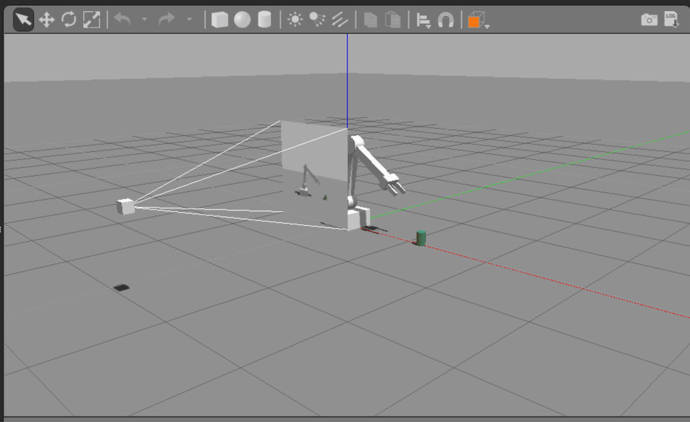
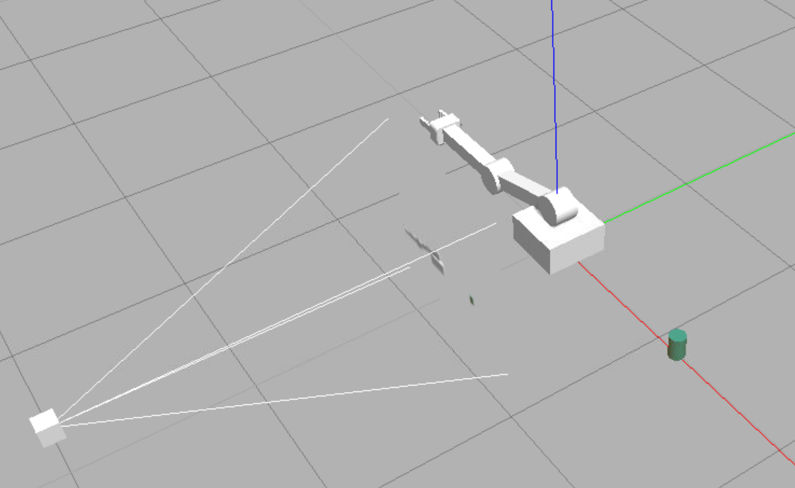

# Introduction
Our approach is to begin by training agents from virtual robotic simulation, and then transfer the agent to a real-world robot. To accomplish this you'll learn how to use C++ API, to run a DQN agent which will let us use robotic platforms that run much faster than if you had implemented the agent in say Python. 

Using this API, you'll train your own virtual robotic agents to perform complex tasks. Once your agents are trained, you can transfer them to a real-world robot by using a computing device like the Jetson Tx2 that's developed at Nvidia.

See the video [here](https://youtu.be/dfeawuScC7k).

# C++ for Robotics

Watch the video below to learn why C++ is useful for robotics from  **Karim Chamaa**, a Content Developer for the  [Robotics Software Engineer Nanodegree Program](https://www.udacity.com/course/robotics-software-engineer--nd209).

_Karim started his early career as a Mechanical Engineer. He earned his M.S. in Mechatronics and Robotics Engineering from NYU. His specialties include Kinematics, Control, and Electronics._

_from the video_

There are three mains reasons why C++ might be a better choice than Python and C for programming robots:

- In robotics, you need a fast runtime for your code. This is because your robotics projects will often be dependent on real-time performance. Also, C++ runs faster than Python because it's compiled rather than interpreted on the fly. 
- The second advantage of C++ is when it comes to using ROS packages. Typically, you'll download ROS packages containing nodes written in C++, so you often want to read through them and tweak them to fit your need. 
- Finally, there is an advantage of using C++ when it comes to hardware. Today's robotic system interface with and control all kinds of physical hardware, like sensors and actuators, through low-level programs called **device drivers**. To achieve fast and precise control, device drivers are often written in a compiled language like C or C++. Therefore, understanding C++ will help you tap into this low layer of control when tweaking and building your robots.

See the video [here](https://youtu.be/1oElWzRt-lU).

In the video, Karim refers to the  [Robotics Operating System (ROS)](http://www.ros.org/), which is widely used across industry and in academia for building robotics applications.

As Karim discussed in the video, robots require real-time responses to changes in their environments, so computation performance matters. By using a compiled language (C/C++) instead of an interpreted language (Python), performance is improved.

## Transitioning to C++
If you are not familiar with C++, you can review the free  [Udacity C++ course](https://classroom.udacity.com/courses/ud210)  or the excellent  [Sololearn tutorial](https://www.sololearn.com/Course/CPlusPlus/)  for in-depth learning.

Watch the [video below](https://youtu.be/BvDvxw8e0CY) to learn more about how C++ differs from Python.

_from the video_

Since many of you are transitioning from Python to C++, let's explore some of the key differences between them. 

- C++ is a **statistically-typed language**, while Python is **dynamic**. This means that when declaring a variable in C++, you have to assign it a data type. With Pytho, variables don't need to be assigned to a type and can be used anywhere in the code without any kind of declaration beforehand. 
- Also, in Python, functions can accept arguments of any type and return values of any type without prior initialization. In C++, **main functions is the entry point** of the program, while in Python the entry point is the start of the source code. 
- Further, C++ is a **compiled** language, while Python is **interpreted**. This means that programs in C++ have to be compiled before you run them, while Python programs run through an interpreter. 
- In C++, **identation is optional**, while in Python it's **mandatory**. In other words, with C++ indentation is purely for human readability, whereas in Python, it's necessary to indicate a block of code. 

# C/C++ API

To successfully leverage deep learning technology in robots, we need to move to a library format that can integrate with robots and simulators.

In this section, we introduce an API (application programming interface) in C/C++. The API provides an interface to the Python code written with PyTorch, but the wrappers use Python’s low-level C to pass memory objects between the user’s application and Torch without extra copies.

_from the video_

In this lesson, we will work with an API developed in Nvidia. It includes a couple of 3D robotics simulators such as a Rover that learns to follow objects while avoiding the walls of its environment. Along with the robot arm that you can train to touch objects. The repository also includes some simple 2D environments that are designed to help you with debugging your code. 

Check out the instructions below to learn how to setup the environment. 

See the video [here](https://youtu.be/a9-HdpCaYW4).

## API Repository
You can find the API repository  [here](https://github.com/dusty-nv/jetson-reinforcement).

<p align="center">

</p>

## Installing the Repository

----------

We will provide the coding environment for you in a Udacity Workspace, so you do not need to install the API. However, if you'd like to install it on a GPU x86_64 system, you need only follow the build instructions in the  [repository](https://github.com/udacity/RoboND-DeepRL-Project).

## API Repository Sample Environments

----------

In addition to OpenAI Gym samples, the repository contains the following demos:

-   C/C++ 2D Samples
    -   Catch (DQN text)
    -   Fruit (2D DQN)
-   C/C++ 3D Simulation
    -   (Robotic) Arm (3D DQN in Gazebo)
    -   Rover (3D DQN in Gazebo)

The purpose of building the simple 2D samples is to test and understand the C/C++ API as we move toward the goal of using the API for robotic applications. Each of these samples will use a Deep Q-Network (DQN) agent to solve problems.

## The DQN agent

----------

The repo provides a base  [`rlAgent`](https://github.com/dusty-nv/jetson-reinforcement/blob/master/c/rlAgent.cpp)  base class that can be extended through inheritance to implement agents using various reinforcement learning algorithms. We will focus on the  [`dqnAgent`](https://github.com/dusty-nv/jetson-reinforcement/blob/master/c/dqnAgent.cpp)  class and applying it to solve DQN reinforcement learning problems.

The following pseudocode illustrates the signature of the  [`dqnAgent`](https://github.com/dusty-nv/jetson-reinforcement/blob/master/c/dqnAgent.cpp)  class:

```cpp
class dqnAgent : public rlAgent
{
public:

    /**
     * Create a new DQN agent training instance,
     * the dimensions of a 2D image are expected.
     */
    static dqnAgent* Create( uint32_t width, uint32_t height, uint32_t channels, 
        uint32_t numActions, const char* optimizer = "RMSprop", 
        float learning_rate = 0.001, uint32_t replay_mem = 10000, 
        uint32_t batch_size = 64, float gamma = 0.9, float epsilon_start = 0.9,  
        float epsilon_end = 0.05,  float epsilon_decay = 200,
        bool allow_random = true, bool debug_mode = false);

    /**
     * Destructor
     */
    virtual ~dqnAgent();

    /**
     * From the input state, predict the next action (inference)
     * This function isn't used during training, for that see NextReward()
     */
    virtual bool NextAction( Tensor* state, int* action );

    /**
     * Next action with reward (training)
     */
    virtual bool NextReward( float reward, bool end_episode );
}


```

In the pseudocode above, the agent is instantiated by the  `Create()`  function with the appropriate initial parameters. For each iteration of the algorithm, the environment provides sensor data, or environmental state, to the  `NextAction()`  call, which returns the agent's action to be applied to the robot or simulation. The environment's reward is issued to the  `NextReward()`  function, which kicks off the next training iteration that ensures the agent learns over time.

Let's take a detailed look at some of the parameters that can be set up in the  `Create()`  function.

## Setting the Parameters

----------

The parameter options are specified separately for each sample. For instance, you can see how the parameters are set for the  `catch`  agent by perusing the top of the  [`catch.cpp`](https://github.com/dusty-nv/jetson-reinforcement/blob/master/samples/catch/catch.cpp)  file.

```cpp
// Define DQN API settings
#define GAME_WIDTH   64             // Set an environment width 
#define GAME_HEIGHT  64             // Set an environment height 
#define NUM_CHANNELS 1              // Set the image channels 
#define OPTIMIZER "RMSprop"         // Set a optimizer 
#define LEARNING_RATE 0.01f         // Set an optimizer learning rate
#define REPLAY_MEMORY 10000         // Set a replay memory
#define BATCH_SIZE 32               // Set a batch size
#define GAMMA 0.9f                  // Set a discount factor
#define EPS_START 0.9f              // Set a starting greedy value
#define EPS_END 0.05f               // Set a ending greedy value
#define EPS_DECAY 200               // Set a greedy decay rate
#define USE_LSTM true               // Add memory (LSTM) to network
#define LSTM_SIZE 256               // Define LSTM size
#define ALLOW_RANDOM true           // Allow RL agent to make random choices
#define DEBUG_DQN false             // Turn on or off DQN debug mode
```

# ple

SEND FEEDBACK

# Catch Sample

The  [`catch`](https://github.com/udacity/RoboND-DeepRL-Project/blob/master/samples/catch/catch.cpp)  sample is a simple C/C++ program which links to the reinforcement learning library provided in the repository.

The environment is a 2-dimensional screen. A ball drops from the top of the screen and the agent is supposed to “catch” the ball before it hits the bottom of the screen. Its only allowed actions are left, right or none.

### `catch`  Implementation

----------

The  [`catch.cpp`  code](https://github.com/udacity/RoboND-DeepRL-Project/blob/master/samples/catch/catch.cpp)  `main`  procedure consists of the following sections:

-   Initialize and instantiate a  `dqnAgent`
-   Allocate memory for the game
-   Set up the game state (ball location)
-   Game loop
    -   Update the game state
    -   Get the agent’s next action with  `NextAction()`
    -   Apply the action to the game
    -   Compute the reward
    -   Exit if game over

The  `dqnAgent`  is initialized with parameters defined at the start of the module:

```cpp
// Create reinforcement learner agent in pyTorch using API
dqnAgent* agent = dqnAgent::Create(gameWidth, gameHeight, 
                    NUM_CHANNELS, NUM_ACTIONS, OPTIMIZER, 
                    LEARNING_RATE, REPLAY_MEMORY, BATCH_SIZE, 
                    GAMMA, EPS_START, EPS_END, EPS_DECAY,
                    USE_LSTM, LSTM_SIZE, ALLOW_RANDOM, DEBUG_DQN);

```

## Quiz - Catch Rewards
As with the OpenAI Gym environments, the  `catch`  game environment must provide rewards to the agent based on the action the agent chooses. The reward function snippet from  [`catch.cpp`](https://github.com/udacity/RoboND-DeepRL-Project/blob/master/samples/catch/catch.cpp)  can be found in the main game loop, and is pasted below.

```cpp
// Compute reward
    float reward = 0.0f;

    if( currDist == 0 )
        reward = 1.0f;
    else if( currDist > prevDist )
        reward = -1.0f;
    else if( currDist < prevDist )
        reward = 1.0f;
    else if( currDist == prevDist )
        reward = 0.0f;

```

The variable  `currDist`  is the current distance to the ball and the variable  `prevDist`  is the distance to the ball found in the previous frame. 

## Running  `catch`
To test the textual catch sample, begin by opening the Udacity Workspace in a new window by clicking on  [this link](https://classroom.udacity.com/nanodegrees/nd893/parts/314f8ff8-9c7f-4dd8-a806-5c81c2b07994/modules/85e060a7-7cd2-4378-a90c-efd94f79451c/lessons/473f623a-a7f0-4cd8-b0fb-3fe0152c9248/concepts/a0f2580c-9d5f-4ba9-84ac-8439cfa7ebfe).

Then, follow these steps:

-   When asked if you'd like to  **Enable GPU Mode**, select  **[YES]**.
-   Click on the  **[Go to Desktop]**  button in the bottom right corner of the Workspace; this will open a new window.
-   If you get an error message that says something like  **_No session for pid 55_**, click  **[OK]**  to close the window.

Next, open a terminal by clicking the  **Terminator**  icon on the desktop. Navigate to the folder containing the samples by typing the following in a terminal window:

```bash
cd /home/workspace/jetson-reinforcement/build/x86_64/bin
```

Then, run the  `catch`  executable from the terminal:

```bash
$ ./catch 
```

The terminal will list the initialization values, then print out results for each iteration. After around 100 episodes or so, the agent should start winning the episodes nearly 100% of the time. The following is an example output:

```txt
[deepRL]  input_width:    64
[deepRL]  input_height:   64
[deepRL]  input_channels: 1
...
WON! episode 1
001 for 001  (1.0000)  
WON! episode 5
004 for 005  (0.8000)  
...
WON! episode 110
078 for 110  (0.7091)  19 of last 20  (0.95)  (max=0.95)
WON! episode 111
079 for 111  (0.7117)  19 of last 20  (0.95)  (max=0.95)
WON! episode 112
080 for 112  (0.7143)  20 of last 20  (1.00)  (max=1.00)

```

Internally,  `catch`  is using the  `dqnAgent`  API from our C++ library to implement the learning.

## Alternate Arguments
There are some optional command line parameters to catch that you can play around with, to change the dimensions of the environment and pixel array input size, increasing the complexity to see how it impacts convergence and training times:

```bash
$ ./catch --width=96 --height=96
$ ./catch --render  # enable text output of the environment
```

With 96x96 environment size, the catch agent achieves >75% accuracy after around 150-200 episodes. With 128x128 environment size, the catch agent achieves >75% accuracy after around 325 episodes.

# Fruit Sample

The  [`fruit`](https://github.com/dusty-nv/jetson-reinforcement/blob/master/samples/fruit/fruit.cpp)  sample is a simple C/C++ program which links to the reinforcement learning library provided in the repository.

The environment is a 2-dimensional screen. The agent is learning "from vision" to translate the raw pixel array into actions using the DQN algorithm. The agent appears at random locations and must find the "fruit" object to gain the reward and win episodes before running out of bounds or the timeout period expires. The agent has 5 possible actions to choose from: up, down, left, right, or none on the screen in order to navigate to the object.

<p align="center">

</p>

## `fruit`  Implementation
The  [`fruit`](https://github.com/dusty-nv/jetson-reinforcement/blob/master/samples/fruit/fruit.cpp)  code looks very similar to the  `catch`  code. It’s important to note that the  _same agent class_  is used in both environments!

```cpp
// Create reinforcement learner agent in pyTorch
dqnAgent* agent = dqnAgent::Create(gameWidth, gameHeight, 
                    NUM_CHANNELS, NUM_ACTIONS, OPTIMIZER, 
                    LEARNING_RATE, REPLAY_MEMORY, BATCH_SIZE, 
                    GAMMA, EPS_START, EPS_END, EPS_DECAY,
                    USE_LSTM, LSTM_SIZE, ALLOW_RANDOM, DEBUG_DQN);
```

The parameter values are slightly different (the frame size and number of channels have changed), but the algorithm for training the network to produce actions from inputs remains the same.

The environment is more complicated for  `fruit`  than it is for  `catch`, so it has been extracted to the  [`fruitEnv.cpp`](https://github.com/dusty-nv/jetson-reinforcement/blob/master/samples/fruit/fruitEnv.cpp)  module and it’s own class,  `FruitEnv`. The environment object named  `fruit`  is instantiated in the  `fruit.cpp`  module.

```cpp
// Create Fruit environment
FruitEnv* fruit = FruitEnv::Create(gameWidth, gameHeight, epMaxFrames);
```

We can trace the handoff between the agent and environment through the following code snippet located in the main game loop in the  `fruit.cpp`  module:

```cpp
// Ask the agent for their action
int action = 0;
if( !agent->NextAction(input_tensor, &action) )
    printf("[deepRL]  agent->NextAction() failed.\n");

if( action < 0 || action >= NUM_ACTIONS )
    action = ACTION_NONE;

// Provide the agent's action to the environment
const bool end_episode = fruit->Action((AgentAction)action, &reward);
```

In this snippet,  `action`  is the variable that contains the  `agent`  object’s next action, based on the previous environment state represented by the  `input_tensor`  variable. The  `reward`  is determined in the last line when the  `action`  is submitted to the environment object named  `fruit`.

## Quiz - Fruit Rewards
The  `fruit`  rewards function can be implemented a number of different ways. Below are several possible reward functions for the game that compare previous and current distances between the agent and its goal. Match each to descriptions in the quiz below.

### A

```cpp
*reward = (lastDistanceSq > fruitDistSq) ? 1.0f : 0.0f;

```

### B

```cpp
*reward = (sqrtf(lastDistanceSq) - sqrtf(fruitDistSq)) * 0.5f;

```

### C

```cpp
*reward = (sqrtf(lastDistanceSq) - sqrtf(fruitDistSq)) * 0.33f;

```

### D

```cpp
*reward = exp(-(fruitDistSq/worldWidth/1.5f));
```

## Running  `fruit`
To test the fruit sample, open the desktop in the  **Udacity Workspace**, open a terminal, and once again navigate to the folder containing the samples with:

```bash
$ cd /home/workspace/jetson-reinforcement/build/x86_64/bin
```

Launch the executable from the terminal:

```bash
$ ./fruit
```

It should achieve 85% accuracy after around ~100 episodes within the default 48x48 environment.

## Alternate Arguments
Optional command line parameter examples for  `fruit`  can be used to change the size of the pixel array and limit the number of frames:

```bash
$ ./fruit --width=64 --height=64 --episode_max_frames=100
```

# Rover Sample

The next environment that you will get to explore and work with uses the C++ API and Gazebo.

The repository contains a  [`gazebo-rover.world`](https://github.com/dusty-nv/jetson-reinforcement/blob/master/gazebo/gazebo-rover.world)  file that defines the environment with four main components:

-   The rover.
-   A camera sensor, to capture images to feed into the DQN.
-   A maze.
-   Obstacles that block the rover's path.

<p align="center">

</p>

## Running the Rover
To test the rover sample, open the desktop in the  **Udacity Workspace**, open a terminal, and once again navigate to the folder containing the samples with:

```bash
$ cd /home/workspace/jetson-reinforcement/build/x86_64/bin
```

Launch the executable from the terminal:

```bash
$ ./gazebo-rover.sh
```

## More about the Rover
The robotic rover model, found in the  `gazebo-rover.world`  file, calls upon a gazebo plugin called  `RoverPlugin`. This plugin is responsible for creating the DQN agent and training it to learn. The gazebo plugin shared object file,  `libgazeboRoverPlugin.so`, attached to the robot model in  `gazebo-rover.world`, is responsible for integrating the simulation environment with the RL agent. The plugin is defined in the  `RoverPlugin.cpp`  file, also located in the  [`gazebo/`](https://github.com/dusty-nv/jetson-reinforcement/tree/master/gazebo)  folder.

The  `RoverPlugin.cpp`  file takes advantage of the C++ API covered earlier. This plugin creates specific constructor and member functions for the  `RoverPlugin`  class defined in  `RoverPlugin.h`. Some of the important methods are discussed below:

### RoverPlugin::Load()
This function is responsible for creating and initializing nodes that subscribe to two specific topics - one for the camera, and one for the collision sensor. For each of the two subscribers, there is a callback function defined in the file:

-   `RoverPlugin::onCameraMsg()`  - This is the callback function for the camera subscriber. It takes the message from the camera topic, extracts the image, and saves it. This is then passed to the DQN.
-   `RoverPlugin::onCollisionMsg()`  - This is the callback function for the collision sensor. This function is used to test whether the collision sensor, defined in  `gazebo-rover.world`, observes a collision with another element/model or not. Furthermore, this callback function can also be used to define a reward function based on whether there has been a collision or not.

In gazebo, subscribing to a topic has the following structure:

```
gazebo::transport::SubscriberPtr sub = node->Subscribe("topic_name", callback_function, class_instance);

```

Where,

-   `callback_function`  is the method that’s called when a new message is received, and
-   `class_instance`  is the instance used when a new message is received.

You can refer to the documentation for more details on the above:

-   [Subscribers in Gazebo](http://gazebosim.org/tutorials?tut=topics_subscribed)
-   [Gazebo API](http://osrf-distributions.s3.amazonaws.com/gazebo/api/dev/classgazebo_1_1transport_1_1Node.html#a13a67ebd4537a0057ae92f837bb3042f)

### RoverPlugin::createAgent()
Previously, for the  `fruit`  and  `catch`  samples, you created a DQN agent. The  `createAgent()`  class function serves the same purpose wherein you can create and initialize the agent. In  `RoverPlugin.cpp`, the various parameters that are passed to the  `Create()`  function for the agent are defined at the top of the file. Some of them are:

```cpp
// Define DQN API Settings
#define INPUT_WIDTH   64
#define INPUT_HEIGHT  64
#define INPUT_CHANNELS 3
#define OPTIMIZER "RMSprop"
#define LEARNING_RATE 0.1f
#define REPLAY_MEMORY 10000
#define BATCH_SIZE 32
#define GAMMA 0.9f
#define EPS_START 0.9f
#define EPS_END 0.05f
#define EPS_DECAY 200
#define USE_LSTM true
#define LSTM_SIZE 256
#define ALLOW_RANDOM true
#define DEBUG_DQN false
```

### RoverPlugin::updateAgent()
For every frame that the camera receives, the agent needs to take an appropriate action.

The network selects one output for every frame. This output (action value) can then be mapped to a specific action. The  `updateAgent()`  method receives the action value from the DQN, and decides to take that action.

There are four possible ways to control the rover:

-   drive in reverse
-   drive forward
-   turn left
-   turn right

### RoverPlugin::OnUpdate()
This method is primarily utilized to issue rewards and train the DQN. It is called upon at every simulation iteration and can be used to update the robot positions, issue end of episode (EOE) rewards, or issue interim rewards based on the desired goal.

At EOE, various parameters for the API and the plugin are reset, and the current accuracy of the agent performing the appropriate task is displayed on the terminal.

# Arm Sample

As one of the projects in the  [Robotics Software Engineer Nanodegree program](https://www.udacity.com/course/robotics-software-engineer--nd209), you will explore how to train a robotic arm to touch objects without needing explicit  [inverse kinematics](https://appliedgo.net/roboticarm/).

The repository contains a  [`gazebo-arm.world`](https://github.com/dusty-nv/jetson-reinforcement/blob/master/gazebo/gazebo-arm.world)  file that defines the environment with three main components:

-   The robotic arm with a gripper attached to it.
-   A camera sensor, to capture images to feed into the DQN.
-   A cylindrical object or prop.

<p align="center">

</p>

## Running the Rover
To get started with the arm sample, open the desktop in the  **Udacity Workspace**, open a terminal, and once again navigate to the folder containing the samples with:

```bash
$ cd /home/workspace/jetson-reinforcement/build/x86_64/bin
```

Launch the executable from the terminal:

```bash
$ ./gazebo-arm.sh
```

Once the gazebo environment loads up, you will observe the robotic arm, a camera sensor, and an object in the environment. The gazebo arm will fall to the ground after a short while, and the terminal will continuously display the following message:

```
ArmPlugin - failed to create DQN agent
```

<p align="center">

</p>

Since no DQN agent is currently defined, the arm isn't learning anything and has no input to control it. **For this sample, it's up to you to implement your own DQN agent!**

# Jetson TX2

The repository that we've explored in this lesson is specially designed to be run on the Jetson TX2, an ideal platform for building robots that leverage neural networks. For an example of a robot in action, check out  [this article](https://news.developer.nvidia.com/coming-right-up-high-schoolers-build-indoor-delivery-robot-with-nvidia-jetson-tx2/)!

In the video below, Kelvin will describe what the Jetson TX2 is, and why it's a great development platform for AI applications and robotics.

_from the video_

**What's Jetson TX2 and why it's a great development platform for AI applications in robotics?**

The Jetson TX2 features a 256 core Pascal GPU, a hex-core ARM CPU complex, 8 Gb of RAM, and 32 Gb of flash storage, all on a credit card sized board and less than 15 watt of power. 

What that means is that it's capable of processing complex sensory input data in real-time on the board itself or at the edge as we like to say. 

It doesn't have to rely on uploading information to a remote system to process a deep learning inference model. 

That board is what ultimately gets put inside a mobile robot, or a drone, or a manipulator, etc. 

The developemtn kit that comes with it like a motherboard for your Jeston TX2. It exposes all the input and output so that you can hook up all kinds of sensors and actuators during development including a traditional computer setup with a display, keyboard, and wifi. 

See the video [here](https://youtu.be/M26z7vTti_g).

## Jetson TX2 Development Kit
You can explore the Jetson TX2 development kit on  [NVIDIA's website](https://developer.nvidia.com/embedded/buy/jetson-tx2-devkit). Watch the video below to learn more about the tech specs.

Find out more about TX2 development kit in [this video](https://youtu.be/i56qM6NNW9A).

Register for the NVIDIA Developer Program to access the latest NVIDIA SDK tools and be the first to hear about NVIDIA product announcements. Learn more at  [developer.nvidia.com/developer-program](https://developer.nvidia.com/developer-program). Membership provides access to data and tools for working with the Jetson TX2.

Details about the Developer Kit Board can be found in the  [Jetson Download Center](https://developer.nvidia.com/embedded/downloads#?tx=$product,jetson_tx2$hardware,design,reference,physical,interface,thermal,testing,schematics). Look for the  [Jetson TX1-TX2 Developer Kit Carrier Board Specification](http://developer.nvidia.com/embedded/dlc/jetson-tx1-tx2-developer-kit-carrier-board-spec-20170615).

